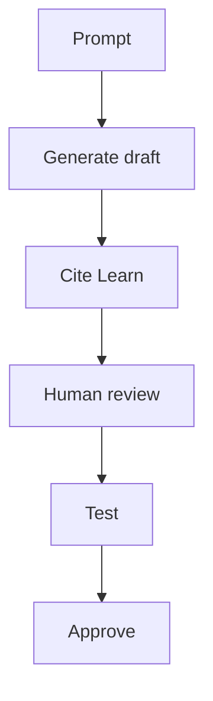

# Working with AI

!!! abstract "At a glance"
    - The repository is set up so GitHub Copilot already knows the North Star, the house rules and the tools when you open it in VS Code.
    - Three things do that: repository-wide instructions, five agent skills for common tasks, and the Microsoft Learn MCP Server for answers grounded in Microsoft's documentation.
    - AI shortens research, scripting, drafting and explaining. It doesn't replace testing with real users, code signing, change approval or ownership.
    - Follow your organisation's policy on AI tools, and never paste secrets or confidential data into a tool that isn't approved for it.

Level 200

AI is useful when the work is repetitive, explainable and reviewable. Keep people in charge of design decisions, change approval, production access and user testing.

This diagram shows the safe loop.

## What's in the repository

| File | What it does |
| --- | --- |
| [.github/copilot-instructions.md](https://github.com/marckean/AVD-Reference_Architecture/blob/main/.github/copilot-instructions.md) | Project-wide instructions. They describe the North Star, require Microsoft Learn grounding with GA or preview status, set the safety rules (no secrets, `-WhatIf` first), and the writing and code conventions |
| [.github/skills/](https://github.com/marckean/AVD-Reference_Architecture/tree/main/.github/skills) | Five agent skills that teach Copilot the repository's workflows, listed below |
| [.vscode/mcp.json](https://github.com/marckean/AVD-Reference_Architecture/blob/main/.vscode/mcp.json) | Adds the Microsoft Learn MCP Server, so Copilot can look up current Microsoft documentation while it works |
| [.vscode/extensions.json](https://github.com/marckean/AVD-Reference_Architecture/blob/main/.vscode/extensions.json) | Recommends the GitHub Copilot Chat, PowerShell and Bicep extensions |

VS Code reads `.github/copilot-instructions.md` for project-wide guidance, and loads project skills from `.github/skills/` ([custom instructions](https://code.visualstudio.com/docs/agent-customization/custom-instructions), [agent skills](https://code.visualstudio.com/docs/agent-customization/agent-skills)). Agent Skills is an open standard, so the same skills work with other skills-compatible agents too.

## Get started

1. Clone the repository and open it in VS Code with GitHub Copilot signed in.
2. When VS Code asks, install the recommended extensions and start the `microsoft-learn` MCP server.
3. In Copilot Chat, type `/` to see the skills, or just describe the task. Copilot loads a skill when it's relevant.

## The skills

| Skill | Use it when you want to |
| --- | --- |
| `app-attach-triage` | Turn an App-V or golden image inventory into App Attach routes, waves and questions for application owners |
| `app-attach-onboarding` | Convert, image and onboard applications with the App Attach toolkit, or troubleshoot an onboarding error |
| `intune-policy-examples` | Explain, adapt, add or deploy the Intune policy examples for multi-session session hosts |
| `north-star-review` | Check a design or change against the North Star, including the decisions you can't change later |
| `discovery-to-deployment` | Turn a completed [discovery questionnaire](discovery-questionnaire.md) into a checked parameters file and deployment commands |

Some prompts to try:

- *"Triage tools/app-attach/output/inventory.csv into waves, and draft the onboarding CSV for wave 1."*
- *"Which reference architecture fits an estate where some applications need Active Directory machine authentication? What's fixed when I create the host pool?"*
- *"Add a policy file for the OneDrive Known Folder Move settings in the same format as the others, and validate it offline."*
- *"Check my azuredeploy.parameters.json against the template and give me the deployment commands."*

## Grounded answers with the Microsoft Learn MCP Server

The Microsoft Learn MCP Server is a remote MCP server that gives AI assistants such as GitHub Copilot access to Microsoft's official documentation, at the endpoint `https://learn.microsoft.com/api/mcp` ([Microsoft Learn MCP Server overview](https://learn.microsoft.com/training/support/mcp)). The repository's instructions tell Copilot to check Microsoft facts there rather than answer from memory, and to cite the article it used. That matters for Azure Virtual Desktop, because features and their status change often.

## Copilot in Intune

If your organisation uses Microsoft Security Copilot, Copilot in Intune can explain individual settings and recommended values while you build a policy in the Intune admin center. Learn says Copilot in Intune is included with Security Copilot, with no other licensing requirements or Intune-specific licences, and that it uses Security Copilot compute units ([Microsoft Copilot in Intune](https://learn.microsoft.com/intune/copilot/)). It's a useful cross-check for the [policy examples](../intune/policy-examples.md).

## Where AI helps, and where people stay in charge

| AI does well | People own |
| --- | --- |
| Reading inventories, logs and errors, and summarising them | Deciding which applications go to a legacy pool or get retired |
| Drafting scripts, templates, policy files and runbooks | Reviewing, testing and approving them |
| Explaining a setting, an error or a design trade-off, with a Learn link | Making the design decision and owning it |
| Checking files against a template or schema | Code signing, change approval and production rollout |
| Proposing test cases | Testing with real users, and the application owner's sign-off |

!!! warning "Treat generated output as a draft"
    Run every script with `-WhatIf` first, against a test group or non-production environment, and have a person review generated templates and policy before anything reaches production. If the assistant says it hasn't verified something, verify it before you rely on it.

## Under the hood

Level 400

The repository points agents at the Microsoft Learn MCP Server. Microsoft describes the server as a way for AI agents to access official Microsoft documentation ([Microsoft Learn MCP Server](https://learn.microsoft.com/training/support/mcp)). Treat its output as grounding, not as approval to skip review.
