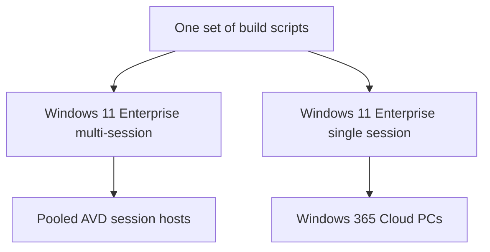
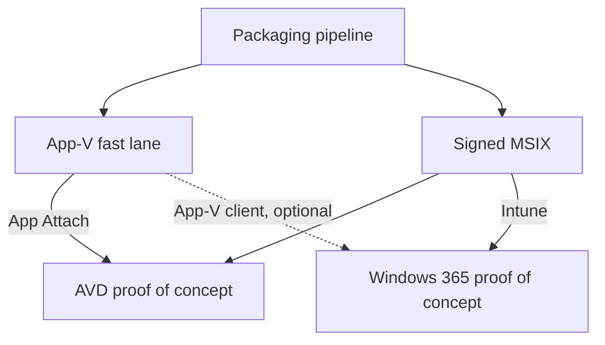

# Azure Virtual Desktop and Windows 365

!!! abstract "At a glance"
    - **Package once.** The same signed MSIX package serves both platforms.
    - **Two delivery paths.** Azure Virtual Desktop attaches it at sign-in with App Attach. Windows 365 installs it through Intune.
    - **One image recipe, two images.** Pooled Azure Virtual Desktop runs Windows 11 Enterprise multi-session. Windows 365 needs a single-session image without FSLogix.
    - **One trust profile.** The same Intune trusted certificate profile covers session hosts and Cloud PCs.

## In plain terms

Level 100

Azure Virtual Desktop and Windows 365 are two ways to deliver a desktop from the cloud. They share more than you might expect: the same applications, the same security agents and the same signing certificate. The difference is how each one receives the applications, and which edition of Windows it runs.

1. **Build and sign the MSIX once.**
2. **Azure Virtual Desktop:** MSIXMGR turns it into a CimFS image on an Azure Files share, and App Attach attaches it at sign-in.
3. **Windows 365:** Intune installs the same MSIX on the Cloud PC as a line-of-business app.

## Side by side

Level 200

| | Azure Virtual Desktop, pooled | Windows 365 |
| --- | --- | --- |
| **Windows edition** | Windows 11 Enterprise multi-session | Windows 11 Enterprise, single session. Learn says multi-session images aren't supported ([Device images overview](https://learn.microsoft.com/windows-365/enterprise/device-images)) |
| **How applications arrive** | App Attach attaches them at sign-in. Nothing is installed on the host ([App Attach overview](https://learn.microsoft.com/azure/virtual-desktop/app-attach-overview)) | Intune installs them on the Cloud PC ([Applications in Windows 365](https://learn.microsoft.com/windows-365/enterprise/app-overview)) |
| **MSIX packages** | A CimFS image made from the signed MSIX | The same signed MSIX, as a line-of-business app ([Deploy MSIX apps with Microsoft Intune](https://learn.microsoft.com/windows/msix/desktop/managing-your-msix-deployment-intune)) |
| **App-V packages** | Supported as they are, through App Attach | No App Attach, and App-V isn't one of Intune's app formats ([Applications in Windows 365](https://learn.microsoft.com/windows-365/enterprise/app-overview)). They can still run through the built-in App-V client, deployed by Configuration Manager on co-managed Cloud PCs ([Enable the App-V in-box client](https://learn.microsoft.com/microsoft-desktop-optimization-pack/app-v/appv-enable-the-app-v-desktop-client), [Deploy App-V virtual applications](https://learn.microsoft.com/intune/configmgr/apps/get-started/deploying-app-v-virtual-applications)). MSIX is the simpler path |
| **Signing trust** | Intune trusted certificate profile | The same profile |
| **Profiles** | FSLogix on Azure Files | Learn says Windows 365 custom images can't contain FSLogix components ([Device images overview](https://learn.microsoft.com/windows-365/enterprise/device-images)) |

## One image recipe, two images

Level 200

The security agents, base applications and settings are the same for both platforms, so keep **one set of build scripts** and run it against **two Windows sources**.

A Windows 365 custom image must also meet these Learn requirements ([Device images overview](https://learn.microsoft.com/windows-365/enterprise/device-images)):

- Windows 10 or Windows 11 Enterprise, as a generalised Generation 2 image.
- Never joined to Active Directory or Microsoft Entra ID, and never enrolled in Intune or co-management.
- No FSLogix components, no recovery partition and no data disks.
- Stored as a managed image, or in an Azure Compute Gallery with the security type set to Trusted Launch.

The Azure Virtual Desktop side is on [Images](../images/index.md).

## Running both proofs of concept

Level 300

- **Build the packaging pipeline once** and point both proofs of concept at it.
- **Start Azure Virtual Desktop with the App-V fast lane** while the first MSIX conversions run. Each MSIX that passes testing then serves Windows 365 as well.
- **App-V on Windows 365 is possible, but it isn't App Attach.** Windows includes the App-V client, and Cloud PCs can be co-managed with Configuration Manager, which deploys App-V packages ([Enable the App-V in-box client](https://learn.microsoft.com/microsoft-desktop-optimization-pack/app-v/appv-enable-the-app-v-desktop-client), [Manage Cloud PCs with Configuration Manager](https://learn.microsoft.com/windows-365/enterprise/manage-cloud-pcs-using-configuration-manager)). For a clean, Intune-only Windows 365 proof of concept, MSIX is the simpler route.
- **Create one Intune trusted certificate profile** and assign it to the session host group and the Cloud PC group.
- **Run the same image scripts twice,** once against each Windows source.

## Under the hood

Level 400

- **App Attach is an Azure Virtual Desktop feature.** It attaches packages from a file share to sessions on session hosts ([App Attach overview](https://learn.microsoft.com/azure/virtual-desktop/app-attach-overview)). Windows 365 Cloud PCs are enrolled in Intune and receive applications the way any other Intune managed Windows device does ([Applications in Windows 365](https://learn.microsoft.com/windows-365/enterprise/app-overview)).
- **The MSIX is the shared artefact.** The CimFS image is specific to App Attach. Intune takes the signed `.msix` or `.msixbundle` file itself ([Deploy MSIX apps using the Intune admin center](https://learn.microsoft.com/windows/msix/desktop/managing-your-msix-deployment-mem-adminconsole)).
- **Signing applies to both.** Every MSIX package installed outside the Microsoft Store must be signed with a certificate the device trusts ([Distribute LOB apps to enterprises](https://learn.microsoft.com/windows/apps/publish/distribute-lob-apps-to-enterprises)). See [Signing certificates, demystified](certificates.md).

## Microsoft Learn

- [Applications in Windows 365](https://learn.microsoft.com/windows-365/enterprise/app-overview)
- [Device images overview for Windows 365](https://learn.microsoft.com/windows-365/enterprise/device-images)
- [Deploy MSIX apps with Microsoft Intune](https://learn.microsoft.com/windows/msix/desktop/managing-your-msix-deployment-intune)
- [Deploy MSIX apps using the Intune admin center](https://learn.microsoft.com/windows/msix/desktop/managing-your-msix-deployment-mem-adminconsole)
- [App Attach in Azure Virtual Desktop](https://learn.microsoft.com/azure/virtual-desktop/app-attach-overview)
- [Distribute LOB apps to enterprises](https://learn.microsoft.com/windows/apps/publish/distribute-lob-apps-to-enterprises)

---

Part of [Applications with App Attach](index.md).
