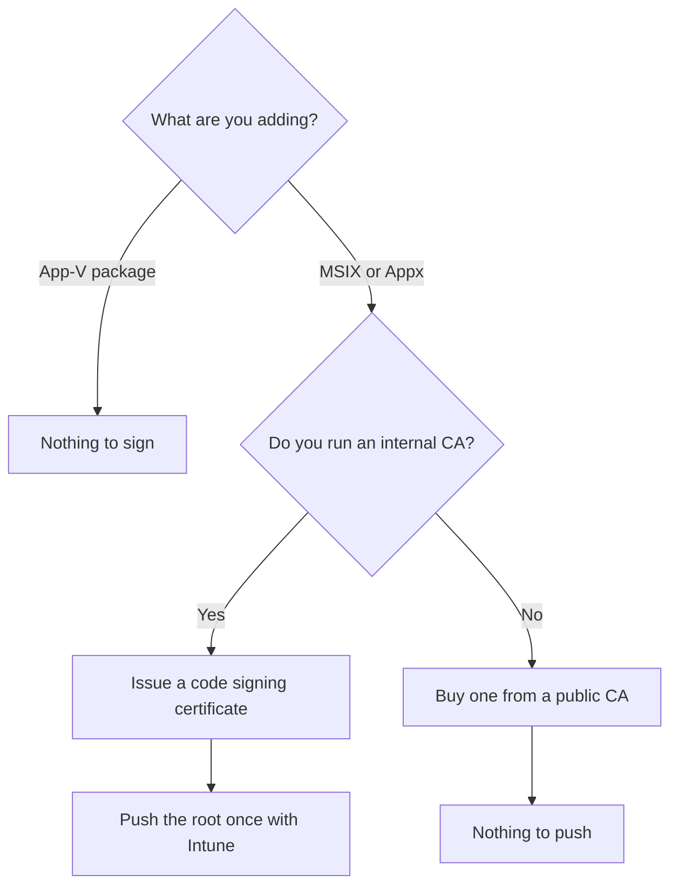
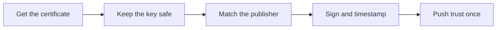

# Signing certificates, demystified

!!! abstract "At a glance"
    - **One certificate, set up once.** It signs every MSIX package you make.
    - **No new certificate authority (CA).** Use the one you already run, or buy a code signing certificate from a public CA.
    - **Trust it once.** One Intune trusted certificate profile covers AVD session hosts and Windows 365 Cloud PCs. A certificate from a public CA needs no profile at all.
    - **App-V packages need no certificate.** Learn's App Attach certificate requirement covers MSIX and Appx packages.

## In plain terms

<span class="level l100">Level 100</span>

A signature is a tamper seal with a name on it. It proves who built the package, and that nobody has changed it since ([Sign an app package using SignTool](https://learn.microsoft.com/windows/msix/package/sign-app-package-using-signtool)). Windows only installs an MSIX package signed with a certificate the device trusts ([Distribute LOB apps to enterprises](https://learn.microsoft.com/windows/apps/publish/distribute-lob-apps-to-enterprises)).


1. **Get one code signing certificate.** Do this once.
2. **Sign every package with it,** and add a timestamp.
3. **Push trust once** with an Intune trusted certificate profile. Skip this if the certificate came from a public CA.
4. **Done.** Every AVD session host and Windows 365 Cloud PC now trusts every package you sign.

## Which certificate?

<span class="level l200">Level 200</span>



| Option | Cost | How devices trust it | Best for |
| --- | --- | --- | --- |
| **Internal CA**, such as Active Directory Certificate Services | No new cost if you already run one | Hybrid joined hosts trust an AD CS enterprise CA automatically. Microsoft Entra joined hosts and Cloud PCs get the root from an Intune trusted certificate profile | Most enterprises |
| **Public CA** code signing certificate | Learn's guide gives about $300 to $500 a year for an OV certificate | Windows already trusts it. Nothing to push | No internal CA |
| **Azure Artifact Signing** (formerly Trusted Signing) | Learn's guide gives the Basic tier at about $10 a month | Windows already trusts it. No Intune profile needed | Organisations that meet the eligibility rules, below |
| **Self-signed** | Free | Install the root on each test host by hand | Lab testing only |

Learn names the internal, public and self-signed sources and explains how each is trusted ([App Attach overview](https://learn.microsoft.com/azure/virtual-desktop/app-attach-overview)). The costs and the Artifact Signing details come from [Sign an MSIX package](https://learn.microsoft.com/windows/msix/package/signing-package-overview) and [Deploy MSIX apps with Microsoft Intune](https://learn.microsoft.com/windows/msix/desktop/managing-your-msix-deployment-intune).

!!! warning "Check Artifact Signing eligibility first"
    Learn recommends Azure Artifact Signing for production MSIX signing. Its Public Trust certificates are currently available to organisations in the USA, Canada, the European Union and the United Kingdom with three or more years of verifiable tax history ([Sign an MSIX package](https://learn.microsoft.com/windows/msix/package/signing-package-overview)). If your organisation isn't eligible, use an internal CA or a public CA.

## Set it up, step by step

<span class="level l300">Level 300</span>



1. **Get the certificate.** Request a code signing certificate. Its object identifier is `1.3.6.1.5.5.7.3.3`. From an internal CA, export it with its private key ([App Attach overview](https://learn.microsoft.com/azure/virtual-desktop/app-attach-overview)).
2. **Keep the private key safe.** Store the PFX password as a pipeline secret. Learn says never to hard-code it in a script or commit it to source control ([Deploy MSIX apps with Microsoft Intune](https://learn.microsoft.com/windows/msix/desktop/managing-your-msix-deployment-intune)).
3. **Match the publisher.** The certificate **Subject** must exactly match the **Publisher** in the package manifest ([Sign your MSIX package](https://learn.microsoft.com/windows/msix/package/sign-msix-package-guide)). Set it once with `-PublisherName` in `New-MsixConversionTemplate.ps1`, and every package matches.
4. **Sign and timestamp each package.** One command per package, which a pipeline can loop over. Use the timestamp server your certificate provider documents:

    ```powershell
    SignTool sign /fd SHA256 /a /f .\codesign.pfx /p $pfxPassword /tr <timestamp-server-url> /td SHA256 .\MyApp.msix
    ```

    The `/fd` hash algorithm must match the one used to build the package, and SHA256 is the default for MSIX ([Sign an app package using SignTool](https://learn.microsoft.com/windows/msix/package/sign-app-package-using-signtool)). The MSIX Packaging Tool can also sign as it saves the package ([App Attach overview](https://learn.microsoft.com/azure/virtual-desktop/app-attach-overview)).

5. **Push trust once.** In the Intune admin center, create a **Trusted certificate** profile for **Windows 10 and later**. Upload the root certificate with the destination store **Computer certificate store - Root**, and any intermediate certificate with **Computer certificate store - Intermediate** ([Trusted root certificate profiles](https://learn.microsoft.com/intune/device-configuration/certificates/trusted-root-profiles)). Assign both to the session host group and the Cloud PC group.

## Under the hood

<span class="level l400">Level 400</span>

- **The whole chain must be trusted.** Learn requires the full certificate chain to be trusted on the session hosts, not just the signing certificate ([App Attach overview](https://learn.microsoft.com/azure/virtual-desktop/app-attach-overview)).
- **AD DS joined hosts.** With AD CS configured as an enterprise CA, the certificates are trusted by default because they're stored in the configuration naming context of Active Directory. A standalone CA needs Group Policy to distribute the root and intermediate certificates ([App Attach overview](https://learn.microsoft.com/azure/virtual-desktop/app-attach-overview)).
- **Timestamps.** Learn says to timestamp packages so their validity outlasts the certificate's expiry. Without a timestamp, an expired certificate means re-signing the package and making sure the hosts trust the new chain ([App Attach overview](https://learn.microsoft.com/azure/virtual-desktop/app-attach-overview)).
- **Self-signed certificates.** Learn says to install the trusted root in the **Trusted Root Certification Authorities** store on each session host, and not to distribute it with Group Policy or Intune, because self-signed certificates are for testing only ([App Attach overview](https://learn.microsoft.com/azure/virtual-desktop/app-attach-overview)).
- **Remove what you don't need.** A certificate in a local machine store affects trust for every user on that computer, so Learn recommends removing certificates when they're no longer needed ([Create a certificate for package signing](https://learn.microsoft.com/windows/msix/package/create-certificate-package-signing)).
- **App-V packages.** Learn's App Attach certificate requirement is written for MSIX and Appx packages. App-V packages are stored on the share as `.appv` files and added directly ([App Attach overview](https://learn.microsoft.com/azure/virtual-desktop/app-attach-overview)).

## Microsoft Learn

- [App Attach in Azure Virtual Desktop: MSIX and Appx package certificates](https://learn.microsoft.com/azure/virtual-desktop/app-attach-overview)
- [Sign an MSIX package](https://learn.microsoft.com/windows/msix/package/signing-package-overview)
- [Sign your MSIX package: end-to-end guide](https://learn.microsoft.com/windows/msix/package/sign-msix-package-guide)
- [Sign an app package using SignTool](https://learn.microsoft.com/windows/msix/package/sign-app-package-using-signtool)
- [Create a certificate for package signing](https://learn.microsoft.com/windows/msix/package/create-certificate-package-signing)
- [Deploy MSIX apps with Microsoft Intune](https://learn.microsoft.com/windows/msix/desktop/managing-your-msix-deployment-intune)
- [Trusted root certificate profiles for Microsoft Intune](https://learn.microsoft.com/intune/device-configuration/certificates/trusted-root-profiles)

---

Part of [Applications with App Attach](index.md).
