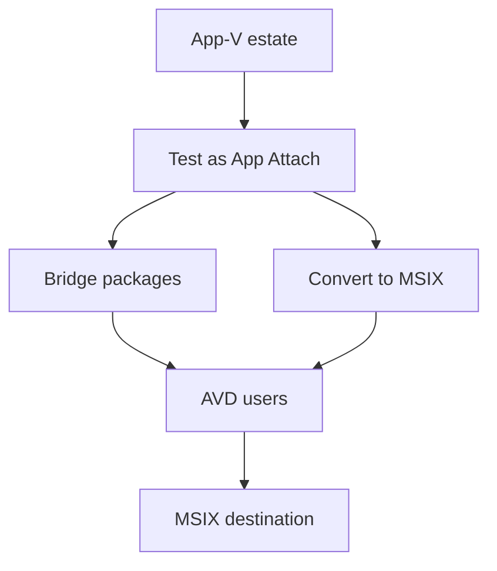

# From App-V to App Attach

Level 300

App-V is not the long-term packaging destination, but existing App-V packages can be a practical bridge into Azure Virtual Desktop.

This diagram shows the migration path: keep what works, convert what should move, and build the MSIX capability over time.

## Using existing App-V packages

App Attach can deliver App-V packages directly. Learn lists App-V as a supported package type with `.appv` file format, and the add and manage article shows adding an App-V package as an App Attach package ([App Attach overview](https://learn.microsoft.com/azure/virtual-desktop/app-attach-overview), [Add and manage App Attach applications](https://learn.microsoft.com/azure/virtual-desktop/app-attach-setup)).

The App-V status needs nuance. The App-V support policy says the **App-V client and sequencer** have moved to fixed extended support, still ship with Windows, and are no longer deprecated. The same policy says the **App-V server components** remain deprecated and support ended in April 2026. It also says **App-V app attach** lets you use App-V packages with Azure Virtual Desktop without running your own server ([App-V in Windows support policy](https://learn.microsoft.com/microsoft-desktop-optimization-pack/app-v/appv-support-policy)).

That means App-V package support in App Attach is a practical bridge, not the destination. Microsoft also says MSIX is the modern Windows app package format and that the **MSIX packaging tool** can repackage existing App-V applications into MSIX ([App-V in Windows support policy](https://learn.microsoft.com/microsoft-desktop-optimization-pack/app-v/appv-support-policy)). A separate MSIX comparison page still says App-V reaches end of life in April 2026; treat that as older or less nuanced than the dedicated App-V support policy page, and use the support policy for lifecycle wording ([Feature-based comparison of Application Virtualization and MSIX](https://learn.microsoft.com/windows/msix/comparisonofappvwithmsix)).

For App-V packages delivered through App Attach, Learn says you can use App-V Dynamic Configuration files. Standard `filename_UserConfig.xml` and `filename_DeploymentConfig.xml` files in the same folder as `filename.appv` are automatically detected; user configuration is only supported on desktop connections, not remote app connections ([App Attach overview](https://learn.microsoft.com/azure/virtual-desktop/app-attach-overview)). The Azure Virtual Desktop What's new page adds that App Attach supports App-V packages with multiple user configuration files as of August 2026 ([What's new in Azure Virtual Desktop](https://learn.microsoft.com/azure/virtual-desktop/whats-new)).

**Status:** App Attach support for Windows Server 2025 and Windows Server 2022 is available as of April 2026, and App Attach support for App-V packages with multiple user configuration files is available as of August 2026 ([What's new in Azure Virtual Desktop](https://learn.microsoft.com/azure/virtual-desktop/whats-new)).

## Moving an App-V estate to App Attach

1. **Inventory** every App-V package, owner, user group, update cadence, dynamic configuration file and dependency.
2. **Keep the first wave simple** by starting with App-V packages that App Attach can use as they are. This proves storage, permissions, assignments and user experience without a repackaging dependency.
3. **Convert where needed** using the MSIX Packaging Tool where the application is a good MSIX candidate. Learn says the MSIX Packaging Tool can repackage existing App-V applications into MSIX, and the App-V support policy positions MSIX as the modern Windows app package format ([App-V in Windows support policy](https://learn.microsoft.com/microsoft-desktop-optimization-pack/app-v/appv-support-policy)).
4. **Test with real multi-session users**. Validate first launch, second launch, user settings, file associations, add-ins, update behaviour and sign-in impact.
5. **Build team capability**. Treat packaging, signing, file share operations and App Attach assignment as a product pipeline owned by the EUC team, not as a one-off migration task.

!!! warning "Validate every package"
    Microsoft Learn confirms the supported formats and the App-V dynamic configuration behaviour, but it doesn't guarantee that every existing App-V package works through App Attach. Test each package in a representative host pool before you rely on it.

## Under the hood

Level 400

The App-V distinction is client-side versus server-side. The App-V support policy says the **App-V client and sequencer** have moved to fixed extended support and are no longer deprecated, while the **App-V server components** remain deprecated and support ended in April 2026. The same page says **App-V app attach** lets you use App-V packages with Azure Virtual Desktop without running your own server ([App-V in Windows support policy](https://learn.microsoft.com/microsoft-desktop-optimization-pack/app-v/appv-support-policy)).

For package behaviour, App Attach automatically detects standard App-V Dynamic Configuration files when the file names match the package name and sit beside the `.appv` file. Learn names the patterns `filename_UserConfig.xml` and `filename_DeploymentConfig.xml`; it also notes that user configuration is only supported on desktop connections, not RemoteApp connections ([App Attach overview](https://learn.microsoft.com/azure/virtual-desktop/app-attach-overview)).

---

Part of [Applications with App Attach](index.md).
