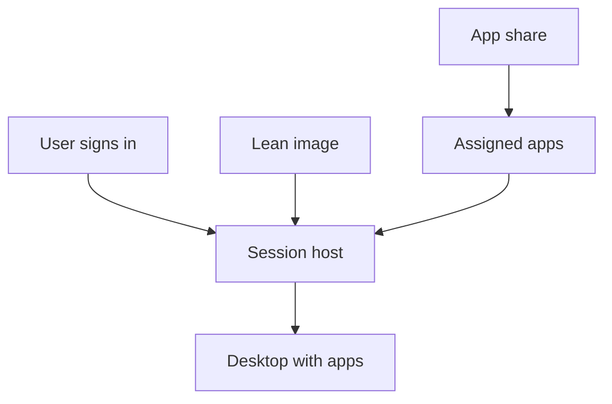
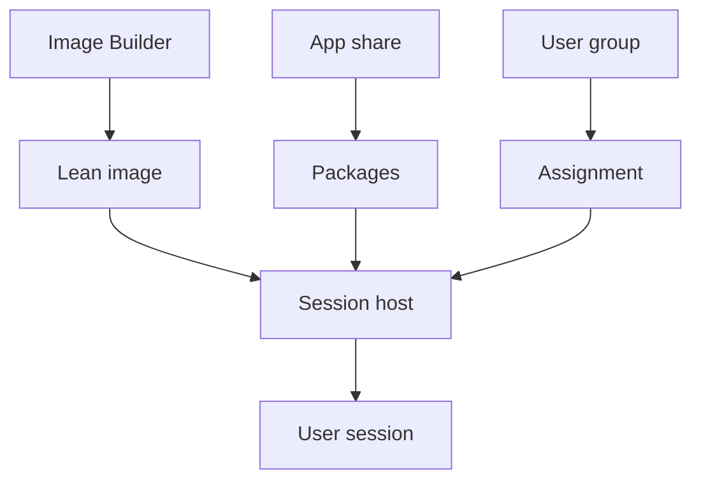
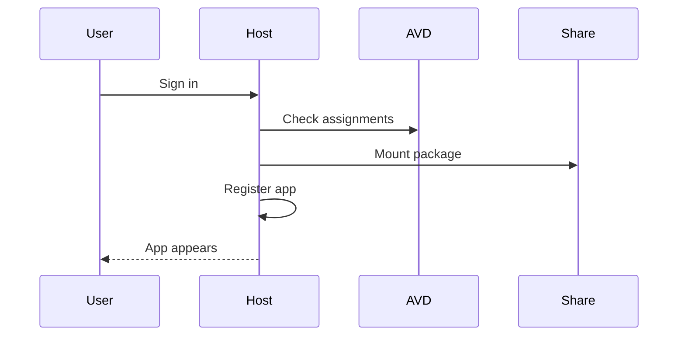

# Applications with App Attach

!!! abstract "At a glance"
    - App Attach dynamically attaches applications to an Azure Virtual Desktop user session from packages stored on an SMB file share.
    - The North Star keeps the image lean and delivers most applications above the image with App Attach.
    - Packages are assigned to host pools and to users or groups, so different users on the same multi-session host can receive different applications.
    - Use CimFS for Windows 11 application images where possible, because Microsoft Learn recommends it for best performance.
    - Existing App-V packages can be delivered by App Attach as a bridge, but MSIX is the strategic destination for modern Windows application packaging.

## In plain terms

Level 100

Think of the session host image as a clean hotel room. The bed, lights and locks are always there, but the guest's tools are brought in only when they arrive. App Attach does that for applications in Azure Virtual Desktop.

The problem it solves is image sprawl. If every application is installed into the image, every application change becomes an image change. App Attach keeps the image lean and attaches the right applications to the right user session from packages on a file share.

This diagram shows the simple idea: the image provides the desktop, while App Attach adds the user's assigned applications.

## What it is

Level 200

App Attach is an Azure Virtual Desktop application delivery feature. Microsoft Learn says it "dynamically attach[es] applications from an application package to a user session" and that applications are not installed locally on session hosts or images, which reduces image complexity and operational overhead ([App Attach in Azure Virtual Desktop](https://learn.microsoft.com/azure/virtual-desktop/app-attach-overview)).

**Status:** Generally available. Microsoft Learn says **MSIX App Attach** came out of preview in April 2021, and the current **App Attach** article documents MSIX, Appx and App-V package support for Azure Virtual Desktop ([What's new in Azure Virtual Desktop](https://learn.microsoft.com/azure/virtual-desktop/whats-new), [App Attach in Azure Virtual Desktop](https://learn.microsoft.com/azure/virtual-desktop/app-attach-overview)).

The important distinction is operational. In a traditional image model, every broadly used application tends to land in the golden image. That makes image updates slower, increases testing blast radius, and makes application ownership ambiguous. In the North Star, [images](../images/index.md) contain Windows, updates, platform agents and security tooling. Applications sit above the image and are attached at sign-in, which lets application changes move independently from operating system changes.

## How it fits

1. **Package** the application as MSIX or Appx in a disk image, or use an existing App-V package. Learn recommends CimFS images when session hosts run Windows 11.
2. **Store it on an SMB share**, usually Azure Files, that the session hosts can read.
3. **Add the package to Azure.** Azure Virtual Desktop imports the package details from the image on the share.
4. **Assign it to host pools.** The same package can be used across multiple host pools.
5. **Assign it to users or groups.** Permissions apply per application, per user.
6. **Add it to a RemoteApp application group** when users need it as a published application rather than inside a desktop.
7. **Mount at sign-in.** App Attach mounts the image to the user's session during sign-in, then registers the application ([App Attach overview](https://learn.microsoft.com/azure/virtual-desktop/app-attach-overview)).

The base image and the applications stay separate, and only meet on the session host:

App Attach has three gates for a user to receive an application. Learn states that the application must be assigned to the host pool, the user must be able to sign in to session hosts in the host pool, and the application must be assigned to the user or group ([App Attach in Azure Virtual Desktop](https://learn.microsoft.com/azure/virtual-desktop/app-attach-overview)). For RemoteApp, the App Attach application must also be added to a RemoteApp application group; for a desktop application group, you do not add the App Attach application to the desktop application group ([App Attach in Azure Virtual Desktop](https://learn.microsoft.com/azure/virtual-desktop/app-attach-overview)).

## North Star recommendation

Use App Attach as the default application delivery layer for pooled Windows 11 Enterprise multi-session host pools. Put only the base platform in the image. Package applications into MSIX or Appx images where practical, keep compatible App-V packages as App-V during transition, and store application images on Azure Files in the same region as the session hosts.

For disk image format, choose **CimFS** for Windows 11 session hosts. Learn says MSIX and Appx images can use **Composite Image File System (CimFS)**, **VHDX**, or **VHD**, but does not recommend VHD, and recommends CimFS for Windows 11 because it mounts and unmounts faster and uses less CPU and memory ([App Attach in Azure Virtual Desktop](https://learn.microsoft.com/azure/virtual-desktop/app-attach-overview), [Create an MSIX image to use with App Attach](https://learn.microsoft.com/azure/virtual-desktop/app-attach-create-msix-image)).

## Design decisions

Level 300

| Decision | North Star choice | Why |
| --- | --- | --- |
| Application layer | App Attach above a lean image | Learn says applications are not installed locally on session hosts or images, which supports fewer custom images ([App Attach overview](https://learn.microsoft.com/azure/virtual-desktop/app-attach-overview)). |
| Package formats | Prefer MSIX or Appx, accept App-V during transition | Learn lists supported package types as **MSIX and MSIX bundle**, **Appx and Appx bundle**, and **App-V** ([App Attach overview](https://learn.microsoft.com/azure/virtual-desktop/app-attach-overview)). |
| Disk image type | CimFS for Windows 11, VHDX where CimFS is unsuitable, avoid VHD | Learn recommends CimFS for Windows 11 and says VHD is not recommended ([Create an MSIX image](https://learn.microsoft.com/azure/virtual-desktop/app-attach-create-msix-image)). |
| Registration type | **On-demand** | Learn says on-demand is recommended and is the default because it does not affect Azure Virtual Desktop sign-in time ([App Attach overview](https://learn.microsoft.com/azure/virtual-desktop/app-attach-overview)). |
| Storage | Azure Files SMB share in the same region as the session hosts | Learn recommends Azure Files for App Attach and says the file share should be in the same Azure region as the session hosts ([App Attach overview](https://learn.microsoft.com/azure/virtual-desktop/app-attach-overview)). |
| Assignment | Assign to host pools and groups, not individual users where possible | Learn supports groups or user accounts and recommends group assignment in the PowerShell example flow ([Add and manage App Attach applications](https://learn.microsoft.com/azure/virtual-desktop/app-attach-setup)). |

## Under the hood

Level 400

At sign-in, App Attach mounts disk images or App-V packages from the SMB file share, then registers the application in the user's session. Learn calls out two registration modes: **On-demand**, where full registration waits until launch and is the recommended default, and **Log on blocking**, where every assigned application is fully registered during sign-in and can affect sign-in time ([App Attach overview](https://learn.microsoft.com/azure/virtual-desktop/app-attach-overview)).

This sequence shows the attach path without assuming the application is installed in the image.

The storage design matters because every session host mounts the package. Learn states that VHDX or CimFS images are mounted using the session host computer account, so **one handle is opened per session host per disk image, rather than per user** ([App Attach overview](https://learn.microsoft.com/azure/virtual-desktop/app-attach-overview)). See [Requirements and file shares](requirements.md) for the storage and permission model.

## In this section

-   __[Requirements and file shares](requirements.md)__

    ---

    Package formats, disk images, file share requirements and permissions, including for Microsoft Entra joined session hosts.

-   __[Packages and updates](packages.md)__

    ---

    Creating MSIX packages and images, and updating or rolling back applications.

-   __[From App-V to App Attach](from-app-v.md)__

    ---

    Using existing App-V packages with App Attach, and a phased route from an App-V estate to MSIX.

## Common pitfalls

- Putting too many applications back into the base image. That undermines the North Star image model described in [images](../images/index.md).
- Using a general-purpose storage account that also contains unrelated data. Learn's service principal warning makes a dedicated App Attach storage account the safer pattern.
- Ignoring storage IOPS and open handles. Learn states each VHDX or CimFS disk image is mounted using the session host computer account, meaning one handle per session host per disk image, not per user ([App Attach overview](https://learn.microsoft.com/azure/virtual-desktop/app-attach-overview)).
- Using **Log on blocking** registration for every application. Learn warns it fully registers assigned applications during sign-in and might affect sign-in time ([App Attach overview](https://learn.microsoft.com/azure/virtual-desktop/app-attach-overview)).
- Converting applications to MSIX before proving whether App Attach can deliver the existing App-V package directly.

## Microsoft Learn

- [App Attach in Azure Virtual Desktop](https://learn.microsoft.com/azure/virtual-desktop/app-attach-overview)
- [Add and manage App Attach applications in Azure Virtual Desktop](https://learn.microsoft.com/azure/virtual-desktop/app-attach-setup)
- [Create an MSIX image to use with App Attach in Azure Virtual Desktop](https://learn.microsoft.com/azure/virtual-desktop/app-attach-create-msix-image)
- [App-V in Windows support policy](https://learn.microsoft.com/microsoft-desktop-optimization-pack/app-v/appv-support-policy)
- [Feature-based comparison of Application Virtualization and MSIX](https://learn.microsoft.com/windows/msix/comparisonofappvwithmsix)
- [Prepare to package a desktop application](https://learn.microsoft.com/windows/msix/desktop/desktop-to-uwp-prepare)
- [What's new in Azure Virtual Desktop?](https://learn.microsoft.com/azure/virtual-desktop/whats-new)
