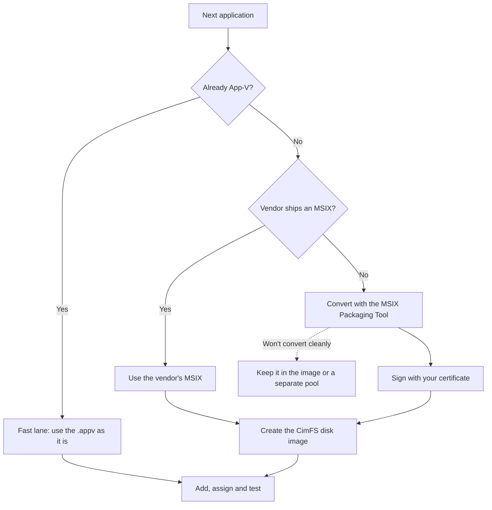
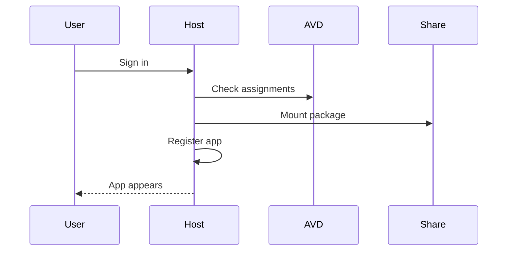

# Applications with App Attach

!!! abstract "At a glance"
    - **Keep the image lean.** Applications live as packages on a file share and are attached to the user's session at sign-in.
    - **App-V packages you already have are the fast lane.** They go on the share as they are: no repackaging, no signing and no disk image.
    - **Everything else becomes MSIX in three steps:** convert it, sign it, create a disk image. One certificate signs every package.
    - **Package once, use it twice.** The same signed MSIX installs on Windows 365 Cloud PCs through Intune.
    - **Most of the work is scripted.** The [App Attach fast track](../accelerators/app-attach-fast-track.md) automates inventory, triage, image creation and assignment. People decide, test and sign off.

## The whole process on one page

Level 100

Think of the session host image as a clean hotel room. The furniture is always there, and each guest's own things arrive with them. App Attach does that for applications.

1. **Package, once per application.** An existing App-V package goes straight through. Anything else is converted to MSIX, signed and turned into a disk image.
2. **Store it** on an Azure Files share in the same Azure region as the session hosts.
3. **Deliver it.** Add it in Azure Virtual Desktop, assign it to a host pool and a user group, and it's attached when the user signs in.

Applications aren't installed on the session hosts or in the image, so an application change doesn't mean an image change ([App Attach in Azure Virtual Desktop](https://learn.microsoft.com/azure/virtual-desktop/app-attach-overview)).

## Pick the easiest route for each app

Level 100

Start every application at the top and stop at the first route that works.

- **App-V first.** Learn lists App-V as a supported App Attach package type, and the `.appv` file is used directly ([App Attach overview](https://learn.microsoft.com/azure/virtual-desktop/app-attach-overview)).
- **Vendor MSIX next.** Several software vendors already publish their applications as MSIX packages ([Create an MSIX image](https://learn.microsoft.com/azure/virtual-desktop/app-attach-create-msix-image)).
- **Convert the rest.** The MSIX Packaging Tool converts MSI, EXE, ClickOnce and App-V installers ([Create an MSIX package from any desktop installer](https://learn.microsoft.com/windows/msix/packaging-tool/create-app-package)).
- **Know when to stop.** Applications that need drivers, per-user services or mandatory elevation are poor MSIX candidates ([Prepare to package a desktop application](https://learn.microsoft.com/windows/msix/desktop/desktop-to-uwp-prepare)). Leave them in the image, or in a [separate pool](../getting-there/stepping-stones.md), and move on.

## Five steps, and what's automated

Level 200

-   :material-magnify:{ .lg .middle } __1. Find and sort__

    ---

    List every application in the golden image and every App-V package, then sort each one into a route.

    **Scripted:** `Get-ImageApplicationInventory.ps1`, `Get-AppVPackageInventory.ps1`, `Invoke-ApplicationTriage.ps1`

-   :material-package-variant-closed:{ .lg .middle } __2. Package__

    ---

    Convert installers with the MSIX Packaging Tool on a clean virtual machine. App-V packages skip this step.

    **Scripted:** `New-MsixConversionTemplate.ps1` writes a conversion template for each installer.

-   :material-certificate:{ .lg .middle } __3. Sign__

    ---

    Sign each MSIX with your one code signing certificate, and add a timestamp. App-V packages skip this step.

    **One command per package:** `SignTool sign`. See [Signing certificates, demystified](certificates.md).

-   :material-harddisk:{ .lg .middle } __4. Image and store__

    ---

    Turn each MSIX into a CimFS disk image, then copy it to the Azure Files share.

    **Scripted:** `New-AppAttachImage.ps1` runs MSIXMGR. `Test-AppAttachShare.ps1` checks the share.

-   :material-account-group:{ .lg .middle } __5. Add, assign and test__

    ---

    Add the package to Azure Virtual Desktop, assign it to a host pool and a user group, then test it with real users.

    **Scripted:** `Add-AppAttachApplication.ps1`. **A person** tests and signs off.

-   :material-robot-outline:{ .lg .middle } __AI does the typing__

    ---

    An AI assistant can read the inventory, draft the triage notes and fill in the templates. People still choose, test and approve.

    See [Working with AI](../accelerators/working-with-ai.md).

All the scripts are in [`tools/app-attach`](https://github.com/marckean/AVD-Reference_Architecture/tree/main/tools/app-attach), and the [App Attach fast track](../accelerators/app-attach-fast-track.md) puts them in order.

## The certificate question

Level 200

Only MSIX and Appx packages need a signature. You get **one** code signing certificate and set up trust **once**. You don't need a new certificate authority (CA).

| If you have... | Do this | Trust on devices |
| --- | --- | --- |
| An internal certificate authority | Issue a code signing certificate from it | Push the root once with an Intune trusted certificate profile |
| No internal certificate authority | Buy a code signing certificate from a public CA | Nothing to push. Windows already trusts it |
| App-V packages only | Nothing | Nothing |

Learn lists these sources and the trust options for each ([App Attach overview](https://learn.microsoft.com/azure/virtual-desktop/app-attach-overview)). The details, costs and the one setting that catches most people out are on [Signing certificates, demystified](certificates.md).

## Azure Virtual Desktop and Windows 365

Level 200

=== "Azure Virtual Desktop"

    - App Attach attaches the application at sign-in. Nothing is installed on the host.
    - MSIX, Appx and App-V packages all work.
    - Pooled hosts run Windows 11 Enterprise multi-session.

=== "Windows 365"

    - Intune installs the same signed MSIX as a line-of-business app ([Deploy MSIX apps with Microsoft Intune](https://learn.microsoft.com/windows/msix/desktop/managing-your-msix-deployment-intune)).
    - Windows 365 supports `.intunewin`, MSI, MSIX and AppX application formats, so plan MSIX or Win32 for App-V applications ([Applications in Windows 365](https://learn.microsoft.com/windows-365/enterprise/app-overview)).
    - Cloud PCs run Windows 11 Enterprise, single session.

The packaging work is shared, and so is the image recipe. The details are on [Azure Virtual Desktop and Windows 365](avd-and-windows-365.md).

## Design decisions

Level 300

| Decision | North Star choice | Why |
| --- | --- | --- |
| Application layer | App Attach above a lean image | Learn says applications are not installed locally on session hosts or images, which supports fewer custom images ([App Attach overview](https://learn.microsoft.com/azure/virtual-desktop/app-attach-overview)). |
| Package formats | Prefer MSIX or Appx, accept App-V during transition | Learn lists supported package types as **MSIX and MSIX bundle**, **Appx and Appx bundle**, and **App-V** ([App Attach overview](https://learn.microsoft.com/azure/virtual-desktop/app-attach-overview)). |
| Disk image type | CimFS for Windows 11, VHDX where CimFS is unsuitable, avoid VHD | Learn recommends CimFS for Windows 11 and says VHD is not recommended ([Create an MSIX image](https://learn.microsoft.com/azure/virtual-desktop/app-attach-create-msix-image)). |
| Signing | One code signing certificate, trusted once through Intune | Learn requires the whole certificate chain to be trusted on session hosts, and names Intune for Microsoft Entra joined hosts ([App Attach overview](https://learn.microsoft.com/azure/virtual-desktop/app-attach-overview)). |
| Registration type | **On-demand** | Learn says on-demand is recommended and is the default because it does not affect Azure Virtual Desktop sign-in time ([App Attach overview](https://learn.microsoft.com/azure/virtual-desktop/app-attach-overview)). |
| Storage | Azure Files SMB share in the same region as the session hosts | Learn recommends Azure Files for App Attach and says the file share should be in the same Azure region as the session hosts ([App Attach overview](https://learn.microsoft.com/azure/virtual-desktop/app-attach-overview)). |
| Assignment | Assign to host pools and groups, not individual users where possible | Learn supports groups or user accounts and recommends group assignment in the PowerShell example flow ([Add and manage App Attach applications](https://learn.microsoft.com/azure/virtual-desktop/app-attach-setup)). |

A user gets an application only when three things are true: the application is assigned to the host pool, the user can sign in to that host pool, and the application is assigned to the user or their group. For RemoteApp, the application is also added to a RemoteApp application group ([App Attach overview](https://learn.microsoft.com/azure/virtual-desktop/app-attach-overview)).

## Under the hood

Level 400

At sign-in, App Attach mounts the disk image or App-V package from the SMB file share, then registers the application in the user's session. Learn describes two registration modes: **On-demand**, where full registration waits until the application is launched and which is the recommended default, and **Log on blocking**, where every assigned application is fully registered during sign-in and can affect sign-in time ([App Attach overview](https://learn.microsoft.com/azure/virtual-desktop/app-attach-overview)).

Every session host mounts the package. Learn states that VHDX or CimFS images are mounted using the session host computer account, so **one handle is opened per session host per disk image, rather than per user** ([App Attach overview](https://learn.microsoft.com/azure/virtual-desktop/app-attach-overview)). See [Requirements and file shares](requirements.md) for the storage and permission model.

## In this section

-   __[Packaging, step by step](packages.md)__

    ---

    Turning an installer into an MSIX package and a CimFS image, then updating or rolling it back.

-   __[Signing certificates, demystified](certificates.md)__

    ---

    Which certificate, what it costs, how devices trust it, and why App-V needs none.

-   __[Azure Virtual Desktop and Windows 365](avd-and-windows-365.md)__

    ---

    One package and one image recipe, two delivery paths.

-   __[From App-V to App Attach](from-app-v.md)__

    ---

    Using existing App-V packages as they are, and a phased route to MSIX.

-   __[Requirements and file shares](requirements.md)__

    ---

    Supported hosts, the file share, permissions and storage sizing.

## Common pitfalls

- Putting too many applications back into the base image. That undermines the North Star image model described in [images](../images/index.md).
- Converting applications to MSIX before proving whether App Attach can deliver the existing App-V package directly.
- A certificate subject that doesn't match the package's **Publisher**. Learn says the two must match exactly ([Sign your MSIX package](https://learn.microsoft.com/windows/msix/package/sign-msix-package-guide)).
- Using a general-purpose storage account that also contains unrelated data. Learn's service principal warning makes a dedicated App Attach storage account the safer pattern.
- Using **Log on blocking** registration for every application. Learn warns it fully registers assigned applications during sign-in and might affect sign-in time ([App Attach overview](https://learn.microsoft.com/azure/virtual-desktop/app-attach-overview)).

## Microsoft Learn

- [App Attach in Azure Virtual Desktop](https://learn.microsoft.com/azure/virtual-desktop/app-attach-overview)
- [Add and manage App Attach applications in Azure Virtual Desktop](https://learn.microsoft.com/azure/virtual-desktop/app-attach-setup)
- [Create an MSIX image to use with App Attach in Azure Virtual Desktop](https://learn.microsoft.com/azure/virtual-desktop/app-attach-create-msix-image)
- [Create an MSIX package from any desktop installer](https://learn.microsoft.com/windows/msix/packaging-tool/create-app-package)
- [Sign an MSIX package](https://learn.microsoft.com/windows/msix/package/signing-package-overview)
- [Deploy MSIX apps with Microsoft Intune](https://learn.microsoft.com/windows/msix/desktop/managing-your-msix-deployment-intune)
- [Applications in Windows 365](https://learn.microsoft.com/windows-365/enterprise/app-overview)
- [App-V in Windows support policy](https://learn.microsoft.com/microsoft-desktop-optimization-pack/app-v/appv-support-policy)
- [Prepare to package a desktop application](https://learn.microsoft.com/windows/msix/desktop/desktop-to-uwp-prepare)
