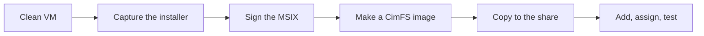
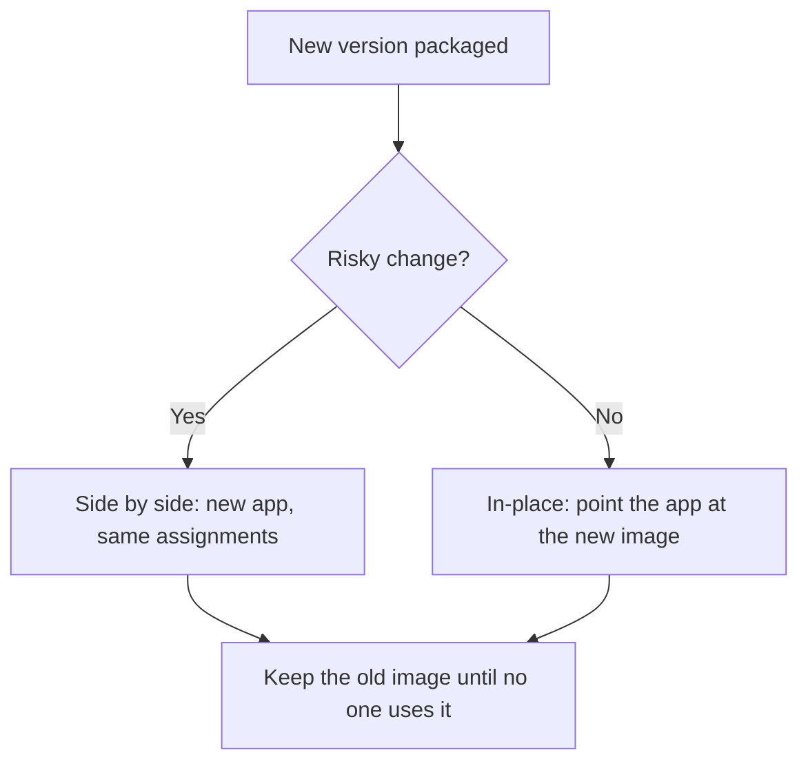

# Packaging, step by step

!!! abstract "At a glance"
    - **App-V packages skip this page.** They go on the share as they are.
    - **Everything else:** capture the installer on a clean virtual machine, sign the MSIX, turn it into a CimFS image, then add and assign it.
    - **Each step is one tool and one command,** so it scripts well. The [App Attach fast track](../accelerators/app-attach-fast-track.md) scripts most of it.

## The MSIX lane

<span class="level l100">Level 100</span>



The MSIX Packaging Tool watches an installer run and captures everything it does into an MSIX package. That's why it needs a clean machine: anything else running gets captured too ([Prepare your environment for conversion](https://learn.microsoft.com/windows/msix/packaging-tool/prepare-your-environment)).

## Step by step

<span class="level l200">Level 200</span>

| Step | What you do | Tool | Scripted by |
| --- | --- | --- | --- |
| 1. Prepare | A clean virtual machine with a checkpoint to revert to after each conversion | Hyper-V, or the Quick Create **MSIX Packaging Tool Environment** | - |
| 2. Capture | Run the installer while the tool captures it | MSIX Packaging Tool | `New-MsixConversionTemplate.ps1` |
| 3. Sign | Sign the package and add a timestamp | SignTool, or the MSIX Packaging Tool | One command. See [certificates](certificates.md) |
| 4. Image | Expand the MSIX into a CimFS disk image | MSIXMGR | `New-AppAttachImage.ps1` |
| 5. Store | Copy the image to the Azure Files share and check access | File copy | `Test-AppAttachShare.ps1` |
| 6. Deliver | Add the package, assign host pools and groups | Azure portal or Azure PowerShell | `Add-AppAttachApplication.ps1` |
| 7. Test | Sign in as a real user, launch it, test it, sign it off | A person | - |

### 1. Prepare a clean machine

Learn recommends a clean virtual machine that matches the architecture you'll deploy to, configured like the target environment, with a checkpoint so you can revert after each conversion. If you don't have one, Learn offers a Quick Create VM, the **MSIX Packaging Tool Environment** in Hyper-V ([Prepare your environment for conversion](https://learn.microsoft.com/windows/msix/packaging-tool/prepare-your-environment)).

### 2. Capture the installer

Use the MSIX Packaging Tool interactively for the first few applications. After that, use its command line with a conversion template, which is how you convert in bulk ([Conversion with the command line](https://learn.microsoft.com/windows/msix/packaging-tool/package-conversion-command-line)):

```powershell
MsixPackagingTool.exe create-package --template .\ConversionTemplate.xml -v
```

`New-MsixConversionTemplate.ps1` writes one template per installer or App-V package from the inventory. Learn notes that App-V 5.x packages can be converted from the command line too ([Conversion with the command line](https://learn.microsoft.com/windows/msix/packaging-tool/package-conversion-command-line)).

### 3. Sign it

Sign every package with the same certificate and add a timestamp. The certificate subject must match the package's **Publisher** exactly. The whole process is on [Signing certificates, demystified](certificates.md).

### 4. Make the CimFS image

MSIXMGR expands the MSIX into a disk image. Learn recommends CimFS, particularly with Windows 11, and this is Learn's example command ([Create an MSIX image](https://learn.microsoft.com/azure/virtual-desktop/app-attach-create-msix-image)):

```powershell
msixmgr.exe -Unpack -packagePath "C:\msix\myapp.msix" -destination "C:\msix\myapp\myapp.cim" -applyACLs -create -fileType cim -rootDirectory apps
```

Create a new destination folder for each image, because a CimFS image is several files. Build the image on a Windows version equal to or lower than the one the session hosts run ([Create an MSIX image](https://learn.microsoft.com/azure/virtual-desktop/app-attach-create-msix-image)).

### 5 to 7. Store, deliver and test

Copy the image folder to the Azure Files share, then add it in Azure Virtual Desktop and assign it to a host pool and a user group ([Add and manage App Attach applications](https://learn.microsoft.com/azure/virtual-desktop/app-attach-setup)). Test with real users before you widen the assignment.

## Updating and rollback

<span class="level l300">Level 300</span>



Learn documents two update patterns. **Side by side** creates a new application with the new disk image and assigns it to the same host pools and users. **In-place** creates a new image where the application version changes, then updates the existing application to use the new image. The version can be higher or lower, but cannot be the same version number; users receive the updated application the next time they sign in ([App Attach overview](https://learn.microsoft.com/azure/virtual-desktop/app-attach-overview)).

Use side by side for higher-risk changes, because rollback is assignment based. Use in-place for low-risk patch updates where testing confirms the new version is safe. Do not delete the old image until all users are finished using it, which is also the Microsoft Learn guidance ([App Attach overview](https://learn.microsoft.com/azure/virtual-desktop/app-attach-overview)).

## Under the hood

<span class="level l400">Level 400</span>

For Windows 11 session hosts, CimFS is the preferred image type. Learn says CimFS mounts and unmounts faster than VHD and VHDX and consumes less CPU and memory; its example shows average mount time of **255 ms** for CimFS compared with **356 ms** for VHD, and average unmount time of **36 ms** for CimFS compared with **1615 ms** for VHD ([App Attach overview](https://learn.microsoft.com/azure/virtual-desktop/app-attach-overview)).

A CimFS image is a `.cim` metadata file plus at least two data files, one starting with `objectid_` and one with `region_`, so always copy the whole folder ([App Attach overview](https://learn.microsoft.com/azure/virtual-desktop/app-attach-overview)).

When a captured application needs a fix to run in the MSIX container, the Package Support Framework applies runtime fixes to the package ([Overview of converting installers to MSIX](https://learn.microsoft.com/windows/msix/packaging-tool/create-an-msix-overview)).

## Microsoft Learn

- [Prepare your environment for conversion](https://learn.microsoft.com/windows/msix/packaging-tool/prepare-your-environment)
- [Create an MSIX package from any desktop installer](https://learn.microsoft.com/windows/msix/packaging-tool/create-app-package)
- [Conversion with the command line](https://learn.microsoft.com/windows/msix/packaging-tool/package-conversion-command-line)
- [Create an MSIX image to use with App Attach](https://learn.microsoft.com/azure/virtual-desktop/app-attach-create-msix-image)
- [Add and manage App Attach applications](https://learn.microsoft.com/azure/virtual-desktop/app-attach-setup)
- [App Attach in Azure Virtual Desktop](https://learn.microsoft.com/azure/virtual-desktop/app-attach-overview)

---

Part of [Applications with App Attach](index.md).
