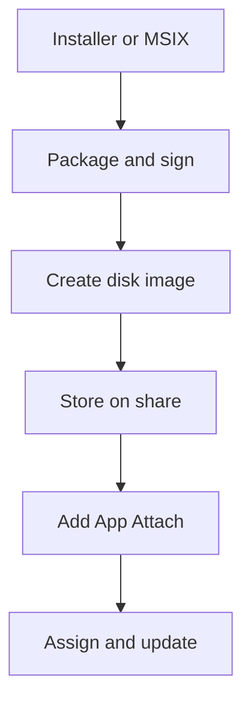

# Packages and updates

Level 300

This page explains how an installer becomes an attachable package, and how you update it without rebuilding the whole desktop image.

This diagram shows the package factory path.

## Creating packages and images

For MSIX and Appx, App Attach uses a disk image created from the application package. Learn names the **MSIXMGR tool** and shows `msixmgr.exe -Unpack` with `-fileType cim` or `-fileType vhdx` to create the image ([Create an MSIX image to use with App Attach](https://learn.microsoft.com/azure/virtual-desktop/app-attach-create-msix-image)). The same article links the **MSIX Packaging Tool** for converting installers to MSIX.

All MSIX and Appx packages require a certificate. Learn says you are responsible for ensuring the certificate chain is trusted, and that a code signing certificate has object identifier `1.3.6.1.5.5.7.3.3`. It names internal or standalone certificate authorities, such as Active Directory Certificate Services, and `New-SelfSignedCertificate` for test certificates only ([App Attach overview](https://learn.microsoft.com/azure/virtual-desktop/app-attach-overview)).

## Updating and rollback

Learn documents two update patterns. **Side by side** creates a new application with the new disk image and assigns it to the same host pools and users. **In-place** creates a new image where the application version changes, then updates the existing application to use the new image. The version can be higher or lower, but cannot be the same version number; users receive the updated application the next time they sign in ([App Attach overview](https://learn.microsoft.com/azure/virtual-desktop/app-attach-overview)).

Use side by side for higher-risk changes, because rollback is assignment based. Use in-place for low-risk patch updates where testing confirms the new version is safe. Do not delete the old image until all users are finished using it, which is also the Microsoft Learn guidance ([App Attach overview](https://learn.microsoft.com/azure/virtual-desktop/app-attach-overview)).

## Under the hood

Level 400

For Windows 11 session hosts, CimFS is the preferred image type. Learn says CimFS mounts and unmounts faster than VHD and VHDX and consumes less CPU and memory; its example shows average mount time of **255 ms** for CimFS compared with **356 ms** for VHD, and average unmount time of **36 ms** for CimFS compared with **1615 ms** for VHD ([App Attach overview](https://learn.microsoft.com/azure/virtual-desktop/app-attach-overview)).

The update rule is version-sensitive. Learn says in-place updates can use a higher or lower version number, but **can't update an application with the same version number**. For controlled rollback, keep the previous disk image until all active users have finished using it ([App Attach overview](https://learn.microsoft.com/azure/virtual-desktop/app-attach-overview)).

---

Part of [Applications with App Attach](index.md).
