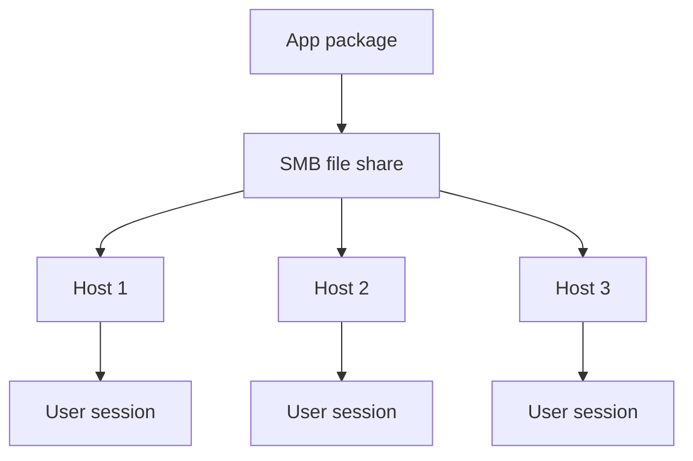

# Requirements and file shares

Level 300

This page is the checklist for making App Attach work reliably: compatible hosts, a readable SMB share, correct service principal access and enough storage performance.

This diagram shows the file share dependency. The package is not copied into every image; each session host reads it from the share.

## Requirements and limitations

The session hosts must run a supported Windows client or server operating system, must be joined to Microsoft Entra ID or AD DS, and at least one session host must be powered on when adding an application ([Add and manage App Attach applications](https://learn.microsoft.com/azure/virtual-desktop/app-attach-setup)).

The App Attach package must be on an SMB file share in the same Azure region as the session hosts, and all session hosts in the host pool must have read access with their computer account ([Add and manage App Attach applications](https://learn.microsoft.com/azure/virtual-desktop/app-attach-setup)). For Microsoft Entra joined session hosts using Azure Files, Learn requires assigning the **Reader and Data Access** Azure RBAC role to both the **Azure Virtual Desktop** and **Azure Virtual Desktop ARM Provider** service principals; the storage account must be in the same subscription as the session host VMs ([Add and manage App Attach applications](https://learn.microsoft.com/azure/virtual-desktop/app-attach-setup)).

!!! warning "Storage account scope"
    Learn warns that assigning the **Azure Virtual Desktop ARM Provider** service principal to the storage account grants the Azure Virtual Desktop service access to all data inside that storage account. Use a dedicated storage account for App Attach packages and rotate access keys regularly ([App Attach overview](https://learn.microsoft.com/azure/virtual-desktop/app-attach-overview)).

Performance is storage-sensitive. Learn gives an example where **a single 1 GB image or App-V package containing one application requires per session host**: **One IOP** steady state, **10 IOPs** at machine boot sign-in, and **400 ms** latency ([App Attach overview](https://learn.microsoft.com/azure/virtual-desktop/app-attach-overview)). This is per session host, per image, not per user. For consolidated IOPS, bandwidth, latency, subnet and quota figures, see [Sizing estimates](../overview/sizing-estimates.md).

Do not combine App Attach images and FSLogix containers on the same file share; Learn specifically recommends avoiding the same file share for App Attach and FSLogix profile containers ([App Attach overview](https://learn.microsoft.com/azure/virtual-desktop/app-attach-overview)).

Poor candidates for MSIX conversion include applications that require Windows drivers, per-user Windows services, in-process shell extensions loaded into processes outside the package, writes to the install directory, or mandatory elevation. Those constraints are documented in the MSIX packaging preparation guidance, not in App Attach itself ([Prepare to package a desktop application](https://learn.microsoft.com/windows/msix/desktop/desktop-to-uwp-prepare)).

## Under the hood

Level 400

Azure Files has open handle limits at the root directory, directory and file levels. For App Attach, Learn explains the important scaling effect: VHDX or CimFS disk images are mounted with the session host computer account, and that means one handle per session host per disk image, not one handle per user ([App Attach overview](https://learn.microsoft.com/azure/virtual-desktop/app-attach-overview)).

That changes how to estimate pressure on the share:

1. Count session hosts in the host pool.
2. Count disk images each host mounts.
3. Multiply hosts by images for the handle count on those image files.
4. Size IOPS per session host, per image, using the Learn example as a starting point.

This is why App Attach storage and FSLogix storage should be separated. FSLogix profile containers scale mainly with users and sign-in concurrency; App Attach image mounts scale mainly with hosts, images and boot or sign-in activity.

---

Part of [Applications with App Attach](index.md).
