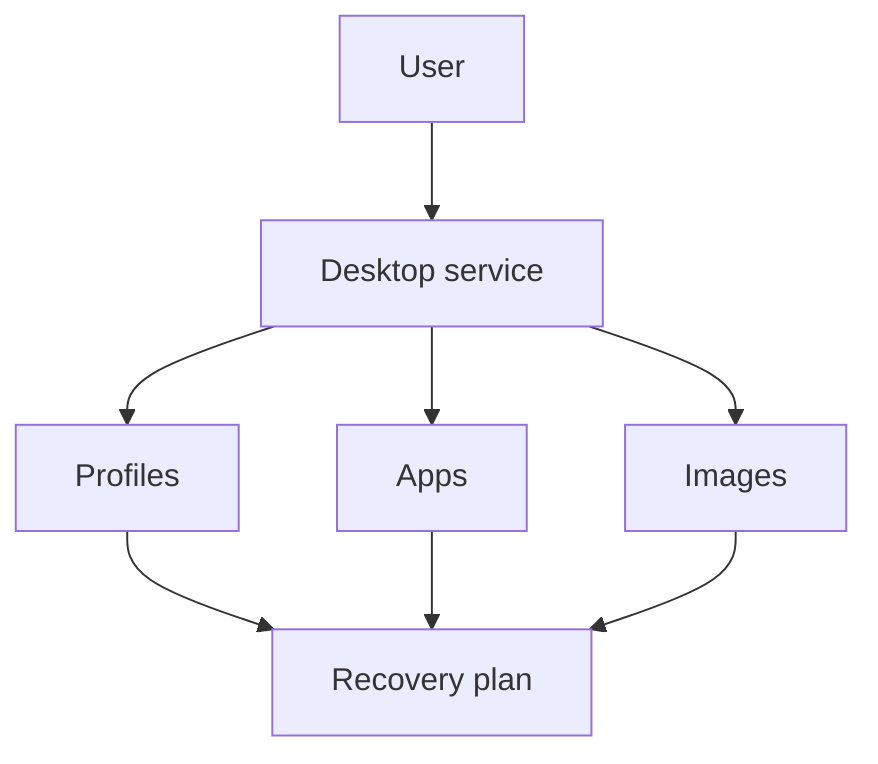
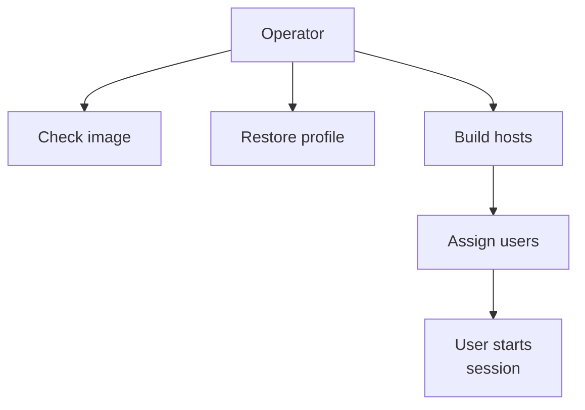

# Business continuity

!!! abstract "At a glance"

    - In the North Star design, session hosts are disposable, so protect profiles, packages, images, configuration and infrastructure as code rather than treating every host as a server to recover.
    - Use availability zones inside the primary region where the region and VM SKU support them.
    - Replicate or back up FSLogix profile storage, App Attach package storage, Azure Compute Gallery image versions and infrastructure state.
    - Prefer active-passive regional recovery for most pooled host pool designs unless your recovery time objective requires active-active.
    - Test failover as an application and identity workflow, not only as an infrastructure deployment.

## In plain terms

Level 100

Business continuity is the plan for keeping work going when something breaks. Disaster recovery is the plan for bringing the service back in another place when the normal place is unavailable.

For Azure Virtual Desktop, the desktop machine should be easy to replace. The important things are the user's profile, the application packages, the image, the network and the configuration that can rebuild the environment.

This diagram shows the simple idea.

## What it is

Level 200

BCDR is the design that keeps users working when a component, availability zone or region is unavailable. In Azure Virtual Desktop, the key choice is what to restore and what to rebuild.

The [North Star design](../overview/how-it-fits-together.md) uses pooled host pools, Windows 11 Enterprise multi-session, Microsoft Entra joined session hosts, Intune enrolment, ephemeral OS disks, App Attach, FSLogix profile containers on Azure Files, Azure Image Builder and Azure Compute Gallery. That means the user state and platform configuration live outside the session host. Microsoft describes ephemeral OS disks as being created on local VM storage and not saved to remote Azure Storage, and says they are ideal for stateless workloads where applications can tolerate individual VM failures [Ephemeral OS disks for Azure VMs](https://learn.microsoft.com/azure/virtual-machines/ephemeral-os-disks).

The recovery objective is therefore:

- **Rebuild** session hosts from image, host pool configuration and infrastructure as code.
- **Protect** FSLogix profile containers, App Attach packages, image definitions and image versions, identity and access assignments, monitoring, network configuration and IaC source.

**Status:** Generally available for Azure Files redundancy, Azure Backup for Azure Files snapshot and vaulted backup, Azure Compute Gallery replication and Azure Monitor. Microsoft Learn states Azure Backup offers general availability of Vaulted Backup for Azure Files [About Azure Files backup](https://learn.microsoft.com/azure/backup/azure-file-share-backup-overview). **Status:** Generally available for Regional host pools, based on the September 2026 entry in [What's new in Azure Virtual Desktop?](https://learn.microsoft.com/azure/virtual-desktop/whats-new). **Status:** Generally available for Automated Host Pools, Dynamic Autoscaling and Ephemeral OS Disks, based on the June 2026 availability announcement in [What's new in Azure Virtual Desktop?](https://learn.microsoft.com/azure/virtual-desktop/whats-new).

!!! note "Classic retirement"

    [What's new in Azure Virtual Desktop?](https://learn.microsoft.com/azure/virtual-desktop/whats-new) states that Azure Virtual Desktop classic retires on September 30, 2026 and connections to classic resources are blocked after retirement. The North Star design assumes Azure Resource Manager based host pools only.

## How it fits

1. **Protect profile and package state.** Replicate or restore the profile shares, and replicate the App Attach package shares.
2. **Replicate image versions** to the secondary region with Azure Compute Gallery.
3. **Rebuild from infrastructure as code.** Session hosts are disposable, so the passive host pool in the secondary region is rebuilt from code, not replicated.

Use Regional host pools for new regional designs. Microsoft Learn states that Regional host pools store host pool metadata in the selected Azure region instead of a geographical database shared across regions, improving resiliency by reducing cross-region dependency [What's new in Azure Virtual Desktop?](https://learn.microsoft.com/azure/virtual-desktop/whats-new). The Regional Host Pools article also states that regional and geographical host pools use different backend infrastructure and coexist [Regional Host Pools](https://learn.microsoft.com/azure/virtual-desktop/regional-host-pools).

!!! warning "Regional host pool diagnostics limitation"

    The [Regional Host Pools](https://learn.microsoft.com/azure/virtual-desktop/regional-host-pools) article states that errors and checkpoints are not being reported into Log Analytics for regional session hosts. Account for this in monitoring and test evidence until Microsoft documents a change.

The primary and secondary host pools should use the same image family, App Attach package set, Intune baseline, Conditional Access assumptions and profile technology. Failover should be entitlement and routing, not redesign.

## North Star recommendation

Level 300

| Decision | North Star choice | Why |
| --- | --- | --- |
| Host recovery | Rebuild pooled session hosts rather than replicate individual VMs | Ephemeral OS disks make hosts stateless and disposable. |
| Regional model | Active-passive for most pooled host pools, using Regional host pools for new deployments | Cloud Adoption Framework guidance recommends active-passive if it satisfies RPO and RTO, and Regional host pools reduce cross-region metadata dependency. |
| In-region resiliency | Use availability zones for session hosts where region and SKU support them | CAF recommends availability zones when maximum host pool resiliency is required in a single region. |
| Profile protection | Azure Files redundancy plus Azure Backup for Azure Files | Profiles are user state and must survive deletion, corruption and regional events. |
| Image recovery | Replicate Azure Compute Gallery image versions to the secondary region | Compute Gallery supports target regions for image version replication. |
| Profile multi-region option | Use FSLogix Cloud Cache only when the storage layer cannot meet BCDR requirements | CAF says Cloud Cache adds complexity and can slow sign-in and sign-out. |

## What needs protecting

### Protect

- **FSLogix profile containers** - FSLogix attaches a profile container at sign-in so the profile appears like a native user profile; Microsoft recommends FSLogix profile containers for Azure Virtual Desktop user profiles and recommends Azure Files for most customers [Storage options for FSLogix profile containers in Azure Virtual Desktop](https://learn.microsoft.com/azure/virtual-desktop/store-fslogix-profile).
- **Azure Files shares** - Azure Files stores multiple copies of data and supports locally redundant, zone-redundant, geo-redundant and geo-zone-redundant storage depending on account type and region [Azure Files data redundancy](https://learn.microsoft.com/azure/storage/files/files-redundancy).
- **App Attach packages** - App Attach dynamically attaches applications from an application package to a user session, so package storage is part of the application recovery path [App Attach in Azure Virtual Desktop](https://learn.microsoft.com/azure/virtual-desktop/app-attach-overview).
- **Images** - Azure Compute Gallery stores image definitions and image versions, and Microsoft Learn states that when choosing target regions for replication, you must include the source region as a target for replication [Store and share images in an Azure Compute Gallery](https://learn.microsoft.com/azure/virtual-machines/shared-image-galleries).
- **Infrastructure as code** - host pools, application groups, workspaces, diagnostics, role assignments, storage, private endpoints and monitoring must be recoverable from source control.

### Rebuild

- **Session hosts** - rebuild from the current image and host pool configuration.
- **Temporary OS state** - do not protect it. It should not contain user data or application source data.
- **Broken hosts** - drain, delete and replace. Do not repair a disposable host.

## Under the hood

Level 400

The recovery sequence is a dependency chain. Profiles and packages must be available before the user signs in. Images and host pool configuration must be available before capacity can be rebuilt. Entitlements must be changed only when the secondary service is ready.

Azure Compute Gallery image versions have **Target regions** and **Regional replica count** properties, and Learn states that the source region must also be passed as one of the target regions when creating an image version [Store and share images in an Azure Compute Gallery](https://learn.microsoft.com/azure/virtual-machines/shared-image-galleries). Azure Files backup uses a Recovery Services vault, backup policy, schedule and retention, then the Azure Backup scheduler triggers backups at the scheduled time [About Azure Files backup](https://learn.microsoft.com/azure/backup/azure-file-share-backup-overview).

## In this section

-   __[Regional design](regional-design.md)__

    ---

    Availability zones, regional host pools and designing for a secondary region.

-   __[Profiles and data](profiles-and-data.md)__

    ---

    Protecting profile and application data on Azure Files, and FSLogix Cloud Cache.

-   __[Recovery objectives and testing](recovery-and-testing.md)__

    ---

    Setting recovery time and recovery point objectives, and testing failover.

## Common pitfalls

!!! warning "Replicating hosts can preserve drift"

    If session hosts are disposable, VM replication is often the wrong default for pooled host pools. It can preserve image drift and does not prove the rebuild path.

!!! warning "Profile resilience can harm logon performance"

    Cloud Cache can help with profile availability, but Microsoft guidance warns it commonly has slower sign-in and sign-out than traditional profile paths with the same storage. Test with real profile sizes.

!!! warning "A secondary region without packages is not a desktop"

    App Attach packages, file share permissions, private endpoints and application group assignments must be part of the failover design.

## Microsoft Learn

- [Multiregion BCDR for Azure Virtual Desktop](https://learn.microsoft.com/azure/architecture/example-scenario/azure-virtual-desktop/azure-virtual-desktop-multi-region-bcdr)
- [Business continuity and disaster recovery considerations for Azure Virtual Desktop](https://learn.microsoft.com/azure/cloud-adoption-framework/scenarios/azure-virtual-desktop/eslz-business-continuity-and-disaster-recovery)
- [Ephemeral OS disks for Azure VMs](https://learn.microsoft.com/azure/virtual-machines/ephemeral-os-disks)
- [Storage options for FSLogix profile containers in Azure Virtual Desktop](https://learn.microsoft.com/azure/virtual-desktop/store-fslogix-profile)
- [Business continuity and disaster recovery options for FSLogix](https://learn.microsoft.com/fslogix/concepts-container-recovery-business-continuity)
- [Azure Files data redundancy](https://learn.microsoft.com/azure/storage/files/files-redundancy)
- [About Azure Files backup](https://learn.microsoft.com/azure/backup/azure-file-share-backup-overview)
- [Store and share images in an Azure Compute Gallery](https://learn.microsoft.com/azure/virtual-machines/shared-image-galleries)
- [App Attach in Azure Virtual Desktop](https://learn.microsoft.com/azure/virtual-desktop/app-attach-overview)
- [Autoscale scaling plans and example scenarios in Azure Virtual Desktop](https://learn.microsoft.com/azure/virtual-desktop/autoscale-scenarios)
- [What's new in Azure Virtual Desktop?](https://learn.microsoft.com/azure/virtual-desktop/whats-new)
- [Regional Host Pools](https://learn.microsoft.com/azure/virtual-desktop/regional-host-pools)
- [Windows update management methodologies for Azure Virtual Desktop session hosts](https://learn.microsoft.com/azure/virtual-desktop/windows-update-management-methodologies-session-hosts)
