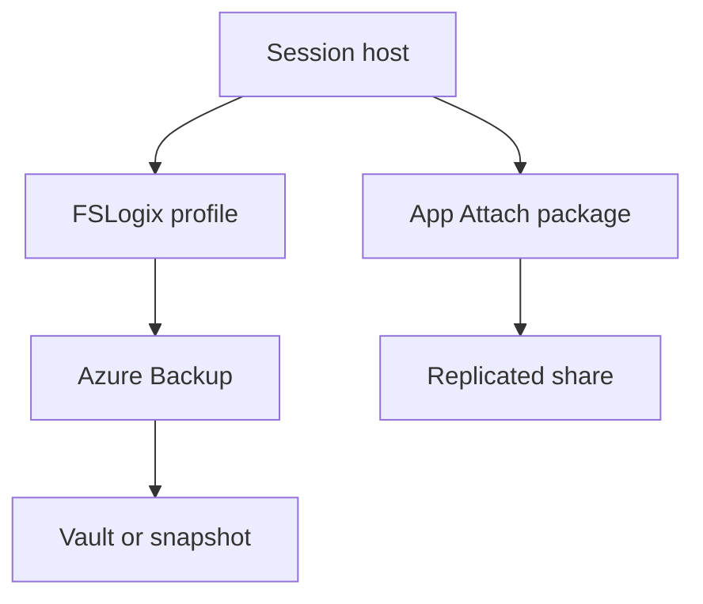

# Profiles and data

Level 300

Profiles are the user's personal desktop state. App Attach packages are the application state. Both must survive when disposable session hosts are rebuilt.

This diagram shows the profile and package protection path.

## Profiles and Azure Files

Profiles set the practical RPO. If a user profile is lost, the desktop may start but the user has lost productivity. Microsoft Learn recommends placing FSLogix containers in storage close to the session host VMs for optimal performance and says Azure Files Premium tier is the first recommended container storage option in the CAF BCDR recommendations [Business continuity and disaster recovery considerations for Azure Virtual Desktop](https://learn.microsoft.com/azure/cloud-adoption-framework/scenarios/azure-virtual-desktop/eslz-business-continuity-and-disaster-recovery#design-recommendations).

Azure Files redundancy choices are a trade-off between cost and availability. Use zone-redundant storage where zone failure resilience is required in-region. Use geo-redundant or geo-zone-redundant storage only where the file share type, performance tier and region support it. CAF notes that GRS is not available with Azure Files Premium tier or Standard tier when large file support is enabled [Business continuity and disaster recovery considerations for Azure Virtual Desktop](https://learn.microsoft.com/azure/cloud-adoption-framework/scenarios/azure-virtual-desktop/eslz-business-continuity-and-disaster-recovery#design-recommendations).

Azure Backup for Azure Files protects file shares with snapshot and vaulted backups. Microsoft states the service is a native cloud solution and that vaulted backup for Azure Files is generally available [About Azure Files backup](https://learn.microsoft.com/azure/backup/azure-file-share-backup-overview).

## FSLogix Cloud Cache

FSLogix Cloud Cache can replicate profile data across multiple locations [Business continuity and disaster recovery options for FSLogix](https://learn.microsoft.com/fslogix/concepts-container-recovery-business-continuity). CAF cautions that Cloud Cache does not improve sign-in and sign-out when storage is poor and is commonly slower than traditional `VHDLocations` with the same storage [Business continuity and disaster recovery considerations for Azure Virtual Desktop](https://learn.microsoft.com/azure/cloud-adoption-framework/scenarios/azure-virtual-desktop/eslz-business-continuity-and-disaster-recovery#design-considerations).

Use Cloud Cache only when profile availability requirements justify the trade-off. Good reasons include a hard requirement for region failure resilience, a storage option that cannot meet BCDR requirements, or a need to replicate between different storage types. Do not use Cloud Cache to hide an undersized or distant profile share.

## Under the hood

Level 400

Azure Files backup mechanics are policy-driven. Learn states that Azure Backup creates a Recovery Services vault, discovers storage accounts, lists file shares, stores their names in the management layer catalog, configures a backup policy with tier, schedule and retention, and then the Azure Backup scheduler triggers backups at the scheduled time [About Azure Files backup](https://learn.microsoft.com/azure/backup/azure-file-share-backup-overview).

For fast restores, Learn says Azure Files backup uses file share snapshots so you can restore selected files instantly. For stronger protection, vaulted backup stores backup data offsite and is generally available for Azure Files [About Azure Files backup](https://learn.microsoft.com/azure/backup/azure-file-share-backup-overview).

---

Part of [Business continuity](index.md).
