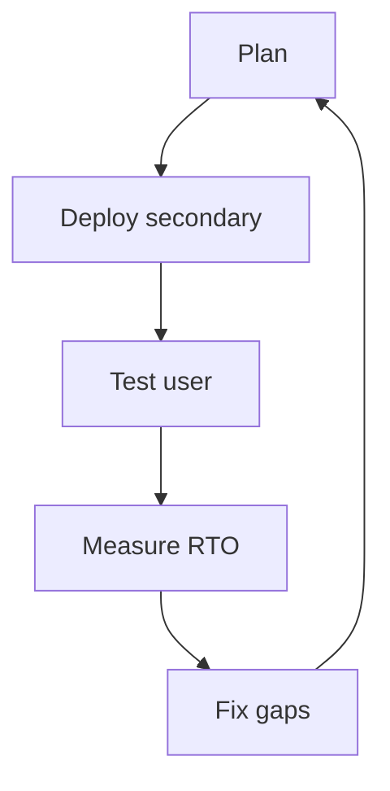

# Recovery objectives and testing

Level 300

Recovery objectives turn "we need it back" into measurable targets. Testing proves the targets before an outage does.

This diagram shows the test loop.

## RTO and RPO

| Layer | RTO consideration | RPO consideration |
| --- | --- | --- |
| Session hosts | Time to create capacity from image, apply Intune policy and register hosts | None, if hosts are stateless |
| Profiles | Time to mount the recovered or replicated file share | Last recoverable profile write |
| App Attach | Time to expose packages in the secondary region | Last replicated package version |
| Images | Time to deploy from the replicated image version | Last approved image version |
| Configuration | Time to deploy host pools, assignments, diagnostics and private endpoints from IaC | Last committed and tested IaC change |

## Testing failover

Test failover quarterly or after major platform changes:

1. Deploy or scale out the passive host pool from the replicated image.
2. Confirm Microsoft Entra join, Intune enrolment and Conditional Access behaviour.
3. Confirm FSLogix profile mount from the recovered or secondary storage path.
4. Confirm App Attach packages attach for a pilot user.
5. Assign a test user to the secondary application group.
6. Validate connection, latency, profile write-back and sign-out.
7. Revert assignments and scale down secondary capacity.

!!! tip

    Capture the image version, storage restore point, package version, policy state, elapsed time and any manual step that must be removed before production.

## Under the hood

Level 400

For image recovery tests, check Azure Compute Gallery replication before starting the failover exercise. Learn says image version replication time depends on the image size and the number of target regions, and recommends keeping the image small and source and target regions close for best results [Store and share images in an Azure Compute Gallery](https://learn.microsoft.com/azure/virtual-machines/shared-image-galleries).

For profile recovery tests, capture the Azure Files restore point used, whether the restore came from snapshot or vaulted backup, and the time from restore start to a successful FSLogix sign-in.

---

Part of [Business continuity](index.md).
