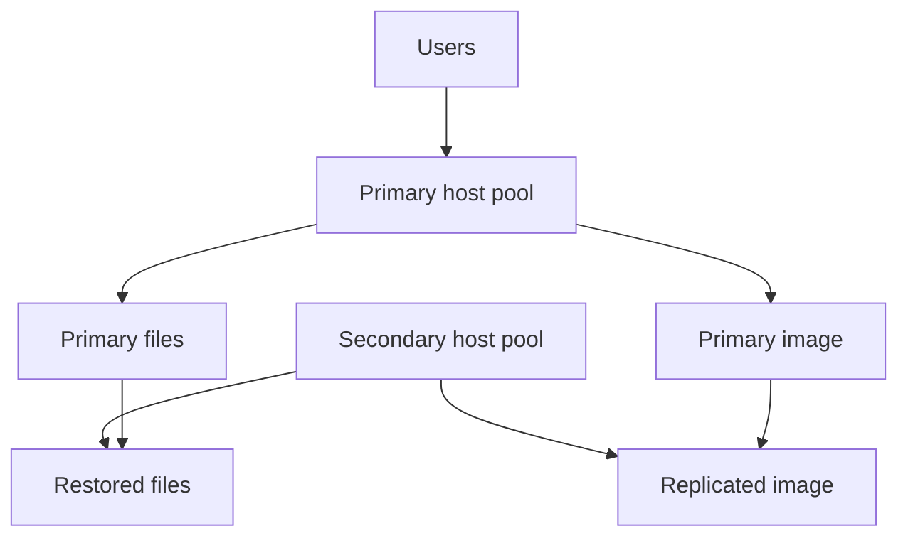

# Regional design

Level 300

Regional design decides where the service runs normally and where it can run during an outage. The North Star pattern is active-passive unless the recovery target requires warm capacity.

This diagram shows the active-passive pattern.

The Cloud Adoption Framework AVD business continuity guidance describes **active-active** and **active-passive** host pool models. It says active-active uses two host pools, one per region, and notes that active-active is limited to pooled host pools and is often complex with additional cost and management [Business continuity and disaster recovery considerations for Azure Virtual Desktop](https://learn.microsoft.com/azure/cloud-adoption-framework/scenarios/azure-virtual-desktop/eslz-business-continuity-and-disaster-recovery#design-considerations).

The same guidance says active-passive can use Azure Site Recovery or a secondary host pool, and its design recommendations state that for Azure Virtual Desktop host pool compute BCDR, use active-passive if it satisfies RPO and RTO [Business continuity and disaster recovery considerations for Azure Virtual Desktop](https://learn.microsoft.com/azure/cloud-adoption-framework/scenarios/azure-virtual-desktop/eslz-business-continuity-and-disaster-recovery#design-recommendations).

!!! warning "Deprecated CAF article"

    The CAF BCDR article currently carries a deprecation notice saying it is no longer being updated and will be removed on October 30, 2026. Use it for the design principles it contains, then validate against current Azure Architecture Center and product documentation.

Use active-passive:

1. Keep a secondary regional landing zone ready.
2. Replicate the image version to the secondary region.
3. Keep storage recovery ready through Azure Files redundancy, backup, restore or Cloud Cache where justified.
4. Keep application groups and user assignments defined as code.
5. Scale secondary capacity only during tests and failover unless RTO requires warm capacity.

For session host servicing, use image-based servicing for pooled Windows client multi-session hosts. Microsoft Learn states that for monthly security and quality updates on Windows client multi-session, **Session host update** and **Azure Compute Gallery** are recommended, and that image-based servicing through session host update is recommended for pooled AVD environments because it provides consistent host configuration, easier rollback and reduced impact to active user sessions [Windows update management methodologies for Azure Virtual Desktop session hosts](https://learn.microsoft.com/azure/virtual-desktop/windows-update-management-methodologies-session-hosts).

## Under the hood

Level 400

Regional host pools matter because the metadata location changes the failure domain. Learn states that Regional host pools store metadata in the selected Azure region instead of a geographical database shared across regions [What's new in Azure Virtual Desktop?](https://learn.microsoft.com/azure/virtual-desktop/whats-new). The Regional Host Pools article also states that regional and geographical objects have different deployment scopes and are not interoperable [Regional Host Pools](https://learn.microsoft.com/azure/virtual-desktop/regional-host-pools).

---

Part of [Business continuity](index.md).
