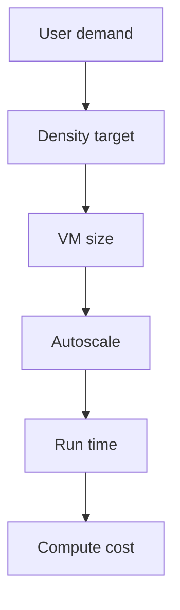

# Compute

Level 300

Compute cost is driven by how many session hosts exist, how large they are and how long they run. Use [Sizing estimates](../overview/sizing-estimates.md) for the shared sizing assumptions.

This diagram shows the compute cost loop.

## Host capacity

Session host compute is usually the dominant cost driver. The North Star design uses pooled Windows 11 Enterprise multi-session because a single VM can serve multiple concurrent users. Microsoft Learn sizing guidance separates workloads into light, medium, heavy and power categories and provides example VM families and minimum vCPU, RAM and profile container storage expectations [Session host virtual machine sizing guidelines for Azure Virtual Desktop and Remote Desktop Services](https://learn.microsoft.com/windows-server/remote/remote-desktop-services/session-host-virtual-machine-sizing-guidelines).

Right-sizing has two steps:

1. Pick an initial SKU and max session count from workload type, application behaviour and user concurrency.
2. Validate with Azure Virtual Desktop Insights, Azure Monitor and user experience data, then adjust.

Do not use average CPU alone. User experience is shaped by sign-in storms, profile mount time, storage latency, application launch, network round-trip time and graphics workload. Prove density before increasing session limits.

## Autoscale

Azure Virtual Desktop Autoscale has two methods. Microsoft Learn says **Power management autoscaling** powers session hosts on and off, while **Dynamic autoscaling** powers on and off and creates and deletes hosts. It also states Dynamic Autoscaling can only be used for pooled host pools with session host configuration [Autoscale scaling plans and example scenarios in Azure Virtual Desktop](https://learn.microsoft.com/azure/virtual-desktop/autoscale-scenarios). The June 2026 entry in [What's new in Azure Virtual Desktop?](https://learn.microsoft.com/azure/virtual-desktop/whats-new) states that **Automated Host Pools**, **Dynamic Autoscaling** and **Ephemeral OS Disks** are now available.

**Status:** Generally available for Power Management Autoscaling.  
**Status:** Generally available for Automated Host Pools, Dynamic Autoscaling and Ephemeral OS Disks, based on the June 2026 availability announcement in [What's new in Azure Virtual Desktop?](https://learn.microsoft.com/azure/virtual-desktop/whats-new).

Autoscale optimisation is about run time and capacity buffers:

- Use schedules that reflect real user waves.
- Keep enough spare capacity to avoid failed connections.
- Drain hosts before removal so user experience is protected.
- Keep the minimum host percentage low only if the image, profile share and application attach path can absorb the next ramp-up.

## Ephemeral OS disks

Ephemeral OS disks are created on local VM storage and are not saved to remote Azure Storage [Ephemeral OS disks for Azure VMs](https://learn.microsoft.com/azure/virtual-machines/ephemeral-os-disks). Learn states that with ephemeral OS disks you get lower read-write latency to the OS disk and faster VM reimage, and the OS disk incurs no storage cost [Ephemeral OS disks for Azure VMs](https://learn.microsoft.com/azure/virtual-machines/ephemeral-os-disks).

**Status:** Generally available for Azure VMs where the VM size and image meet the documented requirements.

The cost benefit is only safe if the host is stateless. Store user profiles in FSLogix, deliver applications through image and App Attach, and keep all host configuration in Intune, policy or code. If a session host contains unique state, ephemeral OS disks are the wrong model.

For update cost control, align pooled Windows client multi-session hosts to image-based servicing. Learn states that **Session host update** is recommended for monthly security and quality updates and feature updates on Windows client multi-session, and that image-based servicing creates a new image version, deploys updated hosts, then drains and removes the old hosts [Windows update management methodologies for Azure Virtual Desktop session hosts](https://learn.microsoft.com/azure/virtual-desktop/windows-update-management-methodologies-session-hosts). This fits disposable hosts and avoids long-lived patch drift.

## Under the hood

Level 400

Ephemeral OS disks affect both cost and operations. Learn states that the operating system is placed on the VM's local storage rather than remote storage and is not preserved in remote Azure Storage [Ephemeral OS disks on Azure Virtual Desktop](https://learn.microsoft.com/azure/virtual-desktop/deploy/session-hosts/ephemeral-os-disks). The VM cannot be treated as recoverable state. If the host breaks, reimage, restart or delete it, then recreate capacity from the image.

---

Part of [Cost optimisation](index.md).
