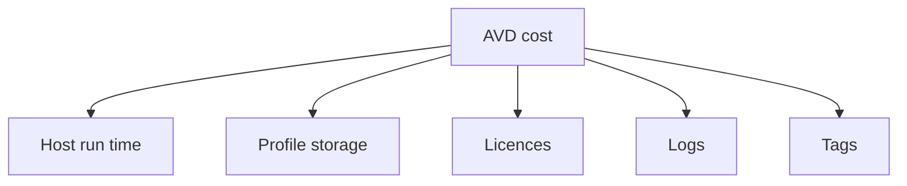
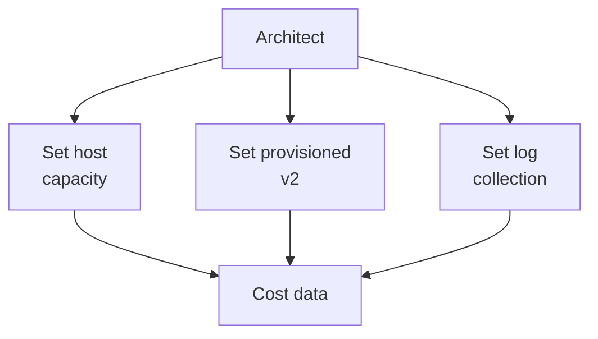

# Cost optimisation

!!! abstract "At a glance"

    - The largest cost lever is the number, size and run time of session hosts.
    - Ephemeral OS disks remove separate managed OS disk storage for pooled hosts, but they also mean hosts must be stateless and rebuildable.
    - Dynamic Autoscaling can create and delete hosts for pooled host pools with session host configuration, and the June 2026 Azure Virtual Desktop update says it is now available.
    - FSLogix profile cost is driven by Azure Files billing model, performance, redundancy and shard design.
    - Log Analytics cost is controlled by collecting only the diagnostics, counters and event logs that support operations.

## In plain terms

Level 100

Cost optimisation means paying for the desktop service people actually use, not for idle machines, unused storage or logs nobody reads. It is like running a building: you still need lights, lifts and security, but you switch off empty floors and meter shared services.

For Azure Virtual Desktop, the main cost choices are how many session hosts run, how large they are, how profiles are stored, how much telemetry is kept, and which baseline usage should be covered by commitments.

This diagram shows the main cost levers.

## What it is

Level 200

Cost optimisation is not a one-off right-sizing exercise. It is the operating model that keeps Azure Virtual Desktop capacity, storage, logging and licences aligned to real usage. The [North Star architecture](../overview/how-it-fits-together.md) optimises cost by using pooled Windows 11 Enterprise multi-session host pools, disposable ephemeral session hosts, Autoscale, Azure Image Builder, Azure Compute Gallery, App Attach, FSLogix on Azure Files and central monitoring.

Do not optimise by weakening the design. A host pool that cannot absorb logon storms, mount profiles or attach applications is not a saving. Optimise documented levers: host count, VM size, run time, OS disk model, profile storage, licence entitlement, logging and commitments.

## Cost levers

Level 300

Detailed sizing numbers are consolidated in [Sizing estimates](../overview/sizing-estimates.md). Use that page for density, profile input/output operations per second, bandwidth, subnet and quota assumptions instead of duplicating sizing tables here.

| Lever | What it changes | North Star setting | Learn link |
| --- | --- | --- | --- |
| Ephemeral OS disks | Removes the need to persist the OS disk in remote Azure Storage for session hosts | Use ephemeral OS disks for pooled, stateless session hosts | [Ephemeral OS disks for Azure VMs](https://learn.microsoft.com/azure/virtual-machines/ephemeral-os-disks) |
| Dynamic Autoscaling | Creates and deletes pooled session hosts to match demand | Use with session host configuration for disposable pooled hosts | [What's new in Azure Virtual Desktop?](https://learn.microsoft.com/azure/virtual-desktop/whats-new) |
| Power Management Autoscaling | Powers hosts on and off to reduce runtime | Use where dynamic create-delete is not acceptable | [Autoscale scaling plans and example scenarios in Azure Virtual Desktop](https://learn.microsoft.com/azure/virtual-desktop/autoscale-scenarios) |
| Multi-session density | Changes users per VM and therefore VM count | Size by workload type, then validate with monitoring | [Session host VM sizing guidelines](https://learn.microsoft.com/windows-server/remote/remote-desktop-services/session-host-virtual-machine-sizing-guidelines) |
| Azure savings plans and reservations | Reduces compute rate for committed baseline usage | Use only for predictable always-on baseline capacity | [Azure savings plan documentation](https://learn.microsoft.com/azure/cost-management-billing/savings-plan/) |
| AVD access licences | Avoids duplicate access licensing for eligible internal users | Use eligible Microsoft 365 or Windows licences for internal users | [Licensing Azure Virtual Desktop](https://learn.microsoft.com/azure/virtual-desktop/licensing) |
| Azure Files provisioned v2 | Separates provisioned storage, IOPS and throughput choices for file shares | Size profile shards by IOPS and capacity, not just user count | [Understand Azure Files billing](https://learn.microsoft.com/azure/storage/files/understanding-billing#provisioned-v2-model) |
| Log Analytics data volume | Changes ingestion and retention charges | Collect only AVD diagnostics and session host data needed for operations | [Azure Monitor Logs cost calculations and options](https://learn.microsoft.com/azure/azure-monitor/logs/cost-logs) |
| Tags and Cost Management | Allocates cost to environment, service, host pool and application | Enforce tags through IaC and policy | [Cost allocation with tags](https://learn.microsoft.com/azure/cost-management-billing/costs/enable-tag-inheritance) |

## Under the hood

Level 400

The cost model is a set of meters, not a single AVD price. Ephemeral OS disks place the operating system on local VM storage rather than remote storage, enabling non-persistence for session hosts [Ephemeral OS disks on Azure Virtual Desktop](https://learn.microsoft.com/azure/virtual-desktop/deploy/session-hosts/ephemeral-os-disks). Azure Files provisioned v2 lets you separately provision storage, input/output operations per second and throughput, and Learn states you pay based on what you provision regardless of how much you use [Understand Azure Files billing](https://learn.microsoft.com/azure/storage/files/understanding-billing#provisioned-v2-model).

This sequence shows how a cost decision becomes an Azure meter.

## Cost model checklist

| Area | Question |
| --- | --- |
| Users | How many concurrent users by workload type, not just named users? |
| Hosts | What is the max session count per SKU and where is the evidence? |
| Autoscale | What is the minimum floor, ramp schedule and acceptable wait time? |
| Profiles | What IOPS and throughput are needed at sign-in and steady state? |
| Images | How many image variants exist and why? |
| Applications | Which apps are in image, App Attach or web delivery? |
| Licences | Do users already hold eligible AVD access licences? |
| Monitoring | Which Log Analytics tables are required for operations and how long are they retained? |
| Commitments | What capacity is always on and therefore eligible for savings plans or reservations? |
| Tags | Can every monthly charge be attributed to a host pool, environment or shared platform service? |

## In this section

-   __[Compute](compute.md)__

    ---

    Host capacity and density, autoscale and ephemeral OS disks.

-   __[Licensing and storage](licensing-and-storage.md)__

    ---

    Licence entitlements for Azure Virtual Desktop, profile storage, images and applications.

-   __[Logging, commitments and tags](logging-and-commitments.md)__

    ---

    Controlling log volume, savings plans and reservations, and cost allocation tags.

## Common pitfalls

!!! warning "Do not average away peak demand"

    Average monthly utilisation can hide morning logon storms and application launch peaks. Size and autoscale for the peaks users feel.

!!! warning "Commitments can fight Autoscale"

    If you commit to capacity that Autoscale would otherwise remove, you may pay for a lower unit price on usage you no longer need. Commit only the measured baseline.

!!! warning "Profile storage is performance infrastructure"

    Choosing the cheapest file share can make sign-in slow for every user. Use the FSLogix and Azure Files guidance before reducing tier or redundancy.

## Microsoft Learn

- [Ephemeral OS disks for Azure VMs](https://learn.microsoft.com/azure/virtual-machines/ephemeral-os-disks)
- [Autoscale scaling plans and example scenarios in Azure Virtual Desktop](https://learn.microsoft.com/azure/virtual-desktop/autoscale-scenarios)
- [Create and assign an autoscale scaling plan for Azure Virtual Desktop](https://learn.microsoft.com/azure/virtual-desktop/autoscale-create-assign-scaling-plan)
- [Session host virtual machine sizing guidelines for Azure Virtual Desktop and Remote Desktop Services](https://learn.microsoft.com/windows-server/remote/remote-desktop-services/session-host-virtual-machine-sizing-guidelines)
- [Licensing Azure Virtual Desktop](https://learn.microsoft.com/azure/virtual-desktop/licensing)
- [Storage options for FSLogix profile containers in Azure Virtual Desktop](https://learn.microsoft.com/azure/virtual-desktop/store-fslogix-profile)
- [Understand Azure Files billing](https://learn.microsoft.com/azure/storage/files/understanding-billing)
- [Azure Monitor Logs cost calculations and options](https://learn.microsoft.com/azure/azure-monitor/logs/cost-logs)
- [Azure VM Image Builder overview](https://learn.microsoft.com/azure/virtual-machines/image-builder-overview)
- [App Attach in Azure Virtual Desktop](https://learn.microsoft.com/azure/virtual-desktop/app-attach-overview)
- [Group and allocate costs using tag inheritance](https://learn.microsoft.com/azure/cost-management-billing/costs/enable-tag-inheritance)
- [What's new in Azure Virtual Desktop?](https://learn.microsoft.com/azure/virtual-desktop/whats-new)
- [Windows update management methodologies for Azure Virtual Desktop session hosts](https://learn.microsoft.com/azure/virtual-desktop/windows-update-management-methodologies-session-hosts)
