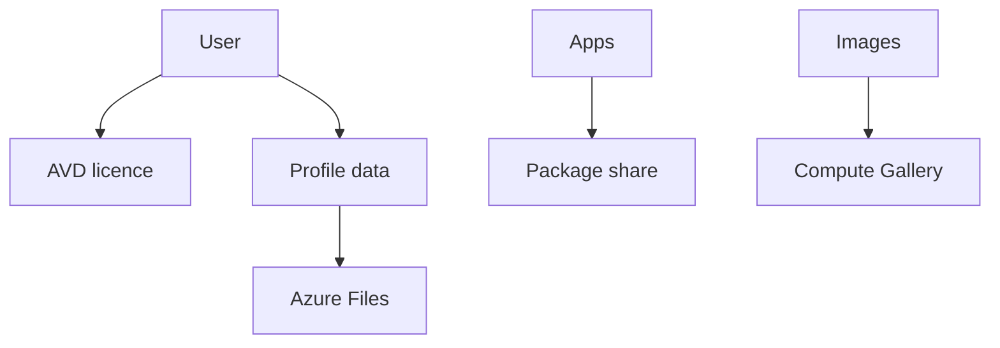

# Licensing and storage

Level 300

Licensing grants the right to use Azure Virtual Desktop. Storage pays for profiles, packages and images. They are separate cost lines and need separate controls.

This diagram shows the separation.

## Licensing

Azure Virtual Desktop requires an eligible licence for each user. For Windows 11 Enterprise multi-session, Learn lists these internal-use licences: **Microsoft 365 E3, E5, A3, A5, F3, Business Premium, Student Use Benefit**, **Windows Enterprise E3, E5**, **Windows Education A3, A5** and **Windows VDA per user** [Licensing Azure Virtual Desktop](https://learn.microsoft.com/azure/virtual-desktop/licensing).

**Status:** Generally available for eligible Azure Virtual Desktop access rights documented by Microsoft Learn.

Licensing does not remove Azure consumption. You still pay for compute, storage, networking and monitoring. Learn also states that per-user access pricing is for external commercial purposes and is not a way to enable external guest accounts for internal purposes [Licensing Azure Virtual Desktop](https://learn.microsoft.com/azure/virtual-desktop/licensing).

## Profile storage

FSLogix profile containers are the recommended user profile solution for Azure Virtual Desktop, and Microsoft recommends Azure Files for most customers [Storage options for FSLogix profile containers in Azure Virtual Desktop](https://learn.microsoft.com/azure/virtual-desktop/store-fslogix-profile). Profile storage cost is controlled by tier, redundancy, performance and sharding.

Azure Files has multiple billing models. Learn states that Azure Files deployment cost is determined by billing model, media tier, redundancy option and resource model [Understand Azure Files billing](https://learn.microsoft.com/azure/storage/files/understanding-billing). Under provisioned v2, plan storage, IOPS and throughput deliberately. The North Star design shards profile storage by IOPS so sign-in and sign-out storms do not overload one share.

Cost optimisation rules:

- Use Premium Azure Files for production profile shares that need consistent latency, as recommended for medium, heavy and power workloads in Learn [Storage options for FSLogix profile containers in Azure Virtual Desktop](https://learn.microsoft.com/azure/virtual-desktop/store-fslogix-profile).
- Shard by performance and operational blast radius.
- Pick redundancy based on BCDR requirements, not habit.
- Use Azure Backup and retention policies deliberately, because snapshots and vaulted backup protect data but also affect storage consumption.

## Images and applications

Azure VM Image Builder builds and distributes images from a configuration and can integrate with Azure Compute Gallery to distribute, replicate, version and scale images globally [Azure VM Image Builder overview](https://learn.microsoft.com/azure/virtual-machines/image-builder-overview). App Attach dynamically attaches application packages to user sessions so applications are not installed locally on session hosts or images [App Attach in Azure Virtual Desktop](https://learn.microsoft.com/azure/virtual-desktop/app-attach-overview).

**Status:** Generally available for Azure VM Image Builder in listed Azure regions except Learn marks USGov Arizona and USGov Virginia as public preview in the Image Builder region list [Azure VM Image Builder overview](https://learn.microsoft.com/azure/virtual-machines/image-builder-overview).  
**Status:** Generally available for App Attach in Azure Virtual Desktop. The App Attach article is not labelled preview; confirm regional and package-format support for your environment.

The cost effect is indirect but material. Smaller images rebuild faster and let Autoscale add capacity quickly. App Attach reduces image variants, but package storage and testing still need funding.

## Under the hood

Level 400

Azure Files provisioned v2 is a useful Level 400 cost lever because it separates the meters. Learn states that provisioned v2 lets you separately provision storage, input/output operations per second and throughput, and that the amount provisioned determines the bill [Understand Azure Files billing](https://learn.microsoft.com/azure/storage/files/understanding-billing#provisioned-v2-model). It also states that you can scale storage, IOPS and throughput up or down, but you can only decrease a provisioned quantity after 24 hours have elapsed since the last increase.

Do not duplicate sizing tables here. Use [Sizing estimates](../overview/sizing-estimates.md) to decide the profile IOPS, throughput and shard assumptions, then apply those values to provisioned v2.

---

Part of [Cost optimisation](index.md).
