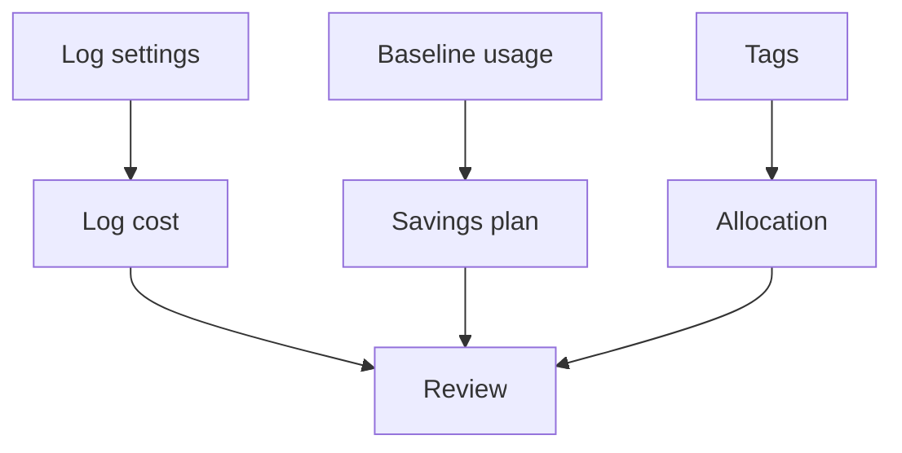

# Logging, commitments and tags

Level 300

Logging, commitments and tags are the finance controls. They decide what evidence you pay to keep, what baseline you commit to, and how the bill is allocated.

This diagram shows the control loop.

## Logging and monitoring cost

Azure Monitor Logs charges are typically driven by ingestion and retention in Log Analytics workspaces. Learn states that several Azure Monitor features have no direct cost but add to collected workspace data [Azure Monitor Logs cost calculations and options](https://learn.microsoft.com/azure/azure-monitor/logs/cost-logs). For Azure Virtual Desktop, start with the diagnostic categories and session host counters required by Azure Virtual Desktop Insights, then tune.

Practical controls:

- Keep AVD diagnostics in a dedicated workspace or clearly tagged shared workspace.
- Do not collect unrelated Windows event logs from session hosts unless they support an alert or investigation.
- Set retention by operational need and compliance requirement.
- Review ingestion by table after every monitoring change.

## Commitments and tags

Use Azure savings plans or reservations for the always-on baseline, not for the burst that Autoscale removes. Keep burst flexible until monitoring proves it is stable.

Use tags for cost allocation. Azure Cost Management supports cost allocation with tags, including tag inheritance settings documented by Microsoft [Group and allocate costs using tag inheritance](https://learn.microsoft.com/azure/cost-management-billing/costs/enable-tag-inheritance). At minimum, tag by environment, workload, host pool, application group, cost centre and data classification.

## Under the hood

Level 400

Azure Monitor Logs cost is mostly driven by ingestion and retention. Microsoft Learn states that several Azure Monitor features have no direct cost but add to workspace data [Azure Monitor Logs cost calculations and options](https://learn.microsoft.com/azure/azure-monitor/logs/cost-logs). For AVD, the practical Level 400 task is to review ingestion by table after every new diagnostic category, performance counter or event log source is enabled.

For commitments, do not use average host count alone. Separate the measured always-on floor from burst capacity. Use [Sizing estimates](../overview/sizing-estimates.md) for the density and concurrency assumptions that drive the baseline.

---

Part of [Cost optimisation](index.md).
