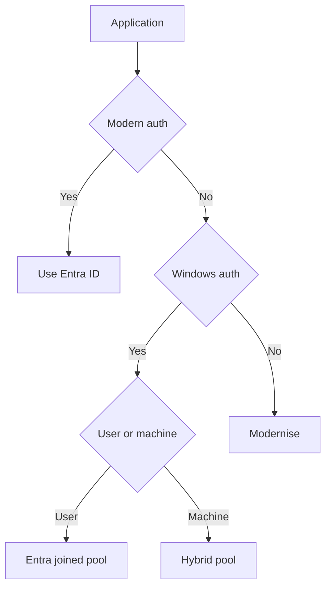
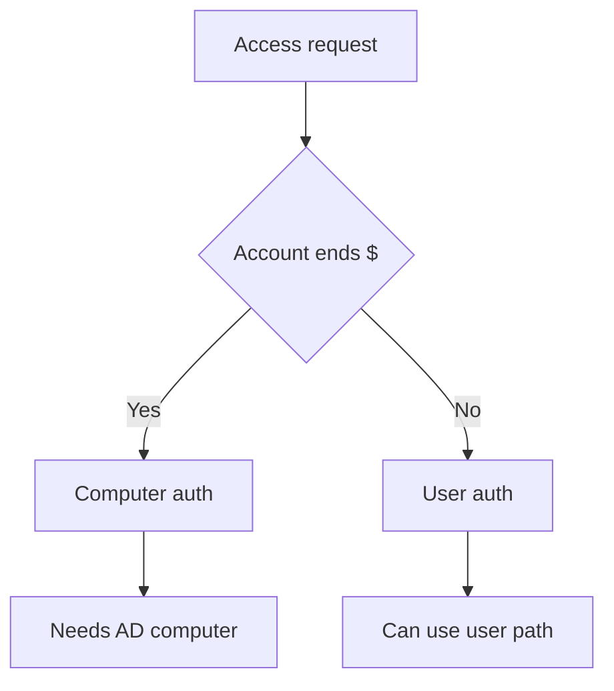

# How applications authenticate

!!! abstract "At a glance"
    - Modern applications usually use OpenID Connect, OAuth 2.0 or SAML with Microsoft Entra ID.
    - Legacy applications often use integrated Windows authentication through Kerberos or NTLM, Lightweight Directory Access Protocol bind, or forms authentication checked against AD DS.
    - User-based authentication can often work from Microsoft Entra joined session hosts when identities are synchronised and domain controllers are reachable.
    - Computer-based authentication needs an AD DS computer account, so it belongs in the hybrid joined stepping-stone pool until remediated.

## In plain terms

Level 100

When someone says "the app uses AD", ask a second question: does it authenticate the user, or does it authenticate the computer? A user-based app checks who the person is. A computer-based app checks whether the device itself is a trusted domain computer.

That difference decides the host pool. Microsoft Entra joined hosts have a Microsoft Entra device object but no AD DS computer object. Learn states that apps and resources depending on Active Directory machine authentication do not work on Microsoft Entra joined devices because those devices do not have a computer object in AD DS ([How SSO to on-premises resources works on Microsoft Entra joined devices](https://learn.microsoft.com/entra/identity/devices/device-sso-to-on-premises-resources)).

This diagram shows the supported user-based path and the blocked machine-authentication path.

1. The session host gets a partial Ticket Granting Ticket from Microsoft Entra ID, along with the Primary Refresh Token. Learn says this ticket *"includes the user's SID only, and no authorization data"*.
2. The session host contacts an on-premises domain controller, trades the partial Ticket Granting Ticket for a fully formed one, and then gets service tickets. For this, Learn says a Microsoft Entra joined session host *"must have a Kerberos server object for users to access on-premises resources, such as SMB shares and Windows-integrated authentication to websites"*.
3. The session host presents the service ticket, and the user reaches the file share or app. This needs line of sight to a domain controller.

The red dashed path is the one that doesn't work: machine authentication needs an AD DS computer account, and a Microsoft Entra joined host doesn't have one. Those apps go to a hybrid joined pool.

Those steps come from the Microsoft Entra passwordless on-premises article and the AVD SSO Kerberos server object requirement ([Enable passwordless security key sign-in to on-premises resources](https://learn.microsoft.com/entra/identity/authentication/howto-authentication-passwordless-security-key-on-premises#use-sso-to-sign-in-to-on-premises-resources-by-using-fido2-keys), [Configure single sign-on](https://learn.microsoft.com/azure/virtual-desktop/configure-single-sign-on#create-a-kerberos-server-object)).

## Modern versus legacy authentication

Level 200

| Type | Common protocols | What authenticates |
| --- | --- | --- |
| Modern | OpenID Connect, OAuth 2.0, SAML | The user or app through Microsoft Entra ID tokens. |
| Integrated Windows authentication | Kerberos or NTLM | The user or computer through AD DS. |
| Directory bind | Lightweight Directory Access Protocol | The bind account or user against a directory. |
| Forms or basic against AD DS | Application-specific form or basic credentials | The user, checked by the app against AD DS. |

For the North Star, prefer modern authentication where the application supports it. For web applications that still use integrated Windows authentication, Microsoft Entra application proxy can publish the app and use Kerberos Constrained Delegation for single sign-on. Learn says application proxy uses Kerberos Constrained Delegation to support on-premises applications that are secured with integrated Windows authentication and require a Kerberos ticket for access ([Kerberos Constrained Delegation for SSO to your apps with application proxy](https://learn.microsoft.com/entra/identity/app-proxy/how-to-configure-sso-with-kcd)).

This decision tree starts with what the application does today.

## User-based versus computer-based authentication

Level 300

User-based authentication uses the user's account. Examples include:

- A web app using Kerberos integrated Windows authentication for the signed-in user.
- A file share that checks the user's access control list entry.
- A legacy app that prompts for user credentials and validates them against AD DS.

Computer-based authentication uses the device account. Examples include:

- A Windows service running as **LocalSystem** or **NetworkService** accessing a network resource. Learn states that both accounts present the computer's credentials to remote servers ([LocalSystem Account](https://learn.microsoft.com/windows/win32/services/localsystem-account), [NetworkService Account](https://learn.microsoft.com/windows/win32/services/networkservice-account)).
- Group Policy, which targets domain computers.
- Computer certificates issued to AD DS computer objects.
- Access control lists that grant access to computer objects.

Group Managed Service Accounts are an option for services that need a managed domain identity. Learn says a group Managed Service Account provides automatic password management, simplified Service Principal Name management and a single identity solution for services running on a server farm ([Group Managed Service Accounts overview](https://learn.microsoft.com/windows-server/security/group-managed-service-accounts/group-managed-service-accounts-overview)).

## How to tell which one an application uses

Level 400

Use more than one signal. No single tool explains every application.

| Check | What to look for | Learn source |
| --- | --- | --- |
| Security event **4624** | **Account Name** ending in `$` usually indicates a computer account. **Package Name (NTLM only)** shows NTLM version for NTLM logons. | [4624(S): An account was successfully logged on](https://learn.microsoft.com/windows/security/threat-protection/auditing/event-4624), [Audit NTLMv1](https://learn.microsoft.com/troubleshoot/windows-server/windows-security/audit-domain-controller-ntlmv1) |
| Security event **4768** | A Kerberos Ticket Granting Ticket was requested. | [4768(S, F)](https://learn.microsoft.com/windows/security/threat-protection/auditing/event-4768) |
| Security event **4769** | A Kerberos service ticket was requested. Check the service name and account. | [4769(S, F)](https://learn.microsoft.com/windows/security/threat-protection/auditing/event-4769) |
| Security event **4776** | NTLM credential validation occurred. | [4776(S, F)](https://learn.microsoft.com/windows/security/threat-protection/auditing/event-4776) |
| `klist` | Lists currently cached Kerberos tickets. `klist -li 0x3e7` checks the local system logon session. | [klist](https://learn.microsoft.com/windows-server/administration/windows-commands/klist) |

The NetBIOS trap is common. Learn says applications running on a Microsoft Entra joined device must use the implicit UPN or NT4 syntax with the domain fully qualified domain name, for example **user@contoso.corp.com** or **contoso.corp.com\user**. If they use the NetBIOS or legacy name, such as **contoso\user**, the errors are **STATUS_BAD_VALIDATION_CLASS - 0xc00000a7** or **ERROR_BAD_VALIDATION_CLASS - 1348** ([How SSO to on-premises resources works on Microsoft Entra joined devices](https://learn.microsoft.com/entra/identity/devices/device-sso-to-on-premises-resources#what-you-should-know)).

## What works where

Level 300

| Application dependency | Entra joined | Entra joined plus Kerberos server object | Hybrid joined | AD DS joined |
| --- | --- | --- | --- | --- |
| Modern Entra ID auth | Yes | Yes | Yes | Yes, if user can reach Entra ID. |
| User Kerberos to AD DS resource | Needs line of sight and synchronised identity | Best fit when AVD SSO is enabled and AD DS exists | Yes | Yes |
| NTLM user authentication | Needs line of sight and synchronised identity | Test in pilot with AVD SSO enabled | Yes | Yes |
| Machine authentication | No | No | Yes | Yes |
| Group Policy computer settings | No | No | Yes | Yes |

With AVD single sign-on, Learn says users authenticate to Windows using a Microsoft Entra ID token, which enables passwordless authentication. Learn also says that if the session host is Microsoft Entra joined and the environment contains AD DS domain controllers, a Kerberos server object is required for users to access on-premises resources such as SMB shares and Windows-integrated authentication to websites ([Configure single sign-on](https://learn.microsoft.com/azure/virtual-desktop/configure-single-sign-on)). Learn does not provide a full NTLM-with-AVD-SSO compatibility matrix. Test NTLM applications in the pilot rather than assuming.

## Options

Level 300

1. **Keep the application on a hybrid joined pool.** Use this for machine authentication, Group Policy dependencies, computer certificates or applications that cannot use supported user-based formats.
2. **Make user-based Kerberos work.** Synchronise the required user attributes, provide line of sight to domain controllers, configure the Kerberos server object when AVD SSO is enabled, and test the Service Principal Name path.
3. **Modernise.** For web applications, consider Microsoft Entra application proxy with Kerberos Constrained Delegation. For services, consider group Managed Service Accounts. For new application work, prefer OpenID Connect or OAuth 2.0 with Microsoft Entra ID.

## Microsoft Learn

- [How SSO to on-premises resources works on Microsoft Entra joined devices](https://learn.microsoft.com/entra/identity/devices/device-sso-to-on-premises-resources)
- [Configure single sign-on for Azure Virtual Desktop using Microsoft Entra ID](https://learn.microsoft.com/azure/virtual-desktop/configure-single-sign-on)
- [LocalSystem Account](https://learn.microsoft.com/windows/win32/services/localsystem-account)
- [NetworkService Account](https://learn.microsoft.com/windows/win32/services/networkservice-account)
- [Group Managed Service Accounts overview](https://learn.microsoft.com/windows-server/security/group-managed-service-accounts/group-managed-service-accounts-overview)
- [Kerberos Constrained Delegation for SSO to your apps with application proxy](https://learn.microsoft.com/entra/identity/app-proxy/how-to-configure-sso-with-kcd)
- [klist](https://learn.microsoft.com/windows-server/administration/windows-commands/klist)
