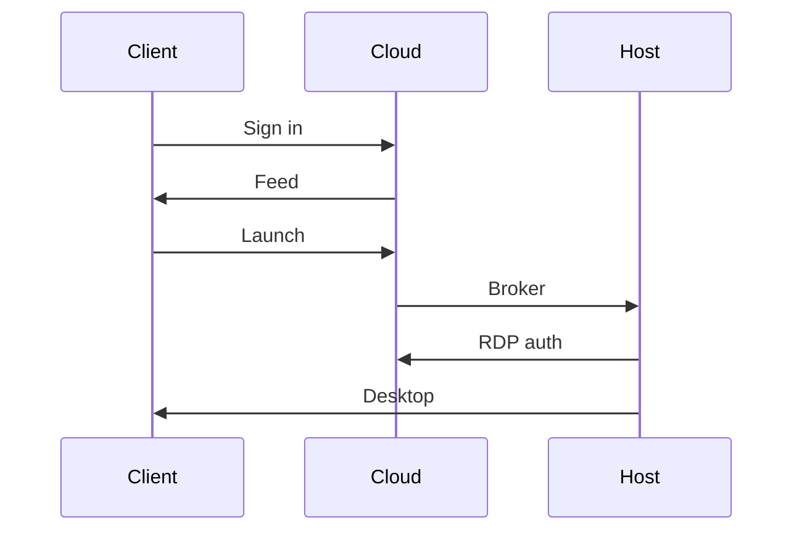
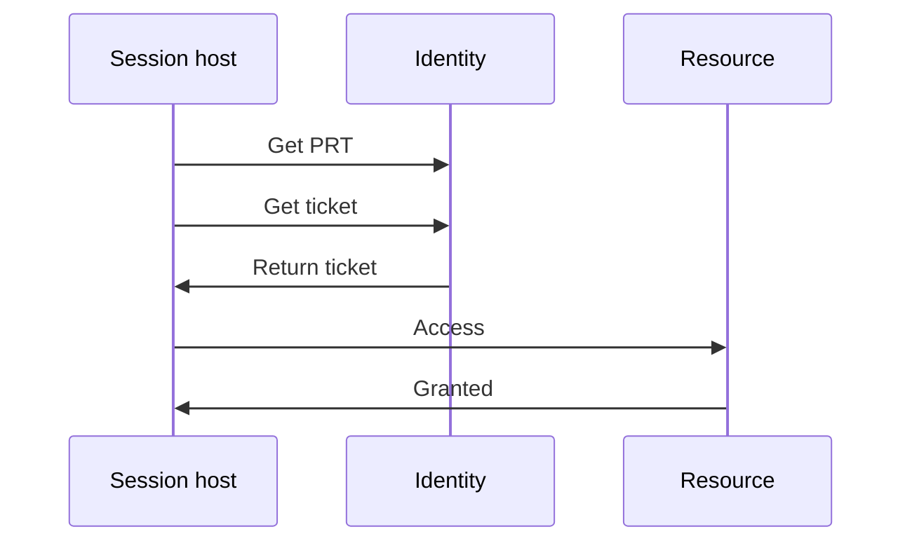
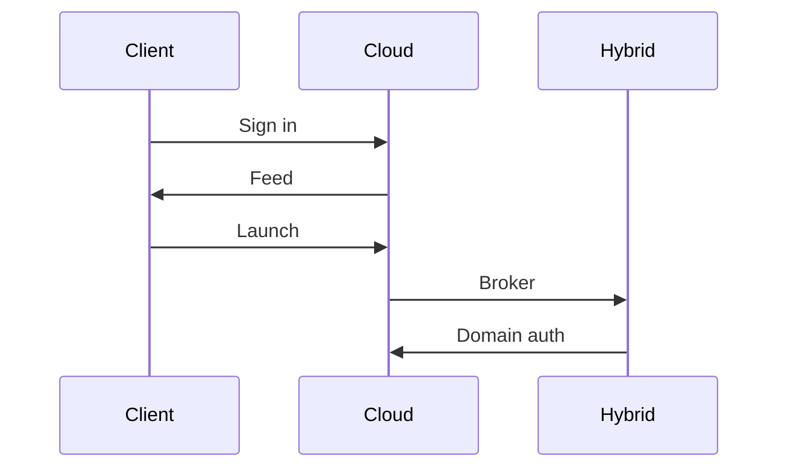

# An AVD sign-in, end to end

!!! abstract "At a glance"
    - The user authenticates to Microsoft Entra ID in the Azure Virtual Desktop client.
    - Conditional Access can target the Azure Virtual Desktop application and, when single sign-on is enabled, the Windows Cloud Login application.
    - With single sign-on, the session host sign-in uses Microsoft Entra authentication for RDP.
    - After sign-in, the session may need a Primary Refresh Token, Microsoft Entra Kerberos for FSLogix, and a Kerberos server object for on-premises resources.

## In plain terms

Level 100

An Azure Virtual Desktop sign-in is not one single sign-in. It is a chain. First the client proves the user to Microsoft Entra ID. Then Azure Virtual Desktop returns the workspace feed and brokers the connection. Then the user signs in to Windows on the session host. Then applications and file shares inside the session may need their own tickets or tokens.

The North Star makes that chain as cloud native as possible. Microsoft Learn says single sign-on for Azure Virtual Desktop using Microsoft Entra ID lets users authenticate to Windows with a Microsoft Entra ID token, enabling passwordless authentication and third-party identity providers that federate with Microsoft Entra ID ([Configure single sign-on](https://learn.microsoft.com/azure/virtual-desktop/configure-single-sign-on)).

## Microsoft Entra joined session host

Level 200

This is the North Star path for pooled session hosts.

1. The Azure Virtual Desktop client sends the user to Microsoft Entra ID.
2. Conditional Access evaluates the sign-in. Learn recommends targeting **Azure Virtual Desktop** and, when SSO is enabled, **Windows Cloud Login** ([Enforce MFA for Azure Virtual Desktop using Conditional Access](https://learn.microsoft.com/azure/virtual-desktop/set-up-mfa)).
3. The Azure Virtual Desktop service returns the feed of assigned resources.
4. The user launches a desktop or RemoteApp.
5. The broker selects a session host.
6. Windows Cloud Login handles the Microsoft Entra authentication for RDP.
7. The user signs in to Windows on the Microsoft Entra joined session host.

Microsoft Learn says that Microsoft Entra joined session hosts remove the need for line of sight to a domain controller for deployment and access, and can be enrolled in Intune ([Microsoft Entra joined session hosts](https://learn.microsoft.com/azure/virtual-desktop/azure-ad-joined-session-hosts)).

## Profiles and on-premises access

Level 300

After Windows sign-in, the session may need profile storage and application access.

1. The signed-in session can have a Primary Refresh Token for cloud SSO.
2. FSLogix on Azure Files can use Microsoft Entra Kerberos. Learn says Microsoft Entra ID issues the necessary Kerberos tickets to access Azure file shares by using SMB ([Enable Microsoft Entra Kerberos authentication for Azure Files](https://learn.microsoft.com/azure/storage/files/storage-files-identity-auth-hybrid-identities-enable)).
3. If AD DS resources are needed, the session host needs line of sight to domain controllers.
4. When AVD SSO is enabled and AD DS exists, a Kerberos server object is required for SMB shares and Windows-integrated authentication to websites ([Configure single sign-on](https://learn.microsoft.com/azure/virtual-desktop/configure-single-sign-on#create-a-kerberos-server-object)).
5. In the documented passwordless flow linked from that AVD article, Microsoft Entra ID generates a Ticket Granting Ticket that contains the user's SID only and no authorisation data, then the client trades that partial Ticket Granting Ticket with an on-premises domain controller for a fully formed Ticket Granting Ticket ([Enable passwordless security key sign-in to on-premises resources](https://learn.microsoft.com/entra/identity/authentication/howto-authentication-passwordless-security-key-on-premises#use-sso-to-sign-in-to-on-premises-resources-by-using-fido2-keys)).
6. User-based Kerberos can then reach supported on-premises resources.

Learn is explicit that accessing on-premises resources from Microsoft Entra joined VMs still requires Active Directory and line of sight to it ([Microsoft Entra joined session hosts](https://learn.microsoft.com/azure/virtual-desktop/azure-ad-joined-session-hosts#accessing-on-premises-resources)).

## Hybrid joined session host

Level 300

The stepping-stone pool uses Microsoft Entra hybrid joined session hosts for applications that need an AD DS computer account.

The high-level AVD feed and broker path is the same. The difference is the session host's machine identity. The host has an AD DS computer account and a Microsoft Entra device registration. Learn says Microsoft Entra hybrid joined devices are joined to on-premises Active Directory and registered with Microsoft Entra ID, and require periodic line of sight to domain controllers ([Microsoft Entra hybrid joined devices](https://learn.microsoft.com/entra/identity/devices/concept-hybrid-join)).

When single sign-on is enabled for hybrid joined AVD session hosts, Learn says a Kerberos server object is required to complete authentication to a domain controller. If it is missing, users can receive an error saying the session does not exist, or SSO can be skipped and a standard authentication dialog shown ([Configure single sign-on](https://learn.microsoft.com/azure/virtual-desktop/configure-single-sign-on#create-a-kerberos-server-object)).

## Comparison

Level 300

| Step | Entra joined North Star | Hybrid joined stepping stone |
| --- | --- | --- |
| Host object | Microsoft Entra device object | Microsoft Entra device object and AD DS computer object |
| Management | Intune | Group Policy, Configuration Manager and optionally Intune co-management |
| Domain controller for deployment | Not required | Required |
| Domain controller for on-premises resources | Required when those resources use AD DS | Required |
| Machine authentication | Not supported | Supported |
| Best fit | Pooled desktops and apps that do not need AD DS machine auth | Legacy applications that need domain-joined behaviour |

## Under the hood

Level 400

The RDP single sign-on switch is the host pool property **enablerdsaadauth:i:1**. Learn says in the Azure portal the equivalent setting is **Microsoft Entra single sign-on** set to **Connections will use Microsoft Entra authentication to provide single sign-on** ([Configure single sign-on](https://learn.microsoft.com/azure/virtual-desktop/configure-single-sign-on#configure-your-host-pool-to-enable-single-sign-on)).

For non-SSO legacy connection paths to Microsoft Entra joined session hosts, Learn documents **targetisaadjoined:i:1**. These connections are restricted to entering user name and password credentials when signing in to the session host ([Microsoft Entra joined session hosts](https://learn.microsoft.com/azure/virtual-desktop/azure-ad-joined-session-hosts#connect-using-legacy-authentication-protocols)).

Important things to test in a pilot:

- Conditional Access policies target both **Azure Virtual Desktop** and **Windows Cloud Login**.
- The Kerberos server object exists when AD DS resources exist.
- `dsregcmd /status` shows **AzureAdPrt**, and where relevant **OnPremTgt** and **CloudTgt**.
- FSLogix opens the Azure Files share using Microsoft Entra Kerberos.
- Legacy applications are tested for user Kerberos, NTLM and machine authentication separately.

## Microsoft Learn

- [Supported identities and authentication methods](https://learn.microsoft.com/azure/virtual-desktop/authentication)
- [Configure single sign-on for Azure Virtual Desktop using Microsoft Entra ID](https://learn.microsoft.com/azure/virtual-desktop/configure-single-sign-on)
- [Microsoft Entra joined session hosts in Azure Virtual Desktop](https://learn.microsoft.com/azure/virtual-desktop/azure-ad-joined-session-hosts)
- [Enforce MFA for Azure Virtual Desktop using Conditional Access](https://learn.microsoft.com/azure/virtual-desktop/set-up-mfa)
- [Enable Microsoft Entra Kerberos authentication for Azure Files](https://learn.microsoft.com/azure/storage/files/storage-files-identity-auth-hybrid-identities-enable)
