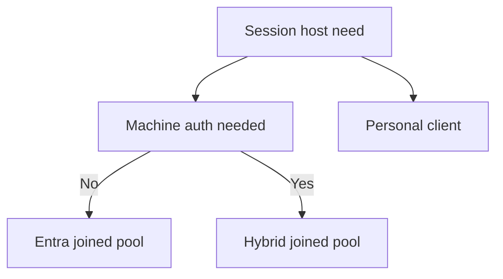
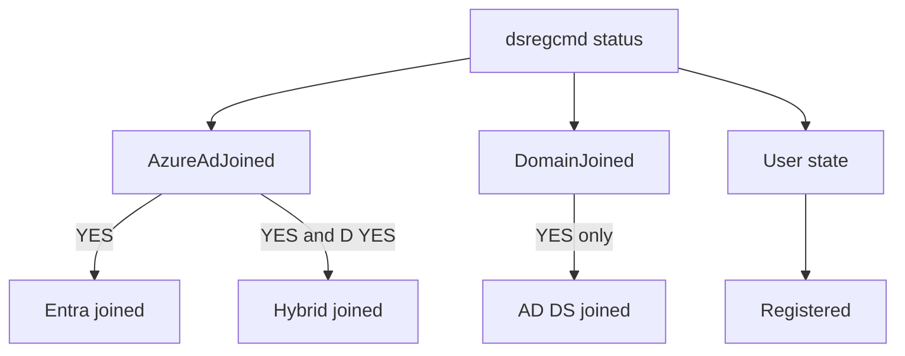

# Device join models

!!! abstract "At a glance"
    - Microsoft Entra registered is for a user bringing a personal or mobile device to access work resources.
    - Microsoft Entra joined is the North Star join model for pooled Azure Virtual Desktop session hosts.
    - Microsoft Entra hybrid joined is the stepping-stone model when a session host must also be AD DS joined.
    - AD DS joined gives the classic domain-joined machine identity but does not by itself give a Microsoft Entra device identity or Primary Refresh Token.

## In plain terms

Level 100

A device join model answers two simple questions: which directory knows this device, and what does the user receive at sign-in? In Azure Virtual Desktop, this decides whether the session host can be managed by Intune, whether it has an AD DS computer account, whether the user gets a Primary Refresh Token, and whether old applications can authenticate the machine.

This is why the North Star uses Microsoft Entra joined pooled hosts, but keeps a separate hybrid joined pool for legacy applications. Microsoft Learn says Microsoft Entra joined VMs remove the need for line of sight to a domain controller for deployment and access, while Microsoft Entra joined devices do not support applications that rely on on-premises machine authentication ([Microsoft Entra joined session hosts](https://learn.microsoft.com/azure/virtual-desktop/azure-ad-joined-session-hosts), [Device join plan](https://learn.microsoft.com/entra/identity/devices/device-join-plan#understand-considerations-for-applications-and-resources)).

This diagram compares the four join models.

## The four models

Level 200

| Model | Object exists in Microsoft Entra ID | Object exists in AD DS | Sign-in gets | AVD fit |
| --- | --- | --- | --- | --- |
| Microsoft Entra registered | Yes | No | Local device sign-in plus cloud SSO for work account | Client device pattern, not a session host pattern. |
| Microsoft Entra joined | Yes | No | Primary Refresh Token and cloud SSO | North Star pooled host pool. |
| Microsoft Entra hybrid joined | Yes | Yes | AD DS domain sign-in plus Microsoft Entra device registration and PRT | Stepping-stone host pool. |
| AD DS joined | No, unless separately registered | Yes | Kerberos or NTLM domain sign-in | Legacy-only pattern, not the North Star. |

Microsoft Learn says Microsoft Entra registered devices are registered to Microsoft Entra ID without requiring an organisational account to sign in to the device, and are commonly bring-your-own-device or mobile scenarios ([Microsoft Entra registered devices](https://learn.microsoft.com/entra/identity/devices/concept-device-registration)). Microsoft Entra joined devices are joined only to Microsoft Entra ID and use an organisational account to sign in to the device ([Microsoft Entra joined devices](https://learn.microsoft.com/entra/identity/devices/concept-directory-join)). Microsoft Entra hybrid joined devices are joined to on-premises Active Directory and registered with Microsoft Entra ID ([Microsoft Entra hybrid joined devices](https://learn.microsoft.com/entra/identity/devices/concept-hybrid-join)).

This flow shows how to choose the AVD host model.

## How each join happens

Level 300

### Microsoft Entra registered

1. The user signs in to Windows with local credentials or a personal account.
2. The user adds a work or school account through Settings or a work application.
3. Microsoft Entra ID creates a registered device object.
4. The organisation can use Conditional Access and Intune enrolment where configured.

Registered devices are useful for clients that launch Azure Virtual Desktop, not for pooled session hosts. They do not create an AD DS computer account.

### Microsoft Entra joined

1. The device joins Microsoft Entra ID during Out of Box Experience, Windows Autopilot, bulk enrolment, or another supported provisioning method.
2. Microsoft Entra ID creates a device object.
3. The user signs in with a Microsoft Entra account.
4. Windows obtains a Primary Refresh Token for SSO.
5. Intune can manage the device.

For AVD, Learn says selecting **Microsoft Entra ID** when creating or expanding a host pool can automatically enrol VMs with Intune, and host pools should contain VMs of the same domain join type ([Microsoft Entra joined session hosts](https://learn.microsoft.com/azure/virtual-desktop/azure-ad-joined-session-hosts#deploy-microsoft-entra-joined-vms)).

### Microsoft Entra hybrid joined

1. The device joins AD DS and receives an AD DS computer account.
2. Hybrid join registration creates the Microsoft Entra device identity.
3. The user signs in with an organisational account.
4. The device can use Group Policy and existing AD DS management, and can also participate in Microsoft Entra scenarios.
5. The device requires periodic line of sight to domain controllers.

Learn says Microsoft Entra hybrid joined devices require network line of sight to on-premises domain controllers periodically, and without this connection devices become unusable ([Microsoft Entra hybrid joined devices](https://learn.microsoft.com/entra/identity/devices/concept-hybrid-join)).

### AD DS joined

1. The device joins an Active Directory domain.
2. AD DS creates the computer account.
3. Users sign in with domain credentials.
4. Kerberos and NTLM are available according to domain policy.
5. Group Policy can manage the device.

This is the classic domain model. It is useful context for legacy applications, but the North Star uses Microsoft Entra joined hosts and the stepping stone uses Microsoft Entra hybrid joined hosts.

### Microsoft Entra Domain Services

Microsoft Entra Domain Services provides managed domain services such as domain join, Group Policy, Lightweight Directory Access Protocol and Kerberos or NTLM without deploying your own domain controllers ([What is Microsoft Entra Domain Services?](https://learn.microsoft.com/entra/identity/domain-services/overview)). It can be useful for some Azure-hosted legacy workloads. It is not a replacement for the North Star join model. For App Attach, Learn lists **Microsoft Entra Domain Services** as **Not supported** as an identity provider ([App Attach in Azure Virtual Desktop](https://learn.microsoft.com/azure/virtual-desktop/app-attach-overview#identity-provider)).

## Under the hood

Level 400

`dsregcmd /status` is the quickest way to prove the join state on a Windows session host. Learn says the **Device State** section uses these fields: **AzureAdJoined**, **EnterpriseJoined**, **DomainJoined** and **DomainName**. It also says Workplace Joined, which is Microsoft Entra registered, appears in the **User state** section ([Troubleshoot devices by using the dsregcmd command](https://learn.microsoft.com/entra/identity/devices/troubleshoot-device-dsregcmd#device-state)).

For the AVD North Star:

- **Microsoft Entra joined** is the default for pooled hosts.
- **Microsoft Entra hybrid joined** is the stepping-stone for applications needing AD DS computer identity.
- **AD DS joined** hosts are not the target state.
- **Microsoft Entra registered** describes user endpoint devices more than AVD session hosts.

## Microsoft Learn

- [What is a device identity?](https://learn.microsoft.com/entra/identity/devices/overview)
- [Microsoft Entra registered devices](https://learn.microsoft.com/entra/identity/devices/concept-device-registration)
- [Microsoft Entra joined devices](https://learn.microsoft.com/entra/identity/devices/concept-directory-join)
- [Microsoft Entra hybrid joined devices](https://learn.microsoft.com/entra/identity/devices/concept-hybrid-join)
- [Microsoft Entra joined session hosts in Azure Virtual Desktop](https://learn.microsoft.com/azure/virtual-desktop/azure-ad-joined-session-hosts)
- [App Attach in Azure Virtual Desktop](https://learn.microsoft.com/azure/virtual-desktop/app-attach-overview)
- [Troubleshoot devices by using the dsregcmd command](https://learn.microsoft.com/entra/identity/devices/troubleshoot-device-dsregcmd)
