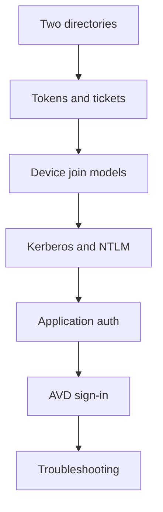
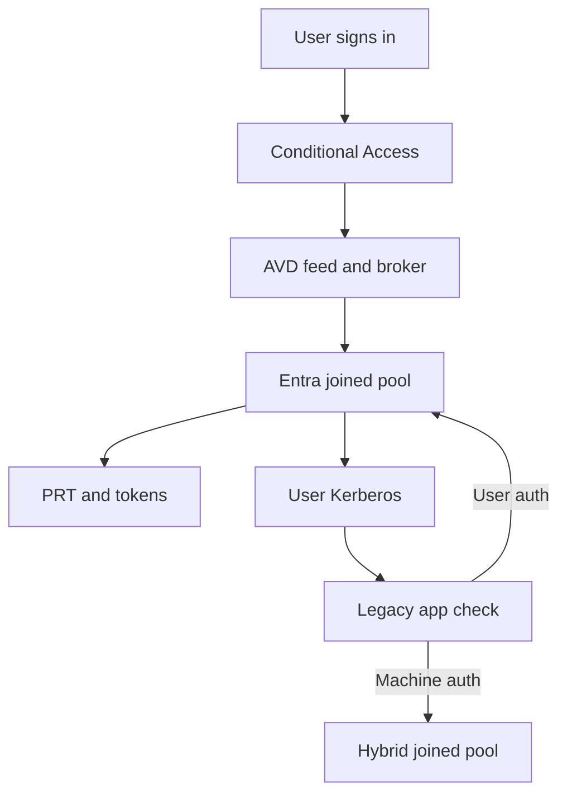

# Identity demystified

!!! abstract "At a glance"
    - Identity decides who can see an Azure Virtual Desktop resource, who can sign in to a session host, and what the user can access inside the session.
    - The North Star is pooled Azure Virtual Desktop on Microsoft Entra joined session hosts managed by Microsoft Intune.
    - Legacy applications that need Active Directory Domain Services machine authentication belong in a separate Microsoft Entra hybrid joined stepping-stone host pool.
    - This section starts at Level 100 and ends at Level 400, so you can read it as a primer or use it as a troubleshooting reference.

## In plain terms

Level 100

Think of identity as the set of passports, building passes and keys a person or device carries. Active Directory Domain Services is the older building-pass system. It knows about domain controllers, computer accounts, Kerberos, NTLM, Lightweight Directory Access Protocol and Group Policy. Microsoft Entra ID is the cloud identity system. It knows about cloud applications, Conditional Access, device objects, Microsoft Intune and tokens.

The North Star uses Microsoft Entra joined Azure Virtual Desktop session hosts because the pooled host layer should be cloud managed, short lived and policy driven. That does not make every old application modern. A legacy application can still need a domain controller, a Service Principal Name, an NTLM challenge, a Lightweight Directory Access Protocol bind, or even the computer account of the session host. The job of the architecture is to sort those dependencies, not hide them.

The one-paragraph version is this: users sign in to Azure Virtual Desktop with Microsoft Entra ID, the session host is Microsoft Entra joined and managed by Intune, the user receives cloud tokens for Microsoft Entra resources, and user-based Kerberos can still work for Active Directory resources when the environment has synchronised identities and line of sight to domain controllers. Applications that authenticate the computer, not the user, do not fit that pool and go to the hybrid joined stepping-stone pool until they are remediated. Microsoft Learn states that Microsoft Entra joined devices can use SSO to on-premises resources with line of sight and synchronised attributes, but applications that depend on Active Directory machine authentication do not work because the device has no AD DS computer object ([How SSO to on-premises resources works on Microsoft Entra joined devices](https://learn.microsoft.com/entra/identity/devices/device-sso-to-on-premises-resources), [Device join plan](https://learn.microsoft.com/entra/identity/devices/device-join-plan#understand-considerations-for-applications-and-resources)).

This map shows the recommended reading path.

## How the series is organised

Level 200

Start with the two identity systems, then learn the credentials they issue, then learn the device models that decide which credentials exist on a session host. After that, the protocol and application pages explain why some old applications work on a Microsoft Entra joined host and some do not.

| Question | Start here | Why |
| --- | --- | --- |
| What is the difference between AD DS and Microsoft Entra ID? | [Two directories](two-directories.md) | It separates directory, protocol and management responsibilities. |
| What is a ticket, and what is a token? | [Tokens and tickets](tokens-and-tickets.md) | It explains Kerberos tickets, NTLM challenge-response and Microsoft Entra tokens. |
| Which join model should an AVD host use? | [Device join models](device-join-models.md) | It compares registered, joined, hybrid joined and AD DS joined devices. |
| Does NTLM fall back to Kerberos? | [Kerberos, NTLM and Negotiate](kerberos-and-ntlm.md) | No. Negotiate tries Kerberos first and falls back to NTLM when needed. |
| Why does a legacy app fail on an Entra joined host? | [How applications authenticate](application-authentication.md) | It distinguishes user-based and computer-based authentication. |
| What actually happens during AVD sign-in? | [An AVD sign-in, end to end](avd-sign-in-end-to-end.md) | It follows the feed, broker, RDP sign-in, Primary Refresh Token and on-premises access path. |
| Which commands and events prove what happened? | [Troubleshooting toolkit](troubleshooting.md) | It lists `dsregcmd /status`, `klist`, event IDs and operational logs. |

## The levels

Level 300

Each page moves through the same depth:

| Level | What to expect |
| --- | --- |
| Level 100 | A plain-language explanation and the reason the North Star cares. |
| Level 200 | Component diagrams and step-by-step flows. |
| Level 300 | Design decisions, fit for Azure Virtual Desktop and known limitations. |
| Level 400 | Protocol details, exact settings, event IDs, command output fields and troubleshooting. |

The result is intentionally layered. You can stop at Level 200 if you only need the concept, or continue to Level 400 when you are validating a pilot.

## The whole picture

Level 400

This flow summarises how the North Star handles cloud sign-in and legacy dependencies.

1. The client signs in to Azure Virtual Desktop through Microsoft Entra ID.
2. Conditional Access evaluates the Azure Virtual Desktop app and, when single sign-on is enabled, the Windows Cloud Login app ([Enforce MFA for Azure Virtual Desktop using Conditional Access](https://learn.microsoft.com/azure/virtual-desktop/set-up-mfa)).
3. The broker connects the user to a Microsoft Entra joined session host in the North Star pool.
4. The Windows session can use Microsoft Entra tokens for cloud resources and, where configured, Kerberos for Azure Files and AD DS resources.
5. If an application needs an AD DS computer account or other domain-joined machine behaviour, route it to the hybrid joined stepping-stone pool.

## Microsoft Learn

- [What is a device identity?](https://learn.microsoft.com/entra/identity/devices/overview)
- [How SSO to on-premises resources works on Microsoft Entra joined devices](https://learn.microsoft.com/entra/identity/devices/device-sso-to-on-premises-resources)
- [Microsoft Entra joined session hosts in Azure Virtual Desktop](https://learn.microsoft.com/azure/virtual-desktop/azure-ad-joined-session-hosts)
- [Configure single sign-on for Azure Virtual Desktop using Microsoft Entra ID](https://learn.microsoft.com/azure/virtual-desktop/configure-single-sign-on)
- [Plan your Microsoft Entra join implementation](https://learn.microsoft.com/entra/identity/devices/device-join-plan)
