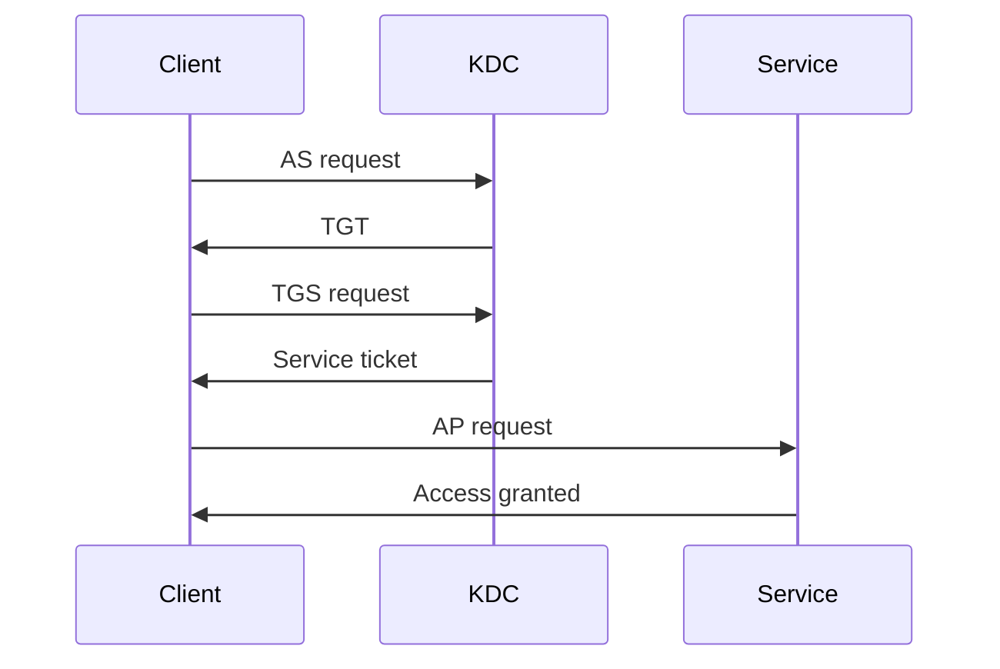
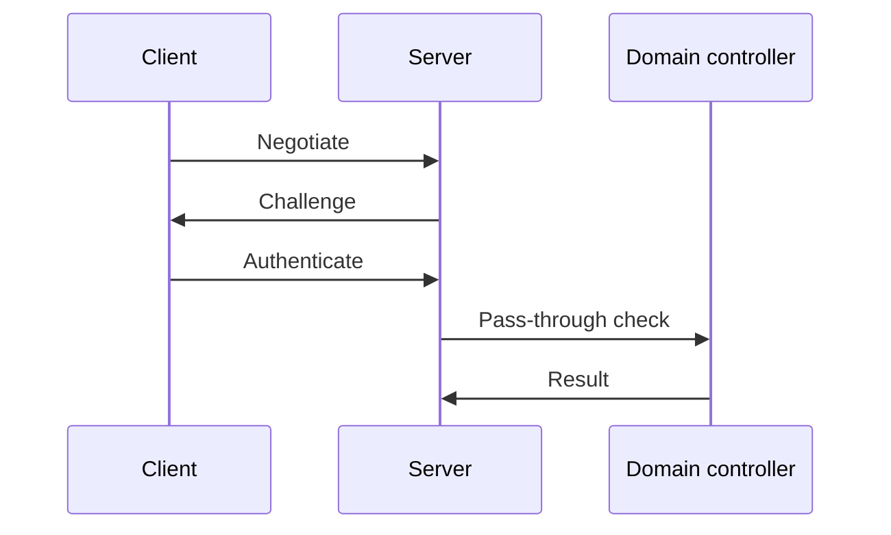
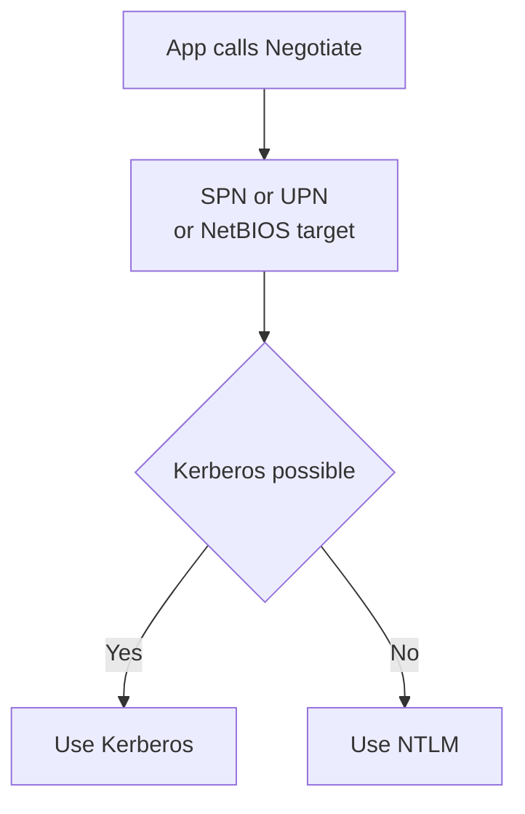
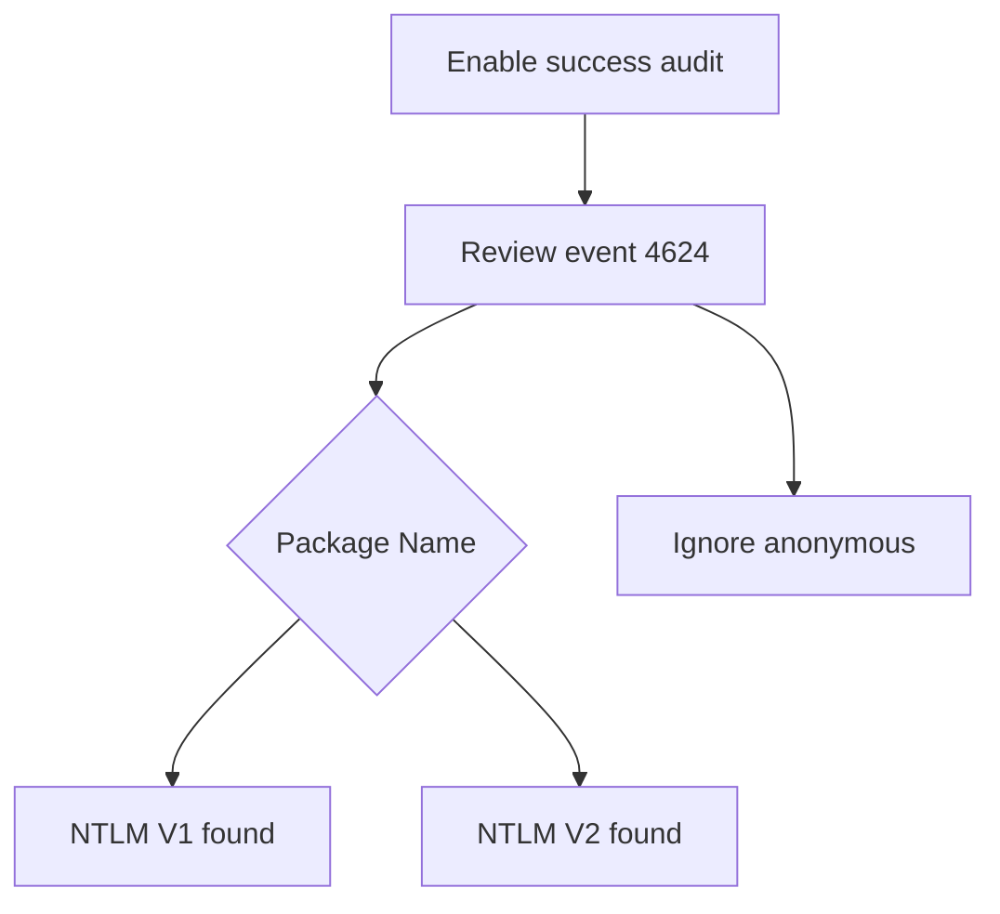

# Kerberos, NTLM and Negotiate

!!! abstract "At a glance"
    - Kerberos is preferred in Active Directory environments.
    - NTLM is challenge-response and is still supported, but NTLM as a family is deprecated and NTLMv1 is removed in Windows 11 version 24H2 and Windows Server 2025.
    - Negotiate tries Kerberos first and falls back to NTLM when Kerberos cannot be used or the application did not provide enough information.
    - Find NTLM and NTLMv1 use before moving legacy applications to the North Star pool.

## In plain terms

Level 100

Kerberos is the normal domain protocol you want. It asks a trusted Key Distribution Center for tickets and then uses those tickets to access services. NTLM is the fallback challenge-response protocol. It proves knowledge of a password-derived secret, but it does not provide the same modern properties as Kerberos.

The common wording trap is backwards. NTLM does not fall back to Kerberos. Negotiate tries Kerberos first and falls back to NTLM only when Kerberos cannot be used or the application did not provide enough information. Microsoft Learn says exactly that Negotiate selects Kerberos unless it cannot be used by one of the systems or the calling app did not provide sufficient information to use Kerberos ([Microsoft Negotiate](https://learn.microsoft.com/windows/win32/secauthn/microsoft-negotiate)).

## Kerberos step by step

Level 200

Kerberos has three parties: client, service and Key Distribution Center. In Windows domains, the Key Distribution Center runs on every domain controller and uses the Active Directory Domain Services database ([Kerberos authentication overview](https://learn.microsoft.com/windows-server/security/kerberos/kerberos-authentication-overview)).

1. **Authentication Service exchange.** The client proves the user's identity and receives a Ticket Granting Ticket.
2. **Ticket Granting Service exchange.** The client presents the Ticket Granting Ticket and asks for a ticket to a specific service.
3. **Application Protocol exchange.** The client presents the service ticket to the service.

Microsoft Learn documents those exchanges as **Authentication Service Exchange** with **KRB_AS_REQ** and **KRB_AS_REP**, **Ticket-Granting Service Exchange** with **KRB_TGS_REQ** and **KRB_TGS_REP**, and the client/server exchange with **KRB_AP_REQ** and **KRB_AP_REP** ([Authentication Service Exchange](https://learn.microsoft.com/windows/win32/secauthn/authentication-service-exchange), [Ticket-Granting Service Exchange](https://learn.microsoft.com/windows/win32/secauthn/ticket-granting-service-exchange), [Client/Server Exchange](https://learn.microsoft.com/windows/win32/secauthn/client-server-exchange)).

Kerberos normally needs:

- Line of sight to a domain controller.
- A service identity and Service Principal Name.
- A DNS name that lets the client target the service correctly.
- Time synchronisation. The **Maximum tolerance for computer clock synchronization** policy determines the maximum time difference in minutes that Kerberos V5 tolerates between the client clock and the domain controller clock. Learn says the default value in the Default Domain Policy is **5 minutes** ([Maximum tolerance for computer clock synchronization](https://learn.microsoft.com/previous-versions/windows/it-pro/windows-10/security/threat-protection/security-policy-settings/maximum-tolerance-for-computer-clock-synchronization)).
- A supported encryption type.

## NTLM step by step

Level 200

Microsoft Learn describes NTLM noninteractive authentication as a client, server and domain controller flow. The server creates an 8-byte random challenge, the client encrypts it using a hash of the user's password, and the domain controller compares the expected response with the client response ([Microsoft NTLM](https://learn.microsoft.com/windows/win32/secauthn/microsoft-ntlm)).

NTLM can authenticate a user or a computer. When the server is validating a domain account, it contacts a domain controller. Microsoft Learn's NTLM overview says a resource server must contact a domain authentication service on a domain controller when the account is a domain account, or look up the account locally when it is a local account ([NTLM overview](https://learn.microsoft.com/windows-server/security/kerberos/ntlm-overview)).

## NTLMv1 versus NTLMv2

Level 300

| Version | What happens | Why it matters |
| --- | --- | --- |
| NTLMv1 | Older LAN Manager and NTLM response formats can be sent depending on policy. | Removed from Windows 11 version 24H2 and Windows Server 2025. |
| NTLMv2 | Uses NTLMv2 response and, where negotiated, NTLMv2 session security. | Still works, but NTLM as a family is deprecated. |

The policy that controls this is **Network security: LAN Manager authentication level**. Learn states that in Active Directory domains, Kerberos is the default authentication protocol, but if Kerberos is not negotiated, Active Directory uses LM, NTLM or NTLMv2 ([Network security: LAN Manager authentication level](https://learn.microsoft.com/windows/security/threat-protection/security-policy-settings/network-security-lan-manager-authentication-level)).

| Registry level | Policy value | What Learn says it does |
| --- | --- | --- |
| 0 | Send LM & NTLM responses | Clients use LM and NTLM authentication, never use NTLMv2 session security, and domain controllers accept LM, NTLM and NTLMv2. |
| 1 | Send LM & NTLM - use NTLMv2 session security if negotiated | Clients use LM and NTLM authentication, use NTLMv2 session security if the server supports it, and domain controllers accept LM, NTLM and NTLMv2. |
| 2 | Send NTLM response only | Clients use NTLMv1 authentication, use NTLMv2 session security if the server supports it, and domain controllers accept LM, NTLM and NTLMv2. |
| 3 | Send NTLMv2 response only | Clients use NTLMv2 authentication, use NTLMv2 session security if the server supports it, and domain controllers accept LM, NTLM and NTLMv2. |
| 4 | Send NTLMv2 response only. Refuse LM | Clients use NTLMv2 authentication, use NTLMv2 session security if the server supports it, and domain controllers refuse LM while accepting NTLM and NTLMv2. |
| 5 | Send NTLMv2 response only. Refuse LM & NTLM | Clients use NTLMv2 authentication, use NTLMv2 session security if the server supports it, and domain controllers refuse LM and NTLM while accepting only NTLMv2. |

The policy path is **Computer Configuration\Windows Settings\Security Settings\Local Policies\Security Options** and the registry location is **HKLM\System\CurrentControlSet\Control\Lsa\LmCompatibilityLevel** ([Network security: LAN Manager authentication level](https://learn.microsoft.com/windows/security/threat-protection/security-policy-settings/network-security-lan-manager-authentication-level)).

## Negotiate

Level 300

Negotiate is the application layer between Security Support Provider Interface and the security packages. It selects between Kerberos and NTLM. The important rule is Kerberos first, NTLM fallback.

Microsoft Learn documents the fallback reasons:

- Kerberos cannot be used by one of the systems involved in authentication.
- The calling application did not provide sufficient information to use Kerberos.

To let Negotiate select Kerberos, the client application must provide a Service Principal Name, a User Principal Name or a NetBIOS account name as the target name. Otherwise, Negotiate always selects NTLM ([Microsoft Negotiate](https://learn.microsoft.com/windows/win32/secauthn/microsoft-negotiate)).

## Status and removal

Level 400

For Windows client, Learn says: *"All versions of NTLM, including LANMAN, NTLMv1, and NTLMv2, are no longer under active feature development and are deprecated."* It also says: *"NTLMv1 is removed starting in Windows 11, version 24H2 and Windows Server 2025"* ([Deprecated features for Windows client](https://learn.microsoft.com/windows/whats-new/deprecated-features), [Features and functionality removed in Windows client](https://learn.microsoft.com/windows/whats-new/removed-features)).

For Windows Server 2025, Learn says: *"NTLMv1 is removed. LANMAN and NTLMv2 are no longer under active feature development and are deprecated. NTLMv2 will continue to work but will be removed from Windows Server in a future release."* ([Features removed or no longer developed in Windows Server](https://learn.microsoft.com/windows-server/get-started/removed-deprecated-features-windows-server)).

## How to find NTLM and NTLMv1 use

Level 400

To find NTLMv1, Learn says to enable Logon Success Auditing on the domain controller, then review Security event **4624**. The field **Package Name (NTLM only)** shows the version, for example **NTLM V1** ([Audit use of NTLMv1 on a Windows Server-based domain controller](https://learn.microsoft.com/troubleshoot/windows-server/windows-security/audit-domain-controller-ntlmv1)).

Learn also warns that anonymous sessions are logged as NTLMv1 because no key material exists, so the general recommendation is to ignore the event for protocol usage information when the event is logged for **ANONYMOUS LOGON** ([Audit use of NTLMv1 on a Windows Server-based domain controller](https://learn.microsoft.com/troubleshoot/windows-server/windows-security/audit-domain-controller-ntlmv1)).

Use these logs together:

| Evidence | What it tells you | Learn source |
| --- | --- | --- |
| Security event **4624** | A logon session was created, including **Package Name (NTLM only)** for NTLM. | [4624(S): An account was successfully logged on](https://learn.microsoft.com/windows/security/threat-protection/auditing/event-4624) |
| Security event **4768** | A Kerberos Ticket Granting Ticket was requested. | [4768(S, F)](https://learn.microsoft.com/windows/security/threat-protection/auditing/event-4768) |
| Security event **4769** | A Kerberos service ticket was requested. | [4769(S, F)](https://learn.microsoft.com/windows/security/threat-protection/auditing/event-4769) |
| Security event **4776** | A computer attempted to validate credentials using NTLM. | [4776(S, F)](https://learn.microsoft.com/windows/security/threat-protection/auditing/event-4776) |

## Microsoft Learn

- [Kerberos authentication overview in Windows Server](https://learn.microsoft.com/windows-server/security/kerberos/kerberos-authentication-overview)
- [NTLM overview](https://learn.microsoft.com/windows-server/security/kerberos/ntlm-overview)
- [Microsoft NTLM](https://learn.microsoft.com/windows/win32/secauthn/microsoft-ntlm)
- [Microsoft Negotiate](https://learn.microsoft.com/windows/win32/secauthn/microsoft-negotiate)
- [Network security: LAN Manager authentication level](https://learn.microsoft.com/windows/security/threat-protection/security-policy-settings/network-security-lan-manager-authentication-level)
- [Audit use of NTLMv1 on a Windows Server-based domain controller](https://learn.microsoft.com/troubleshoot/windows-server/windows-security/audit-domain-controller-ntlmv1)
- [Features and functionality removed in Windows client](https://learn.microsoft.com/windows/whats-new/removed-features)
- [Deprecated features for Windows client](https://learn.microsoft.com/windows/whats-new/deprecated-features)
- [Features removed or no longer developed in Windows Server](https://learn.microsoft.com/windows-server/get-started/removed-deprecated-features-windows-server)
