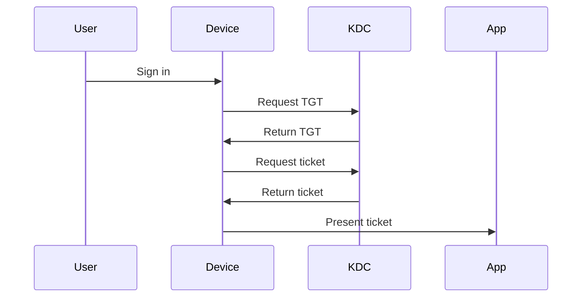
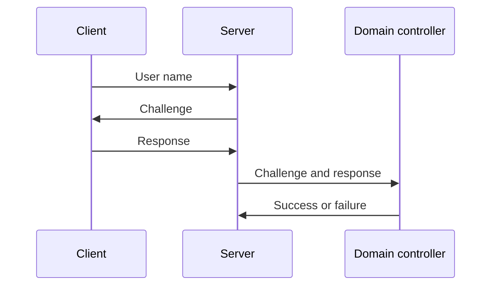
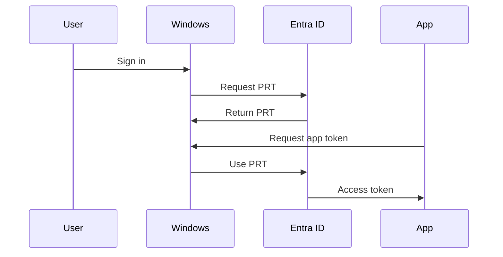
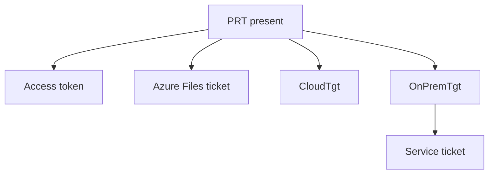

# Tokens and tickets

!!! abstract "At a glance"
    - Kerberos uses tickets. A Ticket Granting Ticket gets service tickets, and service tickets are presented to services.
    - NTLM does not issue a reusable ticket. It proves knowledge of a password hash through challenge-response.
    - Microsoft Entra ID uses a Primary Refresh Token on supported devices, then access tokens, ID tokens and refresh tokens for applications.
    - Microsoft Entra Kerberos bridges some file and on-premises access scenarios, but it does not turn a Microsoft Entra joined device into an AD DS joined device.

## In plain terms

Level 100

Kerberos tickets are like stamped passes. You prove who you are once to a trusted authority, then use tickets to reach specific services without typing your password again. Microsoft Entra tokens are like cloud passes. They let applications know who you are, what tenant issued the sign-in, and what access the application can use.

NTLM is different. It is more like a challenge at the door. The server sends a challenge, the client calculates a response using password-derived material, and a domain controller validates the response. Microsoft Learn describes NTLM as an encrypted challenge-response protocol that authenticates without sending the password over the wire ([Microsoft NTLM](https://learn.microsoft.com/windows/win32/secauthn/microsoft-ntlm)).

This diagram shows the different credentials a Microsoft Entra joined session host can use.

1. Sign-in gets a Primary Refresh Token from Microsoft Entra ID. Where a Kerberos server object exists, it also gets a partial Ticket Granting Ticket for the on-premises domain.
2. The Primary Refresh Token gets access tokens, which cloud apps such as Microsoft 365 accept.
3. Microsoft Entra Kerberos issues the ticket for the Azure Files profile share.
4. A domain controller trades the partial Ticket Granting Ticket for a full Ticket Granting Ticket.
5. The full Ticket Granting Ticket gets service tickets for on-premises apps and file shares.

Steps 1 and 4 follow the flow Learn documents for Microsoft Entra Kerberos and on-premises resources: *"Microsoft Entra ID generates a Kerberos TGT for the user's on-premises Active Directory domain"*, and the client *"trades the partial TGT for a fully formed TGT"* at a domain controller ([Passwordless sign-in to on-premises resources](https://learn.microsoft.com/entra/identity/authentication/howto-authentication-passwordless-security-key-on-premises)).

## Kerberos tickets

Level 200

Microsoft Learn says Kerberos has three parties: the client, the service and the Key Distribution Center. In Windows domains, the Key Distribution Center runs on every domain controller and uses the Active Directory Domain Services database as its account database ([Kerberos authentication overview](https://learn.microsoft.com/windows-server/security/kerberos/kerberos-authentication-overview)).

| Kerberos item | What it does |
| --- | --- |
| Ticket Granting Ticket | Lets the client request access to services without presenting the password again. |
| Service ticket | Lets the client authenticate to a specific service. |
| Privilege Attribute Certificate | Carries Windows authorisation data in a Kerberos ticket. Learn notes a server usually does not contact a domain controller unless it needs to validate the PAC. |

The important design point is that Kerberos is user or computer authentication to a specific service. The service normally has a Service Principal Name. If the application does not provide enough target information, Negotiate cannot choose Kerberos and selects NTLM instead ([Microsoft Negotiate](https://learn.microsoft.com/windows/win32/secauthn/microsoft-negotiate)).

## NTLM challenge-response

Level 300

NTLM proves that the client can calculate a response to a server challenge. It does not hand the client a reusable Kerberos-style service ticket. Learn describes the noninteractive flow as client, server and domain controller: the server sends an 8-byte challenge, the client returns a response, and the domain controller compares its own calculation with the client's response ([Microsoft NTLM](https://learn.microsoft.com/windows/win32/secauthn/microsoft-ntlm)).

NTLM can authenticate users and computers. That is why a service running as LocalSystem or NetworkService can present the computer's credentials on the network. Microsoft Learn states that LocalSystem has extensive local privileges and acts as the computer on the network, and that NetworkService has minimum local privileges and also acts as the computer on the network ([LocalSystem Account](https://learn.microsoft.com/windows/win32/services/localsystem-account), [NetworkService Account](https://learn.microsoft.com/windows/win32/services/networkservice-account)).

## Primary Refresh Token and OAuth tokens

Level 300

A Primary Refresh Token is a secure Microsoft Entra authentication artefact issued to Microsoft first-party token brokers to enable single sign-on across applications on supported devices. Learn says that once issued, a Primary Refresh Token is valid for 90 days and is continuously renewed while the user actively uses the device. On Windows, the Microsoft Entra CloudAP plugin renews the Primary Refresh Token every 4 hours during Windows sign-in, and the Web Account Manager plugin can renew it during application token requests ([Understanding Primary Refresh Token](https://learn.microsoft.com/entra/identity/devices/concept-primary-refresh-token)).

In OAuth and OpenID Connect terms:

| Token | Purpose |
| --- | --- |
| Primary Refresh Token | Device SSO artefact used by Windows token brokers. |
| Access token | Presented to an application programming interface. |
| ID token | Tells a client application who signed in. |
| Refresh token | Lets an application obtain new tokens according to policy. |

Use lifetimes only where Learn documents them for the scenario. This page uses the documented Primary Refresh Token lifetime and renewal behaviour above, and does not invent access-token or refresh-token lifetimes.

## Under the hood

Level 400

Microsoft Entra Kerberos appears in two different AVD-adjacent patterns:

| Pattern | What Learn says | Design note |
| --- | --- | --- |
| Azure Files for FSLogix | Microsoft Entra ID issues the Kerberos tickets needed to access Azure file shares over SMB. For cloud-only users, Azure Files no longer needs a domain controller for authorisation or authentication. | Used by the North Star profile pattern. |
| On-premises resources with a Kerberos server object | In the documented passwordless flow, Microsoft Entra ID generates a Kerberos Ticket Granting Ticket for the user's on-premises AD DS domain. The Ticket Granting Ticket includes the user's SID only and no authorisation data, and the client trades that partial Ticket Granting Ticket with an on-premises domain controller for a fully formed Ticket Granting Ticket. | Used for passwordless access paths and on-premises resource access validation. AVD SSO also requires a Kerberos server object when a Microsoft Entra joined session host needs AD DS resources. |

For Azure Files, Learn states that Microsoft Entra Kerberos authentication over SMB requires enabling the client setting **Kerberos/CloudKerberosTicketRetrievalEnabled**, and on Azure Virtual Desktop multi-session devices you should configure it through the Intune Settings Catalog rather than OMA-URI ([Enable Microsoft Entra Kerberos authentication for Azure Files](https://learn.microsoft.com/azure/storage/files/storage-files-identity-auth-hybrid-identities-enable#configure-the-clients-to-retrieve-kerberos-tickets)).

For on-premises resources, Learn documents the partial Ticket Granting Ticket exchange in the passwordless article, and the AVD single sign-on article says a Microsoft Entra joined session host must have a Kerberos server object for users to access on-premises resources such as SMB shares and Windows-integrated authentication to websites ([Enable passwordless security key sign-in to on-premises resources](https://learn.microsoft.com/entra/identity/authentication/howto-authentication-passwordless-security-key-on-premises#use-sso-to-sign-in-to-on-premises-resources-by-using-fido2-keys), [Configure single sign-on](https://learn.microsoft.com/azure/virtual-desktop/configure-single-sign-on#create-a-kerberos-server-object)).

For diagnostics, Learn says `dsregcmd /status` reports **OnPremTgt** as *YES* when a Cloud Kerberos ticket to access on-premises resources is present, and **CloudTgt** as *YES* when a Cloud Kerberos ticket to access cloud resources is present ([Troubleshoot devices by using the dsregcmd command](https://learn.microsoft.com/entra/identity/devices/troubleshoot-device-dsregcmd#sso-state)).

Microsoft Entra Kerberos for Azure Files has limits. Learn states that Kerberos tickets can include a maximum of 1,010 Security Identifiers for groups. If the combined on-premises and cloud group Security Identifiers exceed 1,010, the Kerberos ticket cannot be issued ([Enable Microsoft Entra Kerberos authentication for Azure Files](https://learn.microsoft.com/azure/storage/files/storage-files-identity-auth-hybrid-identities-enable#limitations-and-considerations)).

## Microsoft Learn

- [Kerberos authentication overview in Windows Server](https://learn.microsoft.com/windows-server/security/kerberos/kerberos-authentication-overview)
- [Microsoft NTLM](https://learn.microsoft.com/windows/win32/secauthn/microsoft-ntlm)
- [Microsoft Negotiate](https://learn.microsoft.com/windows/win32/secauthn/microsoft-negotiate)
- [Understanding Primary Refresh Token](https://learn.microsoft.com/entra/identity/devices/concept-primary-refresh-token)
- [Enable Microsoft Entra Kerberos authentication for Azure Files](https://learn.microsoft.com/azure/storage/files/storage-files-identity-auth-hybrid-identities-enable)
- [Troubleshoot devices by using the dsregcmd command](https://learn.microsoft.com/entra/identity/devices/troubleshoot-device-dsregcmd)
