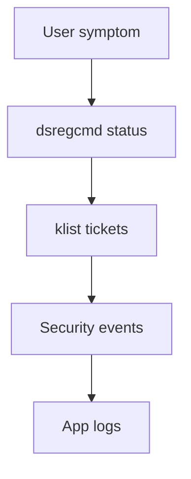
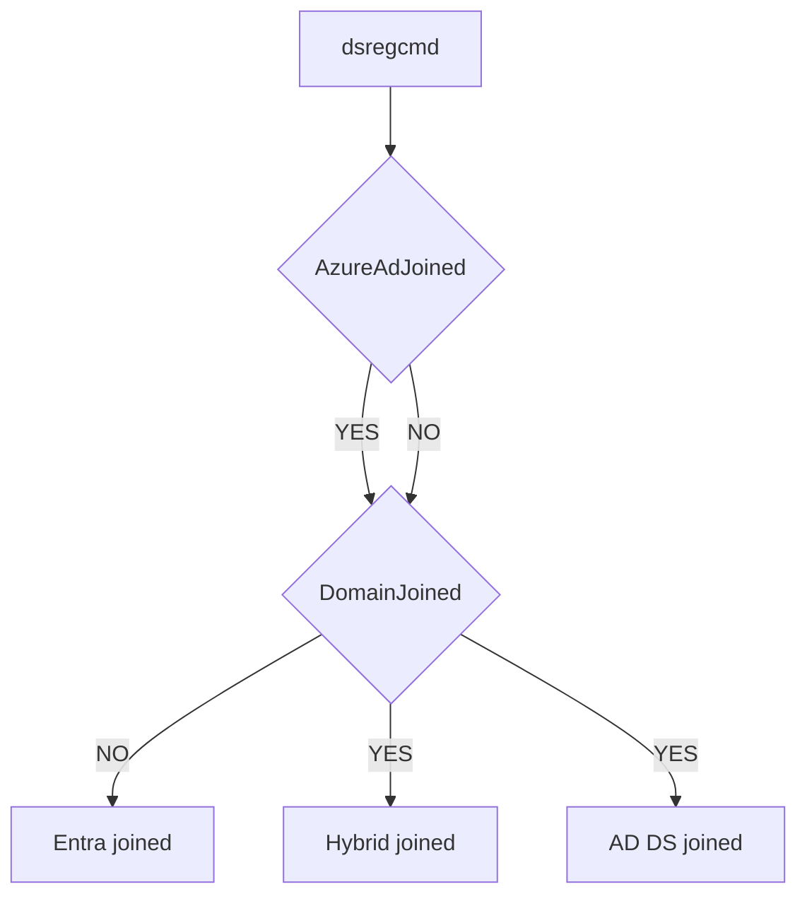
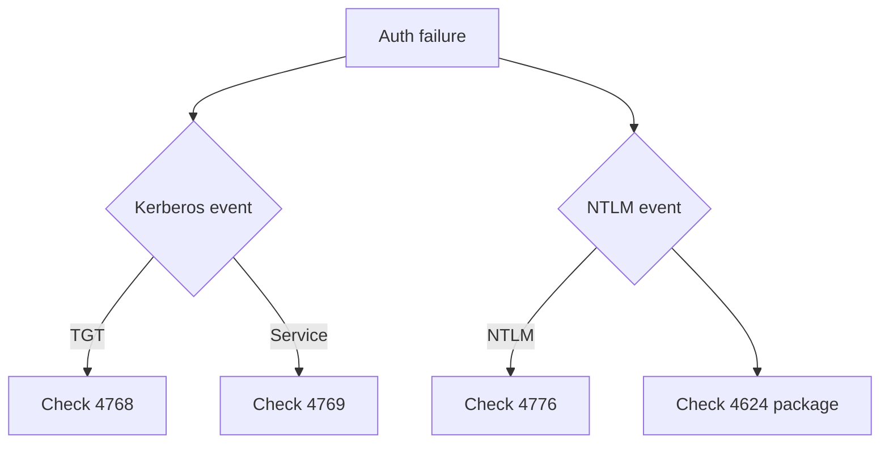

# Troubleshooting toolkit

!!! abstract "At a glance"
    - Use `dsregcmd /status` to prove join state, Primary Refresh Token state and cloud Kerberos state.
    - Use `klist` to prove Kerberos tickets and specific service ticket requests.
    - Use Security events **4624**, **4768**, **4769** and **4776** to separate logon, Kerberos and NTLM evidence.
    - Use symptoms only as clues. Prove the identity path with command output and logs.

## In plain terms

Level 100

Identity troubleshooting is detective work. The user's error message is the clue, not the conclusion. You need to prove which directory the device is joined to, whether the user has a Primary Refresh Token, whether Kerberos tickets exist, and whether the application used Kerberos, NTLM or machine authentication.

This page is the Level 400 toolbox for the rest of the demystified section.

## First triage

Level 200

Start with the device and session state before you inspect the application.

1. Run `dsregcmd /status` in the user's context.
2. Check join state, **AzureAdPrt**, **OnPremTgt** and **CloudTgt**.
3. Use `klist` to confirm user Kerberos tickets.
4. Use `klist -li 0x3e7` for the local system logon session when testing computer-account behaviour.
5. Check domain controller and server Security events.

## `dsregcmd /status`

Level 300

Microsoft Learn says `dsregcmd /status` explains the state of devices in Microsoft Entra ID and should be run as a domain user account. It also says the command must run in a user context to retrieve that user's valid SSO status ([Troubleshoot devices by using the dsregcmd command](https://learn.microsoft.com/entra/identity/devices/troubleshoot-device-dsregcmd)).

| Field | Meaning |
| --- | --- |
| **AzureAdJoined** | **YES** if the device is joined to Microsoft Entra ID. |
| **DomainJoined** | **YES** if the device is joined to an Active Directory domain. |
| **DomainName** | Domain name when domain joined. |
| **DeviceAuthStatus** | Health check for the device in Microsoft Entra ID. |
| **AzureAdPrt** | **YES** if a Primary Refresh Token is present for the logged-in user. |
| **AzureAdPrtUpdateTime** | UTC time when the Primary Refresh Token was last updated. |
| **AzureAdPrtExpiryTime** | UTC time when the Primary Refresh Token will expire if not renewed. |
| **OnPremTgt** | **YES** if a Cloud Kerberos ticket to access on-premises resources is present. |
| **CloudTgt** | **YES** if a Cloud Kerberos ticket to access cloud resources is present. |

This flow shows how to read the join fields.

## `klist`

Level 300

Microsoft Learn says `klist` displays currently cached Kerberos tickets. Useful commands include ([klist](https://learn.microsoft.com/windows-server/administration/windows-commands/klist)):

| Command | Use |
| --- | --- |
| `klist` | Lists tickets for the current signed-in user. |
| `klist tgt` | Shows the initial Kerberos Ticket Granting Ticket. |
| `klist get host/%computername%` | Requests a ticket for a specific Service Principal Name. |
| `klist sessions` | Lists logon sessions on the computer. |
| `klist -li 0x3e7` | Checks tickets in the local system logon session. |
| `klist purge` | Deletes tickets in the current logon session. |
| `klist purge -li 0x3e7` | Deletes tickets in the local system logon session. |

Use the local system session when investigating a service running as LocalSystem or NetworkService, because those accounts present the computer's credentials to remote servers ([LocalSystem Account](https://learn.microsoft.com/windows/win32/services/localsystem-account), [NetworkService Account](https://learn.microsoft.com/windows/win32/services/networkservice-account)).

## Events

Level 400

| Event ID | Log | What it proves |
| --- | --- | --- |
| **4624** | Security | A logon session was created. For NTLM, check **Package Name (NTLM only)**. |
| **4768** | Security on domain controller | A Kerberos authentication ticket, or Ticket Granting Ticket, was requested. |
| **4769** | Security on domain controller | A Kerberos service ticket was requested. |
| **4776** | Security on credential authority | The computer attempted to validate credentials using NTLM authentication. |

Learn describes event **4776** as generating every time credential validation occurs using NTLM authentication, and says that for domain accounts the domain controller is authoritative ([4776(S, F)](https://learn.microsoft.com/windows/security/threat-protection/auditing/event-4776)).

For NTLMv1 discovery, Learn says to enable Logon Success Auditing on the domain controller and review event **4624** for **Package Name (NTLM only)**. It also says to ignore events logged for **ANONYMOUS LOGON** for security protocol usage information because anonymous sessions are logged as NTLMv1 when no key material exists ([Audit use of NTLMv1 on a Windows Server-based domain controller](https://learn.microsoft.com/troubleshoot/windows-server/windows-security/audit-domain-controller-ntlmv1)).

## Microsoft Entra operational logs

Level 400

For Microsoft Entra device join and Primary Refresh Token issues, start with `dsregcmd /status` and its diagnostic fields. Learn documents **AcquirePrtDiagnostics**, **Previous Prt Attempt**, **Attempt Status**, **User Identity**, **Credential Type**, **Correlation ID**, **Endpoint URI**, **HTTP Method**, **HTTP Error**, **HTTP Status**, **Server Error Code** and **Server Error Description** in the SSO state section ([Troubleshoot devices by using the dsregcmd command](https://learn.microsoft.com/entra/identity/devices/troubleshoot-device-dsregcmd#sso-state)).

On Windows, also check Event Viewer under **Applications and Services Logs** > **Microsoft** > **Windows** > **AAD**. Learn says the **Operational** and **Analytic** child nodes appear there, that the Microsoft Entra Cloud Authentication Provider plug-in writes error events to **Operational** logs and information events to **Analytic** logs, and that both are needed for Primary Refresh Token troubleshooting ([Troubleshoot primary refresh token issues on Windows devices](https://learn.microsoft.com/entra/identity/devices/troubleshoot-primary-refresh-token#troubleshooting-checklist)). Use the `dsregcmd` correlation values to line up the event log with the failing sign-in.

## Symptom table

Level 400

| Symptom | Likely cause | Check |
| --- | --- | --- |
| User sees repeated sign-in prompts to AVD session host | SSO not enabled, Conditional Access targeting mismatch, or Kerberos server object missing for hybrid or AD DS resource scenario | Check **enablerdsaadauth:i:1**, **Windows Cloud Login** Conditional Access, and Kerberos server object. |
| `AzureAdPrt : NO` | User has no Primary Refresh Token | Run `dsregcmd /status` in user context and read **AcquirePrtDiagnostics**. |
| `OnPremTgt : NO` where on-premises SSO is expected | Cloud Kerberos path not present | Check Kerberos server object, line of sight, Cloud Kerberos policy and domain sync. |
| App works on domain joined host but fails on Entra joined host | Machine authentication or NetBIOS `DOMAIN\user` trap | Check event account names ending in `$`, and test UPN or FQDN NT4 syntax. |
| Event **4624** shows **NTLM V1** | NTLMv1 dependency, unless anonymous | Ignore **ANONYMOUS LOGON** for protocol usage, then identify the source workstation and app. |
| Event **4776** on domain controller | NTLM validation occurred | Correlate with server, workstation and application log. |
| Event **4769** missing for app access | Kerberos service ticket not requested | Check Service Principal Name, DNS name and whether Negotiate selected NTLM. |

## Microsoft Learn

- [Troubleshoot devices by using the dsregcmd command](https://learn.microsoft.com/entra/identity/devices/troubleshoot-device-dsregcmd)
- [klist](https://learn.microsoft.com/windows-server/administration/windows-commands/klist)
- [4624(S): An account was successfully logged on](https://learn.microsoft.com/windows/security/threat-protection/auditing/event-4624)
- [4768(S, F): A Kerberos authentication ticket was requested](https://learn.microsoft.com/windows/security/threat-protection/auditing/event-4768)
- [4769(S, F): A Kerberos service ticket was requested](https://learn.microsoft.com/windows/security/threat-protection/auditing/event-4769)
- [4776(S, F): The computer attempted to validate the credentials for an account](https://learn.microsoft.com/windows/security/threat-protection/auditing/event-4776)
- [Audit use of NTLMv1 on a Windows Server-based domain controller](https://learn.microsoft.com/troubleshoot/windows-server/windows-security/audit-domain-controller-ntlmv1)
- [Troubleshoot primary refresh token issues on Windows devices](https://learn.microsoft.com/entra/identity/devices/troubleshoot-primary-refresh-token)
