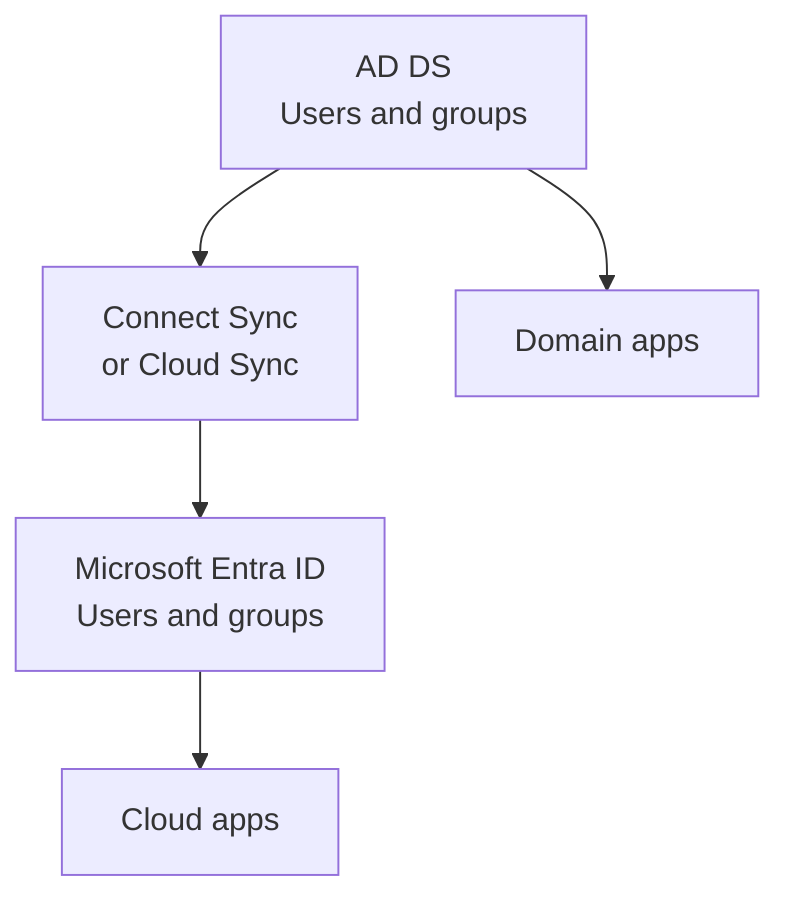
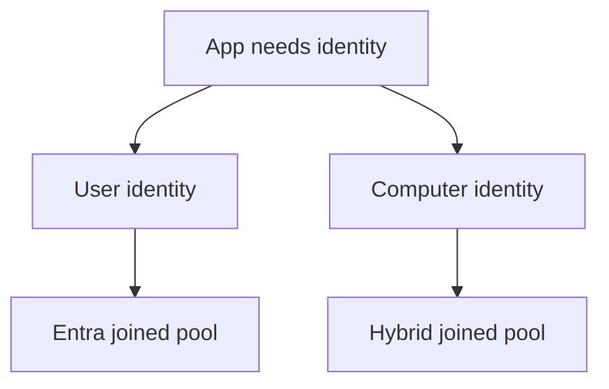

# Two directories: Active Directory and Microsoft Entra ID

!!! abstract "At a glance"
    - Active Directory Domain Services is the on-premises Windows directory. It speaks Kerberos, NTLM and Lightweight Directory Access Protocol, and it holds computer accounts and Group Policy.
    - Microsoft Entra ID is the cloud identity provider. It speaks modern federation and token protocols such as OpenID Connect, OAuth 2.0 and SAML.
    - Hybrid identity synchronises user and group information between them, but it does not turn them into one directory.
    - Azure Virtual Desktop can use Microsoft Entra joined session hosts for the North Star and a separate hybrid joined pool for applications that need AD DS machine behaviour.

## In plain terms

Level 100

Active Directory Domain Services and Microsoft Entra ID are both identity systems, but they were built for different worlds. Active Directory Domain Services is like an office security desk that knows the building, the rooms, the computers and the printers. Microsoft Entra ID is like a cloud identity service that knows cloud applications, sign-in risk, Conditional Access and device compliance.

Most organisations with older Windows applications have both. The mistake is to treat Microsoft Entra ID as if it were just Active Directory Domain Services in the cloud. It is not. Microsoft Learn describes Microsoft Entra Domain Services as the managed service that provides domain join, Group Policy, Lightweight Directory Access Protocol and Kerberos or NTLM authentication when a managed domain is required. That distinction matters because Microsoft Entra ID itself uses modern token protocols, not domain controller protocols ([What is Microsoft Entra Domain Services?](https://learn.microsoft.com/entra/identity/domain-services/overview)).

This diagram shows the split and the synchronisation path between the two directories.

1. A user signs in on-premises with Kerberos or NTLM against domain controllers.
2. Microsoft Entra Connect Sync or Microsoft Entra Cloud Sync synchronises users and groups.
3. The user signs in to cloud applications with Microsoft Entra tokens.

## What each directory is

Level 200

| Directory | Where it lives | What it is best at |
| --- | --- | --- |
| Active Directory Domain Services | Domain controllers in your network or Azure virtual networks | Windows domain sign-in, Kerberos, NTLM, Lightweight Directory Access Protocol, Group Policy, computer accounts, Service Principal Names and legacy applications. |
| Microsoft Entra ID | Microsoft cloud identity platform | Cloud application sign-in, OpenID Connect, OAuth 2.0, SAML, Conditional Access, device identities, app registrations and Intune integration. |

Microsoft Learn defines a device identity as an object in Microsoft Entra ID and says there are three ways to get one: Microsoft Entra registration, Microsoft Entra join and Microsoft Entra hybrid join ([What is a device identity?](https://learn.microsoft.com/entra/identity/devices/overview)). Active Directory Domain Services has its own computer objects. A Microsoft Entra joined Azure Virtual Desktop session host has a Microsoft Entra device object, but not an AD DS computer object.

Hybrid identity is the bridge. Microsoft Learn says hybrid identity creates a common user identity for authentication and authorisation to resources, and is accomplished through provisioning and synchronisation ([What is hybrid identity with Microsoft Entra ID?](https://learn.microsoft.com/entra/identity/hybrid/whatis-hybrid-identity)). Cloud Sync uses a lightweight on-premises provisioning agent and a cloud provisioning service, with synchronisation occurring every two minutes ([What is Microsoft Entra Cloud Sync?](https://learn.microsoft.com/entra/identity/hybrid/cloud-sync/what-is-cloud-sync)).

This flow shows what synchronisation does and does not do.

## Protocols and credentials

Level 300

| Need | Active Directory Domain Services | Microsoft Entra ID |
| --- | --- | --- |
| Interactive Windows domain sign-in | Kerberos or NTLM | Microsoft Entra sign-in creates a Primary Refresh Token on supported devices. |
| Web app sign-in | Integrated Windows authentication, forms authentication or federation | OpenID Connect, OAuth 2.0 or SAML. |
| File share access | Kerberos or NTLM over Server Message Block | Azure Files can use Microsoft Entra Kerberos for SMB when configured. |
| Device management | Group Policy and Configuration Manager | Microsoft Intune and device compliance. |
| Device object | AD DS computer account | Microsoft Entra device object. |

The North Star choice is to use Microsoft Entra joined pooled hosts for the normal pool. Learn says Microsoft Entra joined virtual machines remove the need for line of sight to a domain controller for deployment and access, can be automatically enrolled in Intune, and can use Microsoft Entra Kerberos with Azure Files for FSLogix profiles ([Microsoft Entra joined session hosts](https://learn.microsoft.com/azure/virtual-desktop/azure-ad-joined-session-hosts)).

The stepping-stone choice is a separate Microsoft Entra hybrid joined pool for applications that need AD DS device behaviour. Learn states that Microsoft Entra hybrid joined devices are joined to on-premises Active Directory and registered with Microsoft Entra ID, and require network line of sight to domain controllers periodically ([Microsoft Entra hybrid joined devices](https://learn.microsoft.com/entra/identity/devices/concept-hybrid-join)).

## Under the hood

Level 400

Microsoft Entra joined devices can still use user-based SSO to on-premises resources. Learn says on-premises SSO requires line-of-sight communication with AD DS domain controllers, and Microsoft Entra Connect or Cloud Sync must synchronise default user attributes such as SAM Account Name, Domain Name and UPN ([How SSO to on-premises resources works on Microsoft Entra joined devices](https://learn.microsoft.com/entra/identity/devices/device-sso-to-on-premises-resources)).

The same article states the boundary clearly: applications and resources that depend on Active Directory machine authentication do not work because Microsoft Entra joined devices do not have a computer object in AD DS. That is the reason for the hybrid joined stepping-stone pool.

Microsoft Entra Domain Services is different again. Learn says it provides managed domain services such as domain join, Group Policy, Lightweight Directory Access Protocol and Kerberos or NTLM authentication without deploying domain controllers. It is useful for some Azure-hosted legacy workloads, but it is not the North Star AVD identity provider. For App Attach specifically, Learn lists Microsoft Entra ID and AD DS as supported identity providers and Microsoft Entra Domain Services as not supported ([What is Microsoft Entra Domain Services?](https://learn.microsoft.com/entra/identity/domain-services/overview), [App Attach in Azure Virtual Desktop](https://learn.microsoft.com/azure/virtual-desktop/app-attach-overview#identity-provider)).

## Microsoft Learn

- [What is a device identity?](https://learn.microsoft.com/entra/identity/devices/overview)
- [What is hybrid identity with Microsoft Entra ID?](https://learn.microsoft.com/entra/identity/hybrid/whatis-hybrid-identity)
- [What is Microsoft Entra Cloud Sync?](https://learn.microsoft.com/entra/identity/hybrid/cloud-sync/what-is-cloud-sync)
- [Microsoft Entra joined session hosts in Azure Virtual Desktop](https://learn.microsoft.com/azure/virtual-desktop/azure-ad-joined-session-hosts)
- [How SSO to on-premises resources works on Microsoft Entra joined devices](https://learn.microsoft.com/entra/identity/devices/device-sso-to-on-premises-resources)
- [What is Microsoft Entra Domain Services?](https://learn.microsoft.com/entra/identity/domain-services/overview)
