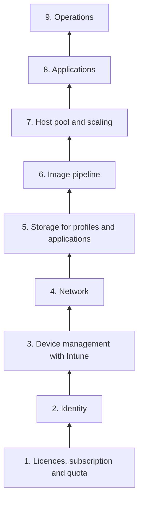

# Dependency checklist

!!! abstract "At a glance"
    - This is the list of everything that must already be in place for the North Star to work: Microsoft Entra joined session hosts, managed by Intune, on a pooled host pool with a session host configuration.
    - It runs from the bottom of the stack up, because each layer depends on the ones beneath it.
    - Each item names the team that usually owns it and links to the Microsoft Learn article it comes from.
    - Use it two ways: as the build checklist for the North Star, and to mark which items an existing image or platform already covers.

## How to use this checklist

!!! tip "See the map first"
    The [dependency map](../overview/dependency-map.md) shows these dependencies as one picture, including the decisions that are fixed when a host pool is created.

Work through it as a group with the owners named in each section. For each item, record one of three answers: **in place**, **needed for the North Star**, or **covered by the existing platform**. The third answer matters when you run an existing image in parallel with the North Star, as described in [Stepping stones](stepping-stones.md). It shows which dependencies only the North Star needs, so they can start early.

## 1. Licences, subscription and quota

*Typical owner: licensing and cloud platform teams*

- [ ] Every user holds a licence that gives Azure Virtual Desktop access rights for Windows 11 Enterprise multi-session, such as Microsoft 365 E3 or E5, or Windows Enterprise E3 or E5 ([Licensing Azure Virtual Desktop](https://learn.microsoft.com/azure/virtual-desktop/licensing)).
- [ ] Users or devices that benefit from Intune are licensed for Intune ([Windows Enterprise multi-session with Intune](https://learn.microsoft.com/intune/solutions/azure-virtual-desktop-multi-session#prerequisites)).
- [ ] Users who need Conditional Access are licensed for Microsoft Entra ID P1 or P2, and Security Defaults are off, because Conditional Access can't be used while they're on ([Enforce MFA for AVD with Conditional Access](https://learn.microsoft.com/azure/virtual-desktop/set-up-mfa)).
- [ ] A subscription and landing zone for AVD, following the Cloud Adoption Framework design areas ([Cloud Adoption Framework for AVD](https://learn.microsoft.com/azure/cloud-adoption-framework/scenarios/azure-virtual-desktop/enterprise-scale-landing-zone)).
- [ ] Virtual machine quota in the target region for peak scale-out, because dynamic autoscaling and session host update create new virtual machines ([View quotas](https://learn.microsoft.com/azure/quotas/view-quotas)).

## 2. Identity

*Typical owner: identity team*

- [ ] Users are hybrid identities synchronised with Microsoft Entra Connect Sync or Microsoft Entra Cloud Sync, or cloud-only identities. FSLogix support for cloud-only identities has been generally available since May 2026 ([Enable Microsoft Entra Kerberos for Azure Files](https://learn.microsoft.com/azure/storage/files/storage-files-identity-auth-hybrid-identities-enable), [What's new in AVD](https://learn.microsoft.com/azure/virtual-desktop/whats-new#may-2026)).
- [ ] Microsoft Entra authentication for RDP is enabled for single sign-on. This needs the **Application Administrator** or **Cloud Application Administrator** role ([Configure single sign-on](https://learn.microsoft.com/azure/virtual-desktop/configure-single-sign-on#prerequisites)).
- [ ] Device groups that contain the session hosts are added to **Windows Cloud Login**, to hide the single sign-on consent prompt ([Configure single sign-on](https://learn.microsoft.com/azure/virtual-desktop/configure-single-sign-on#hide-the-consent-prompt-dialog)).
- [ ] Conditional Access policies target both **Azure Virtual Desktop** and **Windows Cloud Login** when single sign-on is enabled ([Enforce MFA for AVD with Conditional Access](https://learn.microsoft.com/azure/virtual-desktop/set-up-mfa)).
- [ ] A Kerberos server object exists if Active Directory Domain Services is present and users need on-premises resources, such as SMB shares, from Entra joined session hosts ([Create a Kerberos server object](https://learn.microsoft.com/azure/virtual-desktop/configure-single-sign-on#create-a-kerberos-server-object)).
- [ ] Applications have been checked for computer (machine) authentication, which Microsoft Entra joined devices don't support for on-premises applications ([Plan your Microsoft Entra join deployment](https://learn.microsoft.com/entra/identity/devices/device-join-plan#understand-considerations-for-applications-and-resources)). Those applications go to a [stepping-stone pool](stepping-stones.md).
- [ ] Any dependency on NTLMv1 is found and removed, because NTLMv1 is removed from Windows 11 version 24H2 ([Removed features](https://learn.microsoft.com/windows/whats-new/removed-features)).

## 3. Device management with Intune

*Typical owner: endpoint management team. Start here if you have no Intune policies for virtual desktops yet.*

- [ ] Session hosts are in the same tenant as Intune, and run Azure Virtual Desktop agent version 1.0.2944.1400 or later ([Windows Enterprise multi-session with Intune](https://learn.microsoft.com/intune/solutions/azure-virtual-desktop-multi-session#prerequisites)).
- [ ] Session hosts are enrolled in Intune as they're deployed, not cloned from a VM that's already enrolled ([Windows Enterprise multi-session with Intune](https://learn.microsoft.com/intune/solutions/azure-virtual-desktop-multi-session)).
- [ ] Automatic enrolment into Intune is configured and proven before the first North Star host pool ([Set up automatic enrollment](https://learn.microsoft.com/intune/device-enrollment/windows/quickstart-automatic-mdm#set-up-automatic-enrollment)). With a session host configuration, a failed enrolment fails session host provisioning. In live testing it surfaced as `MdmJoinFailed`, about 30 minutes after the hosts were created ([Deploy to Azure](../accelerators/deploy-to-azure.md#what-live-testing-found)).
- [ ] Session hosts are targeted with device groups, using a filter for the **Enterprise multi-session** edition. Device-scoped settings go to device groups and user-scoped settings to user groups ([Windows Enterprise multi-session with Intune](https://learn.microsoft.com/intune/solutions/azure-virtual-desktop-multi-session)).
- [ ] **Kerberos/CloudKerberosTicketRetrievalEnabled** is set to `1` through the settings catalog. Learn says the OMA-URI method doesn't work on multi-session hosts ([Enable Microsoft Entra Kerberos for Azure Files](https://learn.microsoft.com/azure/storage/files/storage-files-identity-auth-hybrid-identities-enable)).
- [ ] FSLogix profile container settings, including **VHDLocations**, are ready before the first user signs in ([FSLogix configuration settings](https://learn.microsoft.com/fslogix/reference-configuration-settings)).
- [ ] Microsoft Defender Antivirus exclusions for FSLogix containers are configured ([FSLogix prerequisites](https://learn.microsoft.com/fslogix/overview-prerequisites#configure-antivirus-file-and-folder-exclusions)).
- [ ] Windows LAPS manages the local administrator account, with backup to Microsoft Entra ID ([Windows LAPS with Microsoft Entra ID](https://learn.microsoft.com/windows-server/identity/laps/laps-scenarios-azure-active-directory)).
- [ ] An update approach suits disposable hosts: new images rolled out with session host update rather than patching hosts in place ([Windows update management methodologies for session hosts](https://learn.microsoft.com/azure/virtual-desktop/windows-update-management-methodologies-session-hosts)).

The full policy set is on the [Intune policies](../intune/index.md) page.

## 4. Network

*Typical owner: network and security teams*

- [ ] Session hosts and clients can reach the required FQDNs and endpoints, outbound on TCP 443 ([Required FQDNs and endpoints](https://learn.microsoft.com/azure/virtual-desktop/required-fqdn-endpoint)).
- [ ] UDP 3478 to `51.5.0.0/16` is allowed for TURN-relayed RDP Shortpath in Azure public cloud ([RDP Multipath](https://learn.microsoft.com/azure/virtual-desktop/rdp-multipath)).
- [ ] Traffic to `169.254.169.254` and `168.63.129.16` isn't intercepted, proxied or redirected ([Required FQDNs and endpoints](https://learn.microsoft.com/azure/virtual-desktop/required-fqdn-endpoint)).
- [ ] Azure Virtual Desktop traffic bypasses proxies. Microsoft recommends bypassing them, and Teams media optimisation isn't supported through a proxy ([Proxy server guidelines](https://learn.microsoft.com/azure/virtual-desktop/proxy-server-support)).
- [ ] Session hosts have explicit outbound connectivity, such as NAT Gateway or a firewall, rather than relying on default outbound access ([Default outbound access](https://learn.microsoft.com/azure/virtual-network/ip-services/default-outbound-access)).
- [ ] Private endpoints and private DNS are in place for the Azure Files storage accounts ([Configure network endpoints for Azure Files](https://learn.microsoft.com/azure/storage/files/storage-files-networking-endpoints)).
- [ ] If you use Private Link for AVD, private endpoints are planned for the **global**, **feed** and **connection** sub-resources ([Private Link with AVD](https://learn.microsoft.com/azure/virtual-desktop/private-link-overview)).

## 5. Storage for profiles and applications

*Typical owner: cloud platform and storage teams*

- [ ] Microsoft Entra Kerberos is enabled on the storage account that holds profiles ([Enable Microsoft Entra Kerberos for Azure Files](https://learn.microsoft.com/azure/storage/files/storage-files-identity-auth-hybrid-identities-enable)).
- [ ] Users have the share-level role **Storage File Data SMB Share Contributor**, and NTFS permissions limit each user to their own profile folder ([Assign share-level permissions](https://learn.microsoft.com/azure/storage/files/storage-files-identity-assign-share-level-permissions)).
- [ ] Shares and storage accounts are sized for sign-in storms. The FSLogix example uses 10 IOPS per user at steady state and 50 at sign-in and sign-out ([Container storage options](https://learn.microsoft.com/fslogix/concepts-container-storage-options)), and an SSD share tops out at 102,400 IOPS ([Azure Files scale targets](https://learn.microsoft.com/azure/storage/files/storage-files-scale-targets)). The sharding worked example is on the [User profiles](../profiles/index.md) page.
- [ ] The App Attach share is in the same Azure region as the session hosts. For Entra joined hosts on Azure Files, the **Azure Virtual Desktop** and **Azure Virtual Desktop ARM Provider** service principals have the **Reader and Data Access** role ([Add and manage App Attach applications](https://learn.microsoft.com/azure/virtual-desktop/app-attach-setup)).
- [ ] The profile shares are backed up ([About Azure Files backup](https://learn.microsoft.com/azure/backup/azure-file-share-backup-overview)).

## 6. Image pipeline

*Typical owner: platform engineering team*

- [ ] The source image is a supported Windows 11 Enterprise multi-session image from the Azure Marketplace ([Prerequisites for AVD](https://learn.microsoft.com/azure/virtual-desktop/prerequisites#operating-systems-and-licenses)).
- [ ] Azure Image Builder is available in the build region ([Azure Image Builder overview](https://learn.microsoft.com/azure/virtual-machines/image-builder-overview)).
- [ ] A user-assigned managed identity exists for custom image template builds ([Custom image templates](https://learn.microsoft.com/azure/virtual-desktop/custom-image-templates)).
- [ ] Azure Compute Gallery image definitions exist, with versions replicated to every region where session hosts run ([Azure Compute Gallery](https://learn.microsoft.com/azure/virtual-machines/azure-compute-gallery)).
- [ ] The security type of the source image, the image definition and the target VMs match, for example Trusted launch ([Trusted launch](https://learn.microsoft.com/azure/virtual-machines/trusted-launch)).

## 7. Host pool and scaling

*Typical owner: platform engineering team*

- [ ] A new pooled host pool is created with a session host configuration. The management approach can't be changed after the host pool is created ([Host pool management approaches](https://learn.microsoft.com/azure/virtual-desktop/host-pool-management-approaches)).
- [ ] The host pool has a managed identity. Learn says host pools with a session host configuration will soon need one to add session hosts ([Configure managed identity](https://learn.microsoft.com/azure/virtual-desktop/configure-managed-identity), [What's new in AVD](https://learn.microsoft.com/azure/virtual-desktop/whats-new#september-2026)).
- [ ] The VM size has a cache or temp disk large enough for the image, because ephemeral OS disks live on local storage ([Ephemeral OS disks on AVD](https://learn.microsoft.com/azure/virtual-desktop/deploy/session-hosts/ephemeral-os-disks)).
- [ ] The host pool has a measured, custom **Max session limit**, not the default ([Configure host pool load balancing](https://learn.microsoft.com/azure/virtual-desktop/configure-host-pool-load-balancing)).
- [ ] The Azure Virtual Desktop service principal has **Desktop Virtualization Power On Off Contributor** and **Desktop Virtualization Virtual Machine Contributor** at subscription scope, for dynamic autoscaling ([Create and assign a scaling plan](https://learn.microsoft.com/azure/virtual-desktop/autoscale-create-assign-scaling-plan)).
- [ ] No other scaling tool or script manages the same host pool ([Create and assign a scaling plan](https://learn.microsoft.com/azure/virtual-desktop/autoscale-create-assign-scaling-plan)).
- [ ] Users are assigned to application groups with **Desktop Virtualization User**, and have **Virtual Machine User Login** where the host pool needs it ([Microsoft Entra joined session hosts](https://learn.microsoft.com/azure/virtual-desktop/azure-ad-joined-session-hosts#assign-user-access-to-host-pools)).

## 8. Applications

*Typical owner: application packaging team and application owners*

- [ ] An application inventory records, for each application, how it's delivered today and how it authenticates.
- [ ] The packaging team can build MSIX packages with the **MSIX Packaging Tool** and disk images with the **MSIXMGR tool** ([Create an MSIX image](https://learn.microsoft.com/azure/virtual-desktop/app-attach-create-msix-image)).
- [ ] MSIX and Appx packages are signed with a certificate the session hosts trust ([App Attach overview](https://learn.microsoft.com/azure/virtual-desktop/app-attach-overview)).
- [ ] Existing App-V packages are listed as candidates for App Attach. App Attach can use them without an App-V server, while MSIX remains the destination ([App-V support policy](https://learn.microsoft.com/microsoft-desktop-optimization-pack/app-v/appv-support-policy)).

## 9. Operations

*Typical owner: operations and service management teams*

- [ ] A Log Analytics workspace and diagnostic settings are in place for host pools, workspaces and application groups ([Diagnostics with Log Analytics](https://learn.microsoft.com/azure/virtual-desktop/diagnostics-log-analytics)).
- [ ] Azure Monitor Agent and a data collection rule collect session host data for AVD Insights ([AVD Insights](https://learn.microsoft.com/azure/virtual-desktop/insights)).
- [ ] Alerts and action groups exist for the conditions that matter, alongside Azure Service Health alerts ([Log search alerts](https://learn.microsoft.com/azure/azure-monitor/alerts/alerts-create-log-alert-rule), [Azure Service Health](https://learn.microsoft.com/azure/service-health/overview)).
- [ ] Cost allocation tags are applied and inherited ([Tag inheritance](https://learn.microsoft.com/azure/cost-management-billing/costs/enable-tag-inheritance)).
- [ ] Everything above is deployed through infrastructure as code ([Cloud Adoption Framework for AVD](https://learn.microsoft.com/azure/cloud-adoption-framework/scenarios/azure-virtual-desktop/enterprise-scale-landing-zone)).
