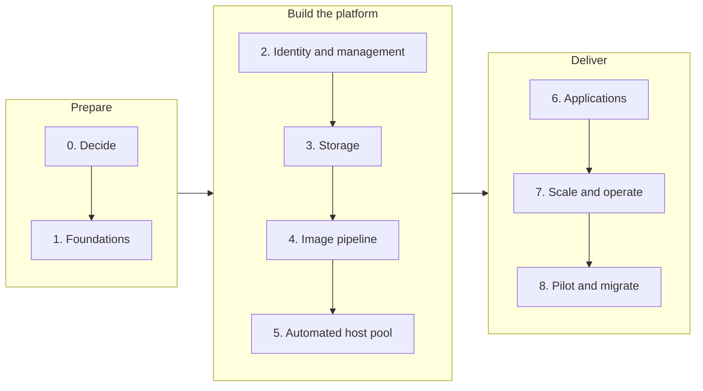

# Getting there

!!! abstract "At a glance"
    - Most organisations reach the North Star in phases, not in one move. This page sets out a proven order.
    - Build the platform from the bottom up: foundations and identity, then management, storage and the image, and only then the host pool.
    - A host pool can't be switched to a session host configuration later, so the North Star is always a new host pool that users move to.
    - Run stepping stones in parallel for the parts of the estate that aren't ready yet, and give each one an exit plan.

## The route

| Phase | What happens | Done when | Read |
| --- | --- | --- | --- |
| **0. Decide** | Agree the North Star as the target and record where you'll deviate from it. Choose regions, the identity model for users, and which workloads start on a stepping stone | Decisions recorded, with an owner for each [dependency](dependencies.md) | [The North Star](../overview/what-good-looks-like.md) |
| **1. Foundations** | Landing zone subscription, spoke virtual network, outbound connectivity, private DNS, Log Analytics workspace and quota, all deployed as code ([Cloud Adoption Framework for AVD](https://learn.microsoft.com/azure/cloud-adoption-framework/scenarios/azure-virtual-desktop/enterprise-scale-landing-zone)) | The network reaches the required endpoints, and the pipeline deploys repeatably | [Networking](../networking/index.md) |
| **2. Identity and management** | Microsoft Entra authentication for RDP, Conditional Access, a Kerberos server object if needed, and the Intune policy baseline for multi-session hosts | A test host joins Entra ID, enrols in Intune and receives every policy | [Identity](../identity/index.md), [Intune](../intune/index.md) |
| **3. Storage** | Azure Files for FSLogix and App Attach, with Microsoft Entra Kerberos, permissions, private endpoints and backup | A test user signs in and gets a profile container | [User profiles](../profiles/index.md) |
| **4. Image pipeline** | A lean base image built by Azure Image Builder and versioned in Azure Compute Gallery | A new image version builds and replicates without manual steps | [Images](../images/index.md) |
| **5. Automated host pool** | A new pooled host pool with a session host configuration, a managed identity, ephemeral OS disks and Entra join | Hosts are created from the configuration, and a session host update rolls out a new image version | [Host pools](../host-pools/index.md) |
| **6. Applications** | The first applications delivered with App Attach, starting with packages that need the least work | Assigned applications appear at sign-in and update without an image rebuild | [App Attach](../app-attach/index.md) |
| **7. Scale and operate** | Dynamic autoscaling, AVD Insights, alerts and cost tagging | The pool scales with demand, and the operations team can see user experience and cost | [Scaling](../scaling/index.md), [Monitoring](../monitoring/index.md) |
| **8. Pilot and migrate** | A pilot with every persona, then migration in waves, with stepping stones for the exceptions | Users run on the North Star, and every stepping stone has an exit date | [Stepping stones](stepping-stones.md) |

## Principles for the journey

1. **Prove the dependencies early.** The [dependency checklist](dependencies.md) has the long-lead items. Intune policies, Conditional Access, Microsoft Entra Kerberos and network changes often take longer than building the host pool.
2. **Build new rather than convert.** The management approach is fixed when a host pool is created ([Host pool management approaches](https://learn.microsoft.com/azure/virtual-desktop/host-pool-management-approaches)), so the North Star is always a new host pool. Users move to it, and the old platform drains away.
3. **Start clean.** Microsoft's golden image guidance is to start from a brand-new source VM rather than create a new base VM from an existing custom image ([Create a golden image](https://learn.microsoft.com/azure/virtual-desktop/set-up-golden-image#other-recommendations)). A clean base image tells you what the North Star needs. Inheriting years of configuration hides it.
4. **Move the easy users first.** Pilot with groups whose applications are already proven, and handle complex personas in a parallel stream rather than leaving them to the end.
5. **Every stepping stone gets an exit plan.** A stepping stone with no exit date becomes the platform.
6. **Measure before and after.** Capture sign-in time, connection quality and density on the current platform, so the North Star can be compared on evidence.

## Next

- [Dependency checklist](dependencies.md) - everything that must be in place, with owners.
- [Stepping stones](stepping-stones.md) - patterns for the parts of the estate that can't move straight to the North Star.
