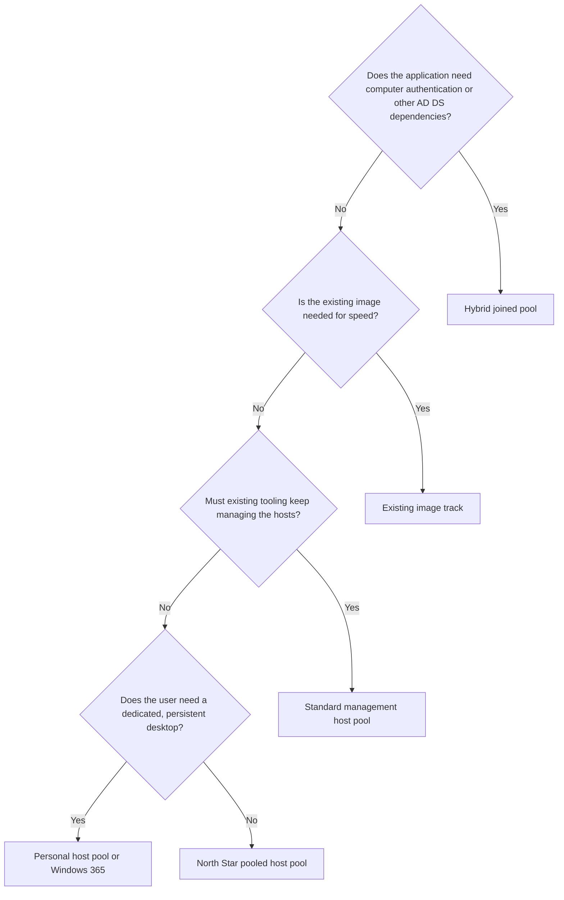

# Stepping stones

!!! abstract "At a glance"
    - A stepping stone is a deliberate, temporary deviation from the North Star for part of the estate.
    - Use one when an application, a team or a timeline can't meet the North Star yet. Don't use one to avoid a decision.
    - Run stepping stones as separate host pools alongside the North Star, so they never compromise it.
    - Every stepping stone needs an owner and exit criteria from the day it's created.

## Choosing a stepping stone

## Hybrid joined pool for legacy applications

**When to use it.** Some applications need what only a domain-joined device can give them. Learn is explicit that Microsoft Entra joined devices don't support on-premises applications that rely on machine authentication ([Plan your Microsoft Entra join deployment](https://learn.microsoft.com/entra/identity/devices/device-join-plan#understand-considerations-for-applications-and-resources)). Applications that authenticate *as the user* usually still work from an Entra joined host, through Kerberos or NTLM, as long as the host has line of sight to a domain controller ([How SSO to on-premises resources works on Microsoft Entra joined devices](https://learn.microsoft.com/entra/identity/devices/device-sso-to-on-premises-resources)). Configure a [Kerberos server object](https://learn.microsoft.com/azure/virtual-desktop/configure-single-sign-on#create-a-kerberos-server-object) when single sign-on is in use. See [Identity and access](../identity/index.md) for the detail.

**How.** A separate, small host pool of Microsoft Entra hybrid joined session hosts, containing only the applications that need it. Publish those applications as RemoteApp so users reach them from their North Star desktop or device.

**Watch for.** NTLMv1 is removed in Windows 11 version 24H2, whatever the join type ([Removed features](https://learn.microsoft.com/windows/whats-new/removed-features)). A hybrid pool doesn't rescue an application that depends on NTLMv1. Find those applications early with the domain controller audit described in [Audit NTLMv1 on a domain controller](https://learn.microsoft.com/troubleshoot/windows-server/windows-security/audit-domain-controller-ntlmv1).

**Exit when** each application is remediated, replaced or retired. Track the list in the application inventory.

## Existing image alongside the clean image

**When to use it.** You have a working image on your current platform, with your security agents and applications already validated, and you need users on Azure Virtual Desktop quickly. Running that image on Azure Virtual Desktop proves users can work, while a clean image proves the North Star in parallel.

**How.** Two tracks, each in its own host pool:

| | Existing image track | Clean image track |
| --- | --- | --- |
| Image | Your current image, with the previous platform's agent removed | A lean Windows 11 Enterprise multi-session base from the Marketplace |
| Join type | Usually hybrid joined, as today | Microsoft Entra joined |
| Purpose | Prove users can work quickly | Prove the target design and expose its dependencies |
| Applications | As today, moving to App Attach over time | App Attach from the start |
| Success criteria | The same criteria for both tracks, so results compare | The same criteria for both tracks, so results compare |

**Watch for.** Microsoft's golden image guidance says don't create a new base VM from an existing custom image, and start with a brand-new source VM instead ([Create a golden image](https://learn.microsoft.com/azure/virtual-desktop/set-up-golden-image#other-recommendations)). An inherited image carries years of configuration, so problems on that track may come from the image rather than the platform. Expect to solve some issues twice, once per track.

!!! tip "A middle path"
    If your current image comes from an automated build process, run that process against a fresh Marketplace base instead of cloning the old image. You keep the agents and settings you trust, and you meet the golden image guidance.

**Exit when** the clean image track meets the success criteria for a persona. Move that persona across, and retire the existing image track once no persona depends on it.

## Standard management host pool

**When to use it.** You must keep using existing tools and processes to create, update and scale session hosts, such as automated pipelines or custom scripts. Learn says this needs standard management, because tooling designed for standard management doesn't work with a session host configuration ([Host pool management approaches](https://learn.microsoft.com/azure/virtual-desktop/host-pool-management-approaches)).

**How.** A standard management host pool, with power management autoscaling and managed OS disks. Dynamic autoscaling isn't available here, because it can only be used for pooled host pools with a session host configuration ([Autoscale scenarios](https://learn.microsoft.com/azure/virtual-desktop/autoscale-scenarios)).

**Watch for.** The management approach can't be changed after the host pool is created. Moving to the North Star later means a new host pool, not a conversion.

**Exit when** the tooling dependency is gone. Build a new host pool with a session host configuration and move users to it.

## App-V packages through App Attach

**When to use it.** You have an App-V estate, and converting every package to MSIX before go-live isn't realistic.

**How.** App Attach can deliver App-V packages to Azure Virtual Desktop without an App-V server ([App-V support policy](https://learn.microsoft.com/microsoft-desktop-optimization-pack/app-v/appv-support-policy)). The App-V client and sequencer are in fixed extended support, while support for the App-V server components ended in April 2026 (same source).

**Watch for.** MSIX is the long-term format. Use App-V packages to bridge, not to build new. See [Moving an App-V estate to App Attach](../app-attach/index.md).

**Exit when** each package is converted to MSIX or the application is retired.

## Personal host pool or Windows 365 for dedicated desktops

**When to use it.** A user genuinely needs a dedicated, persistent desktop, for example to install their own tools. The North Star is pooled, and a session host configuration can be used with pooled host pools only ([Host pool management approaches](https://learn.microsoft.com/azure/virtual-desktop/host-pool-management-approaches)).

**How.** Either a personal host pool with standard management, or a Windows 365 Cloud PC, which gives each user a dedicated cloud desktop managed with Intune ([What is Windows 365](https://learn.microsoft.com/windows-365/enterprise/overview)).

**Watch for.** A dedicated desktop serves one user, so it needs more compute per user than a pooled desktop shared by many. Keep this group small and review it regularly.

**Exit when** the need for persistence goes away. Before granting a dedicated desktop, check whether the user's applications can be delivered with App Attach on a pooled desktop instead.

## Governing stepping stones

| Rule | Why |
| --- | --- |
| Each stepping stone is a separate host pool | It can't compromise the North Star host pools |
| Each one has a named owner and an exit date | Without them, the stepping stone becomes the platform |
| Each one is reviewed at the same cadence as the migration plan | Exits get planned, not forgotten |
| Each one uses the same success criteria as the North Star | Results compare on evidence |
