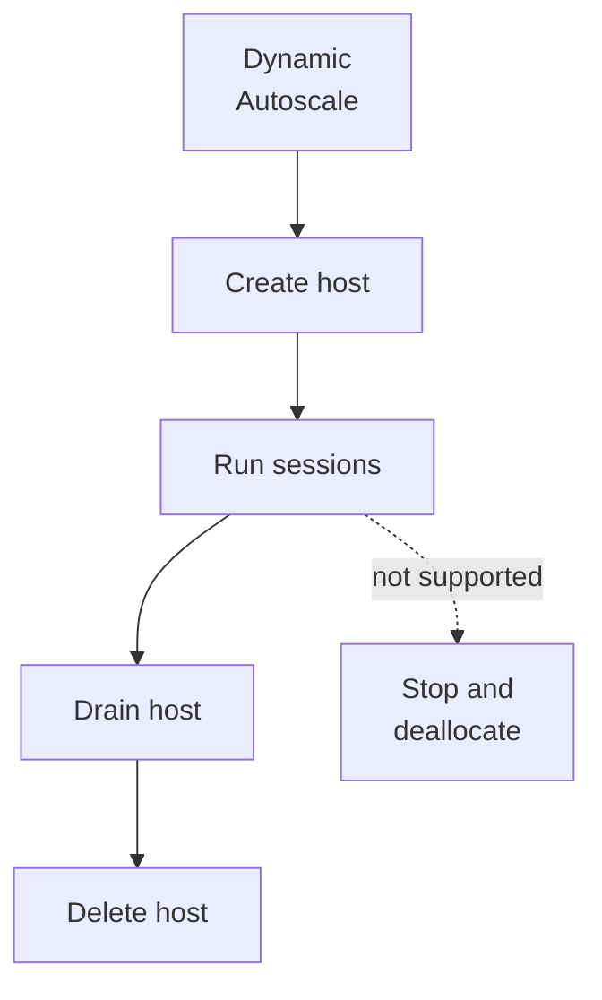

# Ephemeral OS disks

Level 300

An ephemeral OS disk is a throwaway operating system disk. The host can be rebuilt quickly because user state is not meant to live on the OS disk. In the North Star, that works because user profiles are remote and applications are attached or managed separately.

**Status: Generally available for Azure Virtual Desktop, based on [What's new](https://learn.microsoft.com/azure/virtual-desktop/whats-new#june-2026), which says ephemeral OS disks are now available.** The older Azure Virtual Desktop feature article still contains preview wording, so use What's new as the lifecycle source. The base Azure VM capability is documented in [Ephemeral OS disks](https://learn.microsoft.com/azure/virtual-machines/ephemeral-os-disks).

An ephemeral OS disk stores OS disk data on the VM local storage rather than remote Azure Storage. Microsoft describes it as ideal for stateless workloads that tolerate individual VM failure but are sensitive to deployment time or reimage time in [Ephemeral OS disks](https://learn.microsoft.com/azure/virtual-machines/ephemeral-os-disks).

Design implications:

- You cannot stop-deallocate and later start the same VM. Microsoft lists **Stop-deallocated state** and **Stop/ Start of VM** as not supported for ephemeral OS disks in [Ephemeral OS disks](https://learn.microsoft.com/azure/virtual-machines/ephemeral-os-disks#key-differences-between-persistent-and-ephemeral-os-disks).
- You cannot capture VM images, take disk snapshots, use Azure Disk Encryption, Azure Backup, Azure Site Recovery, or OS Disk Swap with ephemeral OS disks on Azure Virtual Desktop, per [Ephemeral OS disks on Azure Virtual Desktop](https://learn.microsoft.com/azure/virtual-desktop/deploy/session-hosts/ephemeral-os-disks#limitations-of-ephemeral-os-disks).
- The image OS disk size must be less than or equal to the temp or cache size of the chosen VM size for the placement used, per [size requirements](https://learn.microsoft.com/azure/virtual-desktop/deploy/session-hosts/ephemeral-os-disks#size-requirements).
- For a Windows 11 Enterprise multi-session Marketplace image at 127 GiB, Microsoft gives Standard_D8s_v3 as an example temp disk placement size because it has a 200 GiB temp disk, per [Ephemeral OS disks on Azure Virtual Desktop](https://learn.microsoft.com/azure/virtual-desktop/deploy/session-hosts/ephemeral-os-disks#size-requirements).

For scaling, treat ephemeral session hosts as replaceable capacity. Pair them with dynamic Autoscale that creates and deletes hosts.

This diagram shows why deallocate-based scaling does not fit an ephemeral host.

## Under the hood

Level 400

Placement decides where the OS disk is stored. The Azure VM article lists **NVMe Disk Placement**, **Temp Disk Placement**, and **Cache Disk Placement** and says the image OS disk size must be less than or equal to the chosen VM size's NVMe, temp, or cache size ([Ephemeral OS disks](https://learn.microsoft.com/azure/virtual-machines/ephemeral-os-disks#placement-options-for-ephemeral-os-disks)).

For Azure Virtual Desktop, Microsoft gives the Windows 11 Enterprise multi-session Marketplace image as 127 GiB and says temp disk placement needs a temp disk at least that large. The documented example is **Standard_D8s_v3**, which has a 200 GiB temp disk ([Ephemeral OS disks on Azure Virtual Desktop](https://learn.microsoft.com/azure/virtual-desktop/deploy/session-hosts/ephemeral-os-disks#size-requirements)).

When using Trusted launch, Microsoft says virtual machine guest state reserves **1 GiB** from the OS cache, temp disk, or NVMe disk, depending on placement. Keys or secrets generated or sealed by the vTPM after VM creation might not be saved after reimage or service healing ([Ephemeral OS disks](https://learn.microsoft.com/azure/virtual-machines/ephemeral-os-disks#trusted-launch-for-ephemeral-os-disks)).

---

Part of [Host pools](index.md).
