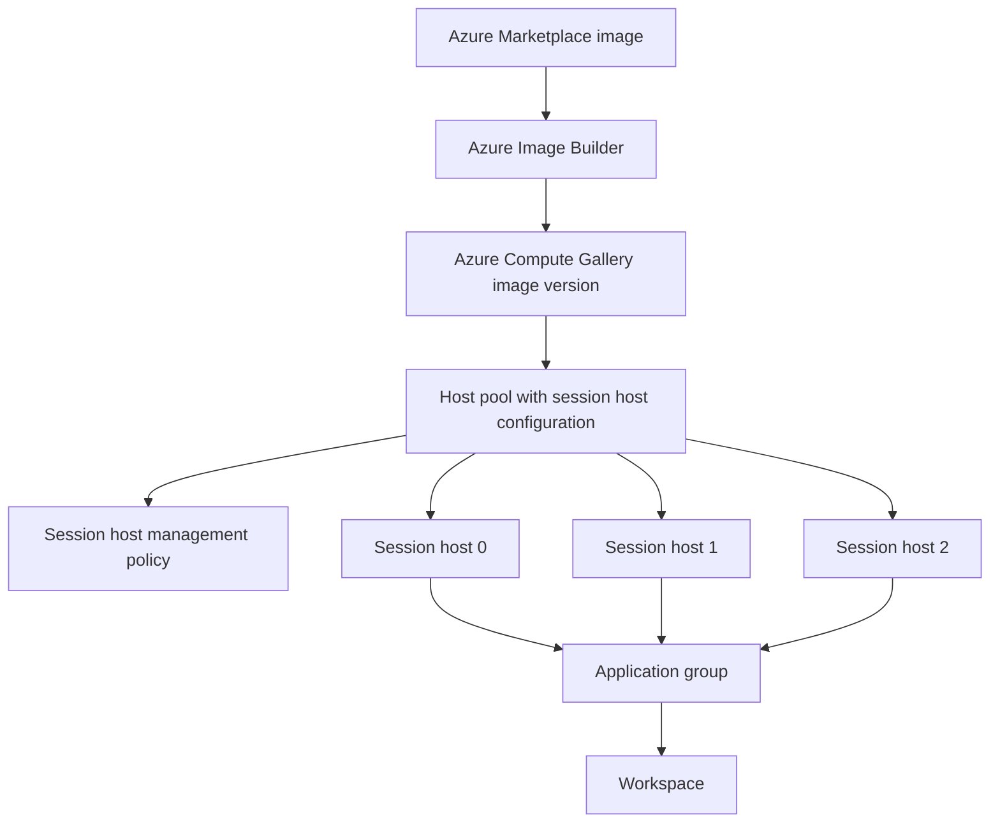

# Host pools

!!! abstract "At a glance"
    - Use pooled host pools with Windows 11 Enterprise multi-session for the North Star.
    - Create the host pool with session host configuration from day one. Microsoft Learn is explicit that the management approach is set at host pool creation and cannot be changed later.
    - Use Microsoft Entra joined session hosts enrolled in Microsoft Intune, with a small hybrid-joined stepping-stone pool only where an application needs it.
    - Use ephemeral OS disks for stateless pooled session hosts where the documented requirements and limitations fit.
    - Roll images and configuration through session host update instead of manually patching individual hosts.

## What it is

An Azure Virtual Desktop host pool is a collection of Azure virtual machines registered to Azure Virtual Desktop as session hosts. Microsoft recommends that all session hosts in a host pool are sourced from the same image for a consistent user experience. Users are assigned to application groups, and each application group is associated with a workspace so the published desktop or applications appear in an Azure Virtual Desktop client. These terms are defined in [Azure Virtual Desktop terminology](https://learn.microsoft.com/azure/virtual-desktop/terminology).

A session host is the virtual machine that actually runs the user session. In a pooled host pool, multiple users can share one Windows 11 Enterprise multi-session host. In a personal host pool, each user has a one-to-one relationship with a session host. The North Star uses pooled host pools for shared desktops and remote applications because Microsoft describes pooled host pools as a lower-cost, higher-efficiency shared remote experience, while personal host pools are for dedicated desktops and stronger data separation in the [terminology article](https://learn.microsoft.com/azure/virtual-desktop/terminology#host-pools).

## How it fits

The host pool is the control boundary. The session host configuration is the desired state for hosts in that pool. The session host management policy defines how hosts are created and updated. Application groups decide what users see. The workspace is the feed users subscribe to.

## North Star recommendation

**Status: Generally available.** This site uses the [What's new in Azure Virtual Desktop](https://learn.microsoft.com/azure/virtual-desktop/whats-new#june-2026) page as the status source where older feature articles still contain preview-era wording. The June 2026 entry says Automated Host Pools are now available. In this site, Automated Host Pools means a host pool that uses session host configuration together with session host update.

For the North Star, create a **Pooled** host pool with **Session host configuration**, Windows 11 Enterprise multi-session, Microsoft Entra join, Intune enrolment, and a host pool managed identity. Managed identity support is generally available for session host configuration, Autoscale, and Start VM on Connect, and Microsoft says a future service update will require it for host pools configured with session host configuration in [What's new](https://learn.microsoft.com/azure/virtual-desktop/whats-new#september-2026). Configure it using [Configure managed identity in Azure Virtual Desktop](https://learn.microsoft.com/azure/virtual-desktop/configure-managed-identity).

!!! note "Status source"
    Some feature articles still contain preview-era wording. For lifecycle status, use [What's new in Azure Virtual Desktop](https://learn.microsoft.com/azure/virtual-desktop/whats-new) as the deciding source.

## Design decisions

| Decision | North Star choice | Why |
|---|---|---|
| Host pool type | Pooled | Pooled host pools can load balance user sessions across session hosts and are the documented fit for shared desktops and RemoteApp workloads in the [terminology article](https://learn.microsoft.com/azure/virtual-desktop/terminology#host-pools). |
| Metadata placement | Regional host pool where available | Regional host pools are generally available and store host pool metadata in the selected Azure region instead of a geographical database shared across regions, per [What's new](https://learn.microsoft.com/azure/virtual-desktop/whats-new#september-2026). |
| Operating system | Windows 11 Enterprise multi-session | Windows Enterprise multi-session allows multiple concurrent sessions and is exclusive to Azure Virtual Desktop on Azure, as described by [Microsoft Intune](https://learn.microsoft.com/intune/solutions/azure-virtual-desktop-multi-session). |
| Join model | Microsoft Entra joined | This supports the Entra-only North Star and allows Intune enrolment when enabled during deployment, per [Intune prerequisites](https://learn.microsoft.com/intune/solutions/azure-virtual-desktop-multi-session#prerequisites). |
| Host pool identity | Managed identity configured on the host pool | Managed identity support is generally available for session host configuration, Autoscale, and Start VM on Connect, and will be required for future SHC host creation, per [What's new](https://learn.microsoft.com/azure/virtual-desktop/whats-new#september-2026). |
| Management approach | Session host configuration | It stores VM image, name prefix, VM size, OS disk information, domain join information, network configuration, location, availability zones, security type, credentials, boot diagnostics, custom script, and tags in a host pool sub-resource, per [host pool management approaches](https://learn.microsoft.com/azure/virtual-desktop/host-pool-management-approaches#session-host-configuration). |
| Updates | Session host update | It replaces session hosts from the updated configuration in batches and standardises the pool, per [session host update](https://learn.microsoft.com/azure/virtual-desktop/session-host-update). |
| OS disk | Ephemeral OS disk | It avoids persistent OS disk state and supports fast reimage for stateless pooled hosts, per [Azure VM ephemeral OS disks](https://learn.microsoft.com/azure/virtual-machines/ephemeral-os-disks). |
| Applications | App Attach first | App Attach dynamically attaches applications to a user session without installing them locally on the session host image, per [App Attach overview](https://learn.microsoft.com/azure/virtual-desktop/app-attach-overview). |
| Profiles | FSLogix profile containers | Users in pooled host pools can connect to different hosts, so Microsoft recommends FSLogix profile containers for profile roaming in [FSLogix profile containers](https://learn.microsoft.com/azure/virtual-desktop/fslogix-profile-containers). |

## In this section

-   __[Session host configuration](session-host-configuration.md)__

    ---

    What the session host configuration defines, how session hosts are created from it, and its requirements.

-   __[Session host update](session-host-update.md)__

    ---

    How session host update replaces session hosts in batches when the configuration changes.

-   __[Ephemeral OS disks](ephemeral-os-disks.md)__

    ---

    What ephemeral OS disks are, the VM size requirements, what you can't do with them and what that means for scaling.

-   __[Sizing and load balancing](sizing-and-load-balancing.md)__

    ---

    Load-balancing algorithms, session limits, session host sizing, Trusted launch, availability zones and naming.

## Common pitfalls

- Creating a standard host pool and expecting to add session host configuration later.
- Using external tooling to add hosts to a session host configuration pool.
- Treating ephemeral OS disk hosts like stopped managed-disk hosts.
- Putting application state or user data on the OS disk.
- Running session host update while Autoscale is enabled.
- Using one host pool for every usage pattern.

## Microsoft Learn

- [Azure Virtual Desktop terminology](https://learn.microsoft.com/azure/virtual-desktop/terminology)
- [Host pool management approaches](https://learn.microsoft.com/azure/virtual-desktop/host-pool-management-approaches)
- [Session host update](https://learn.microsoft.com/azure/virtual-desktop/session-host-update)
- [Ephemeral OS disks on Azure Virtual Desktop](https://learn.microsoft.com/azure/virtual-desktop/deploy/session-hosts/ephemeral-os-disks)
- [Ephemeral OS disks](https://learn.microsoft.com/azure/virtual-machines/ephemeral-os-disks)
- [Configure host pool load balancing in Azure Virtual Desktop](https://learn.microsoft.com/azure/virtual-desktop/configure-host-pool-load-balancing)
- [Session Host Virtual Machine Sizing Guidelines for Remote Desktop](https://learn.microsoft.com/windows-server/remote/remote-desktop-services/session-host-virtual-machine-sizing-guidelines)
- [Using Azure Virtual Desktop multi-session with Microsoft Intune](https://learn.microsoft.com/intune/solutions/azure-virtual-desktop-multi-session)
- [Trusted Launch for Azure VMs](https://learn.microsoft.com/azure/virtual-machines/trusted-launch)
- [Configure managed identity in Azure Virtual Desktop](https://learn.microsoft.com/azure/virtual-desktop/configure-managed-identity)
