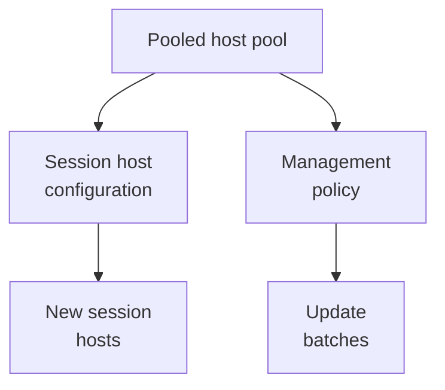

# Session host configuration

Level 300

A session host configuration is the build sheet for a pooled host pool. Instead of every deployment tool deciding how to create a host, Azure Virtual Desktop keeps the desired VM settings on the host pool and uses them whenever it creates session hosts.

A session host configuration is a sub-resource of the host pool that specifies what session hosts should look like. Microsoft Learn says newly created session hosts are created from the session host configuration, and updating existing hosts requires updating the session host configuration and then scheduling session host update in [Host pool management approaches](https://learn.microsoft.com/azure/virtual-desktop/host-pool-management-approaches#session-host-configuration).

This diagram shows the main objects that make a session host configuration pool different from a standard pool.

Key requirements and limits:

- The management approach is set when the host pool is created and cannot be changed later. If a host pool is created without a session host configuration, one cannot be added afterwards, per [host pool management approaches](https://learn.microsoft.com/azure/virtual-desktop/host-pool-management-approaches).
- Session host configuration is for pooled host pools only. Microsoft Learn states that with session host configuration you cannot create, update, or scale hosts outside the Azure Virtual Desktop service using tools designed for standard management in [host pool management approaches](https://learn.microsoft.com/azure/virtual-desktop/host-pool-management-approaches#session-host-configuration-management-approach).
- For session host creation, the standard registration token model is not used. The comparison table says you cannot retrieve a registration token to add hosts created outside Azure Virtual Desktop to a host pool with session host configuration in [Compare host pool management approaches](https://learn.microsoft.com/azure/virtual-desktop/host-pool-management-approaches#compare-host-pool-management-approaches).
- The Azure Virtual Desktop ephemeral OS disk page states that ephemeral OS disks are supported only in pooled host pools configured with session host configuration in [Ephemeral OS disks on Azure Virtual Desktop](https://learn.microsoft.com/azure/virtual-desktop/deploy/session-hosts/ephemeral-os-disks).

## Under the hood

Level 400

The configuration stores VM image, VM name prefix, resource group, size, OS disk information, domain join information, network configuration, location, availability zones, security type, admin credentials, boot diagnostics, custom configuration PowerShell script, and VM tags ([Host pool management approaches](https://learn.microsoft.com/azure/virtual-desktop/host-pool-management-approaches#session-host-configuration)).

The management policy stores the update controls, including **Time zone**, **Max VMs removed during update**, **Logoff delay in minutes**, **Logoff message**, **Leave in drain mode**, and **Failed session host cleanup policy** ([Host pool management approaches](https://learn.microsoft.com/azure/virtual-desktop/host-pool-management-approaches#session-host-management-policy)).

---

Part of [Host pools](index.md).
