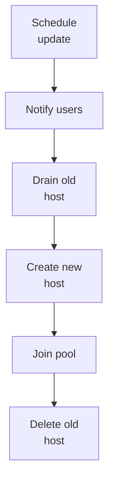

# Session host update

Level 300

Session host update is the safe replacement process for a host pool. It is closer to changing a fleet of rental cars than servicing each car in place: users are moved away, old hosts are removed, and new hosts are created from the updated configuration.

**Status: Generally available.** Session host update is part of the Automated Host Pools capability that [What's new](https://learn.microsoft.com/azure/virtual-desktop/whats-new#june-2026) says is now available.

Session host update updates the underlying VM disk type, OS image, and other configuration properties of all session hosts in a host pool with session host configuration. Microsoft states that it deallocates or deletes the existing VMs and creates new ones that are added back to the host pool with the updated configuration in [Session host update](https://learn.microsoft.com/azure/virtual-desktop/session-host-update).

Use it for image-based change, not in-place drift. The update process notifies connected users, waits for the configured delay, drains selected hosts, removes them from the host pool, creates replacement hosts from the updated session host configuration, joins them to the directory, adds them to the host pool, and deletes the original VMs. The process is documented in [Session host update](https://learn.microsoft.com/azure/virtual-desktop/session-host-update#update-process).

Important limits:

- Only one update can run or be scheduled in a single host pool at a time.
- If Autoscale is used, Microsoft says to disable Autoscale on the host pool before session host update and keep it disabled until the update is finished.
- Customisations manually added to individual session hosts are not present after update. Put them in the image, Intune, Group Policy for hybrid pools, or the custom configuration PowerShell script in the session host configuration.
- The new image must be supported for Azure Virtual Desktop and the VM generation.

This sequence shows the update flow Microsoft documents.

## Under the hood

Level 400

Microsoft says the **batch** is the number of session hosts that can be unavailable at a time. When an update starts, the service first targets one **initial** host to test the end-to-end process, then updates the rest in batches ([Session host update](https://learn.microsoft.com/azure/virtual-desktop/session-host-update#update-process)).

For example, Microsoft documents a 10-host pool with batch size 3 as one initial host, then three batches of three. After the initial host completes, at least seven hosts remain available ([Session host update](https://learn.microsoft.com/azure/virtual-desktop/session-host-update#update-process)).

Only one update can run or be scheduled in a single host pool at a time. Large batch sizes can cause intermittent `AgentRegistrationFailureGeneric`; Microsoft says retrying typically resolves a subset of failed hosts ([Session host update](https://learn.microsoft.com/azure/virtual-desktop/session-host-update#troubleshooting)).

---

Part of [Host pools](index.md).
