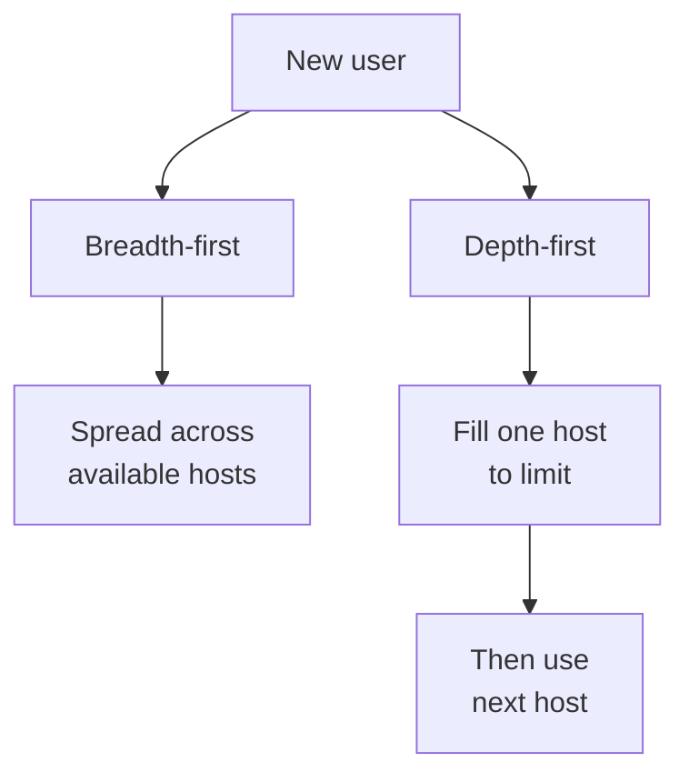

# Sizing and load balancing

Level 300

Sizing decides how many users a host can safely carry. Load balancing decides which host gets the next user. For full density, storage, bandwidth, subnet, and quota estimates, use [Sizing estimates](../overview/sizing-estimates.md); this page focuses on the host pool settings that use those estimates.

## Load balancing and session limits

Azure Virtual Desktop supports two load-balancing algorithms for pooled host pools in [Configure host pool load balancing](https://learn.microsoft.com/azure/virtual-desktop/configure-host-pool-load-balancing):

- **Breadth-first** distributes new user sessions across session hosts. Microsoft states that it aims to optimise session performance by spreading users across hosts.
- **Depth-first** fills one session host until the **Max session limit** is reached, then directs new connections to the next host. Microsoft states that it is useful for cost-conscious environments that want more granular control over powered-on capacity.

Depth-first requires a maximum session limit. Even with breadth-first, set a measured **Max session limit** because Autoscale capacity calculations use host pool capacity and because it provides an operational guardrail. Establish it through a pilot, simulation, and Azure Virtual Desktop Insights rather than by copying a generic number.

This diagram shows how the two algorithms make different placement choices.

## Sizing, Trusted launch, availability zones, and naming

Use the Microsoft multi-session sizing guidance as a starting point, not a final density promise. Microsoft recommends understanding workload type, concurrent user count, resource requirements, performance expectations, scalability, resilience, monitoring, and logon storms in [Session host virtual machine sizing guidelines](https://learn.microsoft.com/windows-server/remote/remote-desktop-services/session-host-virtual-machine-sizing-guidelines). The guidance also notes that high concurrent logon rates can materially affect performance, so test sign-in storms as well as steady-state use.

Use **Trusted launch virtual machines** for the North Star unless a workload cannot support it. Trusted launch provides generation 2 security features such as secure boot and vTPM, as described in [Trusted Launch for Azure VMs](https://learn.microsoft.com/azure/virtual-machines/trusted-launch). If combining Trusted launch with ephemeral OS disks, remember Microsoft states VM guest state reserves 1 GiB from the chosen local placement and keys or secrets generated or sealed by vTPM after VM creation might not be saved after reimage or healing events in [Ephemeral OS disks](https://learn.microsoft.com/azure/virtual-machines/ephemeral-os-disks#trusted-launch-for-ephemeral-os-disks).

Use availability zones where the region, VM SKU, profile storage, image replication, and network design support them. Session host configuration includes VM availability zones as a property, per [host pool management approaches](https://learn.microsoft.com/azure/virtual-desktop/host-pool-management-approaches#session-host-configuration). Keep each host pool in one region and design separate host pools for materially different latency, time-zone, application, or capacity patterns.

For naming, keep the session host **Name prefix** short. The Azure Virtual Desktop ephemeral OS disk creation flow states the name prefix can be a maximum of 11 characters and is used in the computer name, with a suffix such as **hp01-sh-0** added to produce a maximum 15-character computer name in [Ephemeral OS disks on Azure Virtual Desktop](https://learn.microsoft.com/azure/virtual-desktop/deploy/session-hosts/ephemeral-os-disks#create-a-session-host-with-ephemeral-os-disks).

## Under the hood

Level 400

Depth-first needs **Max session limit** because it keeps placing sessions on the host with the most sessions until that limit is reached. Breadth-first does not require a maximum session limit, but setting one gives Autoscale a capacity ceiling to work with ([Configure host pool load balancing](https://learn.microsoft.com/azure/virtual-desktop/configure-host-pool-load-balancing)).

Microsoft's sizing guidance says high concurrent logon rates can significantly affect performance, so test sign-in storms separately from steady state ([Session Host Virtual Machine Sizing Guidelines](https://learn.microsoft.com/windows-server/remote/remote-desktop-services/session-host-virtual-machine-sizing-guidelines#capacity-planning)). Keep the detailed numeric tables in [Sizing estimates](../overview/sizing-estimates.md) so this page stays focused on host pool configuration.

---

Part of [Host pools](index.md).
