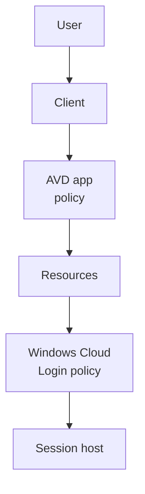

# Conditional Access

Level 300

Conditional Access is the policy checkpoint for sign-ins. For Azure Virtual Desktop with single sign-on, it must protect both the feed and the session host sign-in.

**Status:** Generally available. Conditional Access for Azure Virtual Desktop is documented by Microsoft Learn [Enforce MFA for Azure Virtual Desktop using Conditional Access](https://learn.microsoft.com/azure/virtual-desktop/set-up-mfa).

When SSO is enabled, Learn says two Microsoft Entra applications are involved:

- **Azure Virtual Desktop**, which handles feed subscription and gateway authentication.
- **Windows Cloud Login**, app ID `270efc09-cd0d-444b-a71f-39af4910ec45`, which handles session host sign-in [Enforce MFA for Azure Virtual Desktop using Conditional Access](https://learn.microsoft.com/azure/virtual-desktop/set-up-mfa).

Use two aligned policies:

| Policy | Target | Typical controls |
| --- | --- | --- |
| Feed and gateway | **Azure Virtual Desktop** | MFA, location, device filters, session controls. |
| Session host sign-in | **Windows Cloud Login** | MFA and sign-in frequency aligned with the AVD policy. |

This diagram shows the two Conditional Access evaluations.

1. The feed sign-in is evaluated against the **Azure Virtual Desktop** app.
2. The session host sign-in is evaluated against **Windows Cloud Login** when single sign-on is enabled.
3. Sign-in frequency must be aligned so users do not see unexpected repeated prompts.

Learn warns that **Every time** sign-in frequency is only supported when applied to **Windows Cloud Login** when SSO is enabled. If applied to the wrong app, users can see repeated prompts [Enforce MFA for Azure Virtual Desktop using Conditional Access](https://learn.microsoft.com/azure/virtual-desktop/set-up-mfa#require-multifactor-authentication-for-a-session-host).

---

Part of [Identity and access](index.md).
