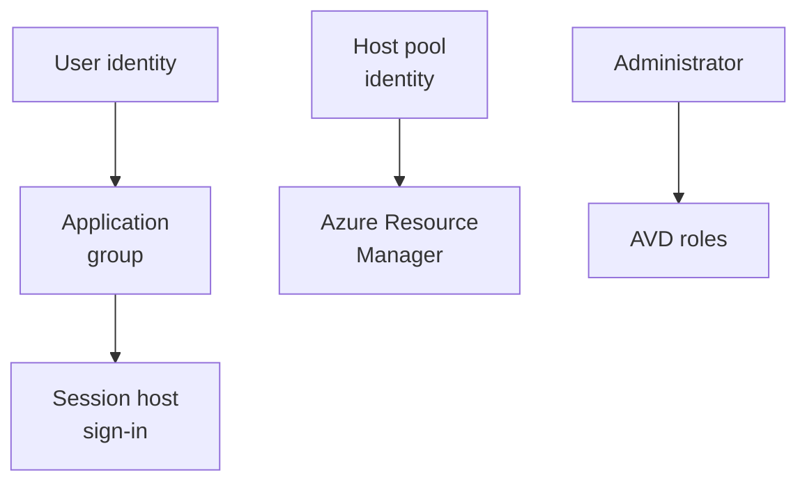

# Identities and roles

Level 300

Identity and role design answers three questions: which users can use the service, which Azure resource identity the host pool uses, and which administrators can manage each layer.

This diagram separates the user, host pool and administrator identities.

## Supported user identity types

**Status:** Generally available for AVD external identities as of November 2025, and generally available for FSLogix support for cloud-only and external identities as of May 2026 [What's new in Azure Virtual Desktop](https://learn.microsoft.com/azure/virtual-desktop/whats-new#november-2025), [What's new in Azure Virtual Desktop](https://learn.microsoft.com/azure/virtual-desktop/whats-new#may-2026).

For the North Star profile pattern, Learn documents Azure Files access from Microsoft Entra joined VMs for FSLogix profile containers using Microsoft Entra Kerberos for **hybrid**, **cloud-only** and **external identities** [Microsoft Entra joined session hosts](https://learn.microsoft.com/azure/virtual-desktop/azure-ad-joined-session-hosts), [Enable Microsoft Entra Kerberos authentication for Azure Files](https://learn.microsoft.com/azure/storage/files/storage-files-identity-auth-hybrid-identities-enable).

!!! note "External identities"
    Learn documents Azure Files SMB support for external identities as currently limited to FSLogix profiles in Azure Virtual Desktop, and not supported for direct share access by business-to-business guest users or users from other Microsoft Entra tenants [Enable Microsoft Entra Kerberos authentication for Azure Files](https://learn.microsoft.com/azure/storage/files/storage-files-identity-auth-hybrid-identities-enable).

## Host pool managed identity

**Status:** Generally available. Managed identity support for Azure Virtual Desktop host pools is generally available as of September 2026, and Learn says it can be used for session host configuration, autoscale, Start VM on Connect and Azure Virtual Desktop for Azure local [What's new in Azure Virtual Desktop](https://learn.microsoft.com/azure/virtual-desktop/whats-new#september-2026).

This is an Azure resource identity, not a user sign-in identity. It belongs in the host pool platform configuration so Azure Virtual Desktop can perform Azure Resource Manager operations for features such as session host configuration and autoscale. Learn also states that, in a future service update, host pools configured with a session host configuration will require a managed identity to add session hosts to the host pool [Configure managed identity in Azure Virtual Desktop](https://learn.microsoft.com/azure/virtual-desktop/configure-managed-identity).

## RBAC for users and administrators

Users need two separate permissions surfaces:

| Need | Role | Scope |
| --- | --- | --- |
| See and launch desktops or apps | **Desktop Virtualization User** | Application group [Built-in Azure RBAC roles](https://learn.microsoft.com/azure/virtual-desktop/rbac#desktop-virtualization-user). |
| Sign in to Microsoft Entra joined VMs when required | **Virtual Machine User Login** | VM, resource group, or subscription [Microsoft Entra joined session hosts](https://learn.microsoft.com/azure/virtual-desktop/azure-ad-joined-session-hosts#assign-user-access-to-host-pools). |
| Admin sign-in to VMs | **Virtual Machine Administrator Login** | VM, resource group, or subscription [Microsoft Entra joined session hosts](https://learn.microsoft.com/azure/virtual-desktop/azure-ad-joined-session-hosts#assign-user-access-to-host-pools). |

For host pools using a session host configuration, Learn says the additional VM role assignment is not required [Microsoft Entra joined session hosts](https://learn.microsoft.com/azure/virtual-desktop/azure-ad-joined-session-hosts#assign-user-access-to-host-pools). Still, include it in operational runbooks because it is required for Microsoft Entra joined host pools without that configuration.

## Local administrator management

Use [Windows LAPS with Microsoft Entra ID](https://learn.microsoft.com/windows-server/identity/laps/laps-scenarios-azure-active-directory) to back up and retrieve the password for a managed local administrator account. Windows LAPS with Microsoft Entra ID and Microsoft Intune support is generally available as of October 23, 2023 according to Microsoft Learn search results for Windows LAPS [What is Windows LAPS](https://learn.microsoft.com/windows-server/identity/laps/laps-overview).

Microsoft Entra also updates the local Administrators group during Microsoft Entra join. Learn documents management of the local administrators group on Microsoft Entra joined devices, including tenant-wide local administrator settings and scoped administrator additions [Manage local administrators on Microsoft Entra joined devices](https://learn.microsoft.com/entra/identity/devices/assign-local-admin).

---

Part of [Identity and access](index.md).
