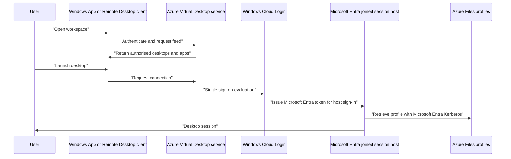

# Identity and access

!!! abstract "At a glance"
    - Use Microsoft Entra joined Windows 11 Enterprise multi-session session hosts as the North Star, enrolled in Intune at provisioning time.
    - Enable Azure Virtual Desktop single sign-on with Microsoft Entra authentication by setting **Microsoft Entra single sign-on** on the host pool, or **enablerdsaadauth** to **1**.
    - Assign users to application groups and, where required, grant **Virtual Machine User Login** on the session host VMs or resource group.
    - Use Conditional Access policies that target both **Azure Virtual Desktop** and **Windows Cloud Login** when single sign-on is enabled.
    - Keep a small hybrid-joined stepping-stone host pool only for applications that need AD DS machine authentication or other domain-joined behaviour.

## What it is

Identity is the control plane for who can discover an Azure Virtual Desktop resource, who can sign in to a session host, and which downstream resources they can use once inside the session. In this North Star, session hosts are [Microsoft Entra joined virtual machines](https://learn.microsoft.com/azure/virtual-desktop/azure-ad-joined-session-hosts), not Active Directory Domain Services joined machines. Microsoft Learn states that Microsoft Entra joined VMs remove the need for line of sight from the VM to a domain controller for deployment and access, and can be automatically enrolled in Intune for management.

This does not mean AD DS disappears from every environment. If the user needs to access on-premises resources from the session, Microsoft Learn states that an Active Directory and line of sight to it are still needed for those resources from Microsoft Entra joined VMs [Microsoft Entra joined session hosts](https://learn.microsoft.com/azure/virtual-desktop/azure-ad-joined-session-hosts#accessing-on-premises-resources). The North Star therefore separates host identity from application dependency:

- Host identity is Microsoft Entra joined.
- User identity is Microsoft Entra ID.
- Legacy application dependencies are isolated into a small hybrid-joined stepping-stone pool when required.

## How it fits

With single sign-on enabled, Microsoft Learn says users authenticate to Windows using a Microsoft Entra ID token, enabling passwordless authentication and third-party identity providers that federate with Microsoft Entra ID when connecting to a session host [Configure single sign-on](https://learn.microsoft.com/azure/virtual-desktop/configure-single-sign-on).

## North Star recommendation

**Status:** Generally available for Microsoft Entra joined session hosts and Intune management. Microsoft Learn documents Microsoft Entra joined session hosts for Azure Virtual Desktop and states that Azure Virtual Desktop multi-session with Microsoft Intune is now generally available [Microsoft Entra joined session hosts](https://learn.microsoft.com/azure/virtual-desktop/azure-ad-joined-session-hosts), [Windows Enterprise multi-session remote desktops](https://learn.microsoft.com/intune/solutions/azure-virtual-desktop-multi-session).

Use Microsoft Entra joined session hosts for all pooled host pools unless a specific application dependency requires hybrid join. Host pools should contain only VMs of the same domain join type, as documented by Microsoft Learn [Microsoft Entra joined session hosts](https://learn.microsoft.com/azure/virtual-desktop/azure-ad-joined-session-hosts#deploy-microsoft-entra-joined-vms). That rule is important for operations and troubleshooting: do not mix Entra joined and hybrid-joined session hosts in the same host pool.

The North Star pattern is:

1. Create pooled host pools with Windows 11 Enterprise multi-session session hosts.
2. Select **Microsoft Entra ID** as the join type when creating or expanding the host pool.
3. Enable **Enroll the VM with Intune** during deployment, as described by Learn for Microsoft Entra joined VMs and Intune management [Windows Enterprise multi-session remote desktops](https://learn.microsoft.com/intune/solutions/azure-virtual-desktop-multi-session#prerequisites).
4. Enable single sign-on with Microsoft Entra authentication.
5. Use FSLogix profile containers on Azure Files with Microsoft Entra Kerberos, covered in [User profiles with FSLogix](../profiles/index.md).
6. Use Conditional Access to protect the Azure Virtual Desktop feed and the session host sign-in.

## Design decisions

| Decision | North Star choice | Why |
| --- | --- | --- |
| Session host join type | Microsoft Entra joined | Removes domain join from the pooled host layer and aligns with Intune management [Microsoft Entra joined session hosts](https://learn.microsoft.com/azure/virtual-desktop/azure-ad-joined-session-hosts). |
| Host pool composition | One domain join type per host pool | Microsoft Learn says host pools should only contain VMs of the same domain join type [Microsoft Entra joined session hosts](https://learn.microsoft.com/azure/virtual-desktop/azure-ad-joined-session-hosts#deploy-microsoft-entra-joined-vms). |
| Single sign-on | Microsoft Entra authentication with **enablerdsaadauth** set to **1** | Learn documents this as the host pool RDP property for SSO [Configure single sign-on](https://learn.microsoft.com/azure/virtual-desktop/configure-single-sign-on#configure-your-host-pool-to-enable-single-sign-on). |
| User assignment | **Desktop Virtualization User** on application groups | This role allows users to use an application on a session host from an application group [Built-in Azure RBAC roles](https://learn.microsoft.com/azure/virtual-desktop/rbac#desktop-virtualization-user). |
| VM sign-in role | **Virtual Machine User Login** on session host VMs or resource group when required | Required for Microsoft Entra joined VMs in host pools without a session host configuration [Microsoft Entra joined session hosts](https://learn.microsoft.com/azure/virtual-desktop/azure-ad-joined-session-hosts#assign-user-access-to-host-pools). |
| Legacy dependencies | Small hybrid-joined stepping-stone pool | Microsoft Entra joined devices do not support on-premises applications that rely on machine authentication [Device join plan](https://learn.microsoft.com/entra/identity/devices/device-join-plan#understand-considerations-for-applications-and-resources). |

## In this section

-   __[Single sign-on](single-sign-on.md)__

    ---

    Microsoft Entra authentication for RDP, the host pool property that turns it on, the consent prompt and the Kerberos server object.

-   __[Conditional Access](conditional-access.md)__

    ---

    Which applications to target, multifactor authentication and sign-in frequency for Azure Virtual Desktop with single sign-on.

-   __[Identities and roles](identities-and-roles.md)__

    ---

    Supported user identities, the host pool managed identity, the roles users and administrators need, and local administrator management.

-   __[Legacy application authentication](legacy-applications.md)__

    ---

    What works and what doesn't for legacy applications on Microsoft Entra joined session hosts, including NTLM and machine authentication.

## Common pitfalls

- Assigning users to the application group but not granting **Virtual Machine User Login** where the host pool configuration requires it.
- Targeting only **Azure Virtual Desktop** in Conditional Access after enabling SSO, and forgetting **Windows Cloud Login**.
- Leaving per-user MFA enabled or enforced. Learn says VM sign-ins do not support per-user enabled or enforced Microsoft Entra multifactor authentication [Troubleshoot connections to Microsoft Entra joined VMs](https://learn.microsoft.com/troubleshoot/azure/virtual-desktop/troubleshoot-azure-ad-connections).
- Mixing domain join types in a host pool.
- Moving machine-authentication applications into the Entra-only pool before validation.
- Treating Microsoft Entra Kerberos for Azure Files and the Kerberos server object for on-premises resource access as the same thing.

## Microsoft Learn

- [Microsoft Entra joined session hosts in Azure Virtual Desktop](https://learn.microsoft.com/azure/virtual-desktop/azure-ad-joined-session-hosts)
- [Configure single sign-on for Azure Virtual Desktop using Microsoft Entra ID](https://learn.microsoft.com/azure/virtual-desktop/configure-single-sign-on)
- [Enforce Microsoft Entra multifactor authentication for Azure Virtual Desktop using Conditional Access](https://learn.microsoft.com/azure/virtual-desktop/set-up-mfa)
- [Built-in Azure RBAC roles for Azure Virtual Desktop](https://learn.microsoft.com/azure/virtual-desktop/rbac)
- [How to manage the local administrators group on Microsoft Entra joined devices](https://learn.microsoft.com/entra/identity/devices/assign-local-admin)
- [How to plan your Microsoft Entra join implementation](https://learn.microsoft.com/entra/identity/devices/device-join-plan)
- [Enable Microsoft Entra Kerberos authentication for hybrid and cloud-only identities on Azure Files](https://learn.microsoft.com/azure/storage/files/storage-files-identity-auth-hybrid-identities-enable)
- [Features and functionality removed in Windows client](https://learn.microsoft.com/windows/whats-new/removed-features)
