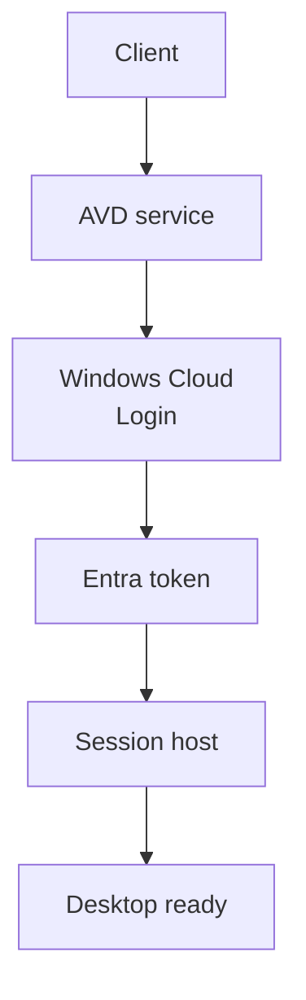

# Single sign-on

<span class="level l300">Level 300</span>

Single sign-on lets the user launch a desktop without typing a second password into Windows. Azure Virtual Desktop uses Microsoft Entra authentication for Remote Desktop Protocol to make that work.

!!! tip "Go deeper"
    For the full sign-in path, see [AVD sign-in end to end](../demystified/avd-sign-in-end-to-end.md). For how tokens and Kerberos tickets differ, see [Tokens and tickets](../demystified/tokens-and-tickets.md).

## Enable Microsoft Entra authentication for RDP

**Status:** Generally available. Microsoft Learn documents the configuration without a preview label [Configure single sign-on](https://learn.microsoft.com/azure/virtual-desktop/configure-single-sign-on).

Before SSO can work, Microsoft Entra authentication for RDP must be enabled in the tenant. Learn says this sets the `isRemoteDesktopProtocolEnabled` property to true on the service principal's `remoteDesktopSecurityConfiguration` object for **Windows Cloud Login**, app ID `270efc09-cd0d-444b-a71f-39af4910ec45` [Configure single sign-on](https://learn.microsoft.com/azure/virtual-desktop/configure-single-sign-on#enable-microsoft-entra-authentication-for-rdp).

Required Microsoft Entra roles for this tenant configuration are **Application Administrator** or **Cloud Application Administrator**, or equivalent [Configure single sign-on](https://learn.microsoft.com/azure/virtual-desktop/configure-single-sign-on#prerequisites).

This diagram shows what changes when single sign-on is enabled.



1. The client launches a desktop from the Azure Virtual Desktop feed.
2. Windows Cloud Login handles the session host authentication.
3. The session host receives a Microsoft Entra sign-in token instead of prompting for a second password.

## Configure the host pool RDP property

Set **Microsoft Entra single sign-on** in the Azure portal to **Connections will use Microsoft Entra authentication to provide single sign-on**, or set the **enablerdsaadauth** RDP property to **1** with PowerShell [Configure single sign-on](https://learn.microsoft.com/azure/virtual-desktop/configure-single-sign-on#configure-your-host-pool-to-enable-single-sign-on).

```text
enablerdsaadauth:i:1
```

If SSO is not enabled, non-Windows clients and unsupported local device states require the legacy **targetisaadjoined** custom RDP property. Learn documents **targetisaadjoined:i:1** for access to Microsoft Entra joined VMs when using other clients or when the local Windows PC does not meet the same-tenant joined, hybrid joined, or registered requirements [Microsoft Entra joined session hosts](https://learn.microsoft.com/azure/virtual-desktop/azure-ad-joined-session-hosts#connect-using-legacy-authentication-protocols).

```text
targetisaadjoined:i:1
```

## Hide the consent prompt

When SSO is enabled, users see a consent dialog when connecting to a new session host. Learn says Microsoft Entra remembers up to 15 hosts for 30 days. To hide the dialog, create Microsoft Entra device groups containing the session hosts and add the group IDs to the **Windows Cloud Login** service principal under **Target device groups to enable SSO**. Learn documents a maximum of 10 device groups [Configure single sign-on](https://learn.microsoft.com/azure/virtual-desktop/configure-single-sign-on#hide-the-consent-prompt-dialog).

## Create a Kerberos server object when AD DS exists

**Status:** Generally available as documented configuration for Azure Virtual Desktop SSO with AD DS resources [Configure single sign-on](https://learn.microsoft.com/azure/virtual-desktop/configure-single-sign-on#create-a-kerberos-server-object).

Learn says you must create a Kerberos server object when:

- The session host is Microsoft Entra hybrid joined.
- The session host is Microsoft Entra joined and the environment contains AD DS domain controllers, so users can access on-premises resources such as SMB shares and Windows-integrated authentication to websites [Configure single sign-on](https://learn.microsoft.com/azure/virtual-desktop/configure-single-sign-on#create-a-kerberos-server-object).

This is different from Microsoft Entra Kerberos for Azure Files. The Kerberos server object supports on-premises resource access and AD DS-integrated authentication. Microsoft Entra Kerberos for Azure Files lets Microsoft Entra joined clients retrieve Kerberos tickets to access Azure Files file shares for FSLogix profiles, including hybrid and cloud-only identities [Enable Microsoft Entra Kerberos authentication for Azure Files](https://learn.microsoft.com/azure/storage/files/storage-files-identity-auth-hybrid-identities-enable). Storage and profile design are covered in [User profiles with FSLogix](../profiles/index.md).

---

Part of [Identity and access](index.md).
