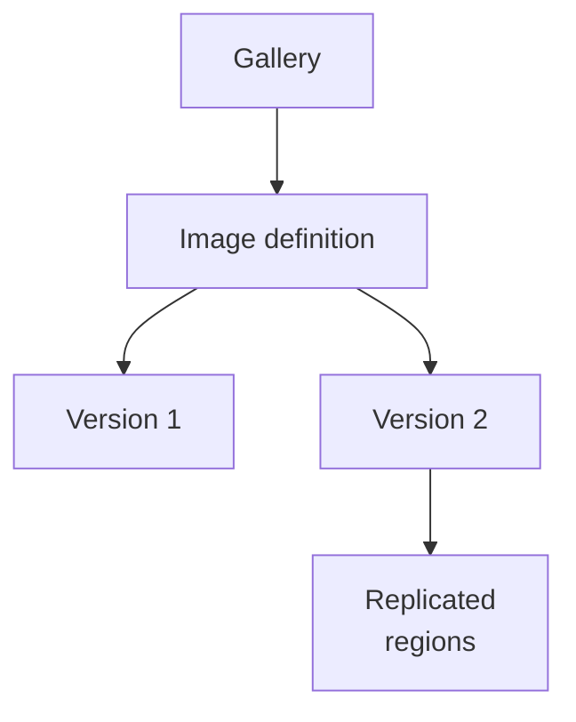

# Azure Compute Gallery

Level 300

Azure Compute Gallery is where image versions live after the build. It gives the host pool a versioned, replicated source instead of a one-off managed image.

Azure Compute Gallery is the image distribution layer. Microsoft says it provides global replication, versioning, grouping, zone-redundant storage in supported regions, and sharing features in [Azure Compute Gallery overview](https://learn.microsoft.com/azure/virtual-machines/azure-compute-gallery).

Use:

- One image definition per operating system, security type, and major build line.
- One image version per release.
- Regional replication to every region where session hosts are deployed.
- ZRS where available and aligned with the organisation's resilience design.

Keep security type aligned. Azure Compute Gallery has Trusted Launch-related settings. The gallery overview states that when you specify **TrustedLaunchSupported** or **TrustedLaunchandConfidentialVMSupported** on an image definition, images can default to Trusted Launch if validation is successful in [Azure Compute Gallery overview](https://learn.microsoft.com/azure/virtual-machines/azure-compute-gallery#trusted-launch-validation-for-azure-compute-gallery-images-preview). That validation feature is preview and not recommended for production workloads according to the same section, so do not rely on preview validation as the only production gate.

!!! info "Preview"
    Trusted Launch validation for Azure Compute Gallery images is currently preview. Use production-safe validation outside that preview feature until it is generally available.

This diagram shows how definitions and versions are separated.

## Under the hood

Level 400

Microsoft documents these Azure Compute Gallery limits: **100 galleries**, **1,000 image definitions**, and **10,000 image versions** per subscription per region; **100 replicas per image version**; image size less than **2 TB**, with shallow replication supporting up to **32 TB**; and no resource movement support ([Azure Compute Gallery](https://learn.microsoft.com/azure/virtual-machines/azure-compute-gallery#limits)).

For scaling, Microsoft recommends one replica for every 20 VMs created concurrently and overprovisioning replicas because resource size, content, and OS type can affect deployment throughput ([Azure Compute Gallery](https://learn.microsoft.com/azure/virtual-machines/azure-compute-gallery#scaling)).

---

Part of [Images](index.md).
