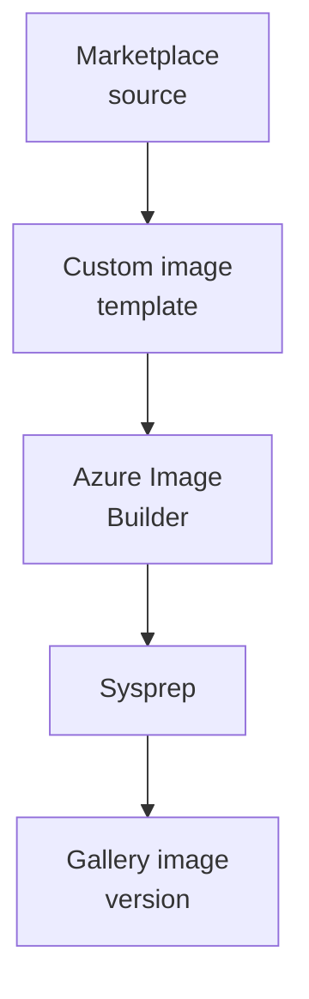

# Building images

Level 300

Image building turns a supported Marketplace source into an organisation-ready base image. Keep it deterministic: same source, same scripts, same output location.

## Source images

Use a supported Azure Virtual Desktop operating system. The prerequisites article lists supported operating systems and licences in [Prerequisites for Azure Virtual Desktop](https://learn.microsoft.com/azure/virtual-desktop/prerequisites#operating-systems-and-licenses). For the North Star, select Windows 11 Enterprise multi-session, which Microsoft describes as exclusive to Azure Virtual Desktop on Azure in [Using Azure Virtual Desktop multi-session with Microsoft Intune](https://learn.microsoft.com/intune/solutions/azure-virtual-desktop-multi-session).

If Microsoft 365 Apps are required for most users, prefer the Marketplace image variant that includes them. If only a subset needs them, validate App Attach or Intune.

## Azure Image Builder and custom image templates

Azure Image Builder is a managed service built on HashiCorp Packer. Microsoft says it removes complex tooling and transient build infrastructure, can start from Azure Marketplace or custom images, and can distribute the resulting image to Azure Compute Gallery, managed images, or VHDs in [Azure VM Image Builder overview](https://learn.microsoft.com/azure/virtual-machines/image-builder-overview).

Azure Virtual Desktop custom image templates are a portal experience built on Azure Image Builder. Microsoft says a custom image template is a JSON file containing source image, distribution targets, build properties, and customisations. Azure Image Builder uses it to create a custom image and generalises the image with sysprep in [Custom image templates](https://learn.microsoft.com/azure/virtual-desktop/custom-image-templates#creation-process).

Built-in scripts in custom image templates include:

- Install language packs.
- Set the default language of the operating system.
- Enable time zone redirection.
- Disable Storage Sense.
- Install FSLogix and configure Profile Container.
- Enable FSLogix with Kerberos.
- Enable RDP Shortpath for managed networks.
- Enable screen capture protection.
- Configure Teams optimizations.
- Configure session timeouts.
- Disable automatic updates for MSIX applications.
- Add or remove Microsoft Office applications.
- Apply Windows Updates.

This diagram shows the image build flow.

## Golden image guidance

Microsoft's golden image guidance matters because cloning the wrong state can break identity, enrolment, and Azure Virtual Desktop registration.

Follow these documented rules from [Create an Azure Virtual Desktop golden image](https://learn.microsoft.com/azure/virtual-desktop/set-up-golden-image):

- Do not join the golden image VM to a host pool by deploying the Azure Virtual Desktop agent. Microsoft says this prevents sysprep from working and directs you to install the agent when deploying session hosts.
- If you use antivirus, disable it before sysprep to avoid sysprep issues.
- Remove the VM from the domain before running sysprep.
- Do not capture a VM that already exists in your host pools. Microsoft says the image conflicts with existing VM configuration and the new VM will not work.
- Do not create a new base VM from an existing custom image. Microsoft says it is better to start with a brand-new source VM.

For Microsoft Entra joined and Intune-enrolled session hosts, also avoid cloning an already enrolled machine. Microsoft Intune states that it does not support using a cloned image of a computer that is already enrolled, including physical and virtual devices such as Azure Virtual Desktop, because replicated device enrolment or identity tokens cause enrolment or sync failures in [Using Azure Virtual Desktop multi-session with Microsoft Intune](https://learn.microsoft.com/intune/solutions/azure-virtual-desktop-multi-session#limitations).

## Under the hood

Level 400

Azure Virtual Desktop custom image templates are JSON definitions that include source image, distribution targets, build properties, and customisations. Azure Image Builder generalises the image with sysprep during creation ([Custom image templates](https://learn.microsoft.com/azure/virtual-desktop/custom-image-templates#creation-process)).

The build uses a user-assigned managed identity and creates temporary resources such as a build VM, Key Vault, storage account, and a resource group named in the `IT_<ResourceGroupName>_<TemplateName>_<GUID>` format ([Custom image templates](https://learn.microsoft.com/azure/virtual-desktop/custom-image-templates#resources)).

---

Part of [Images](index.md).
