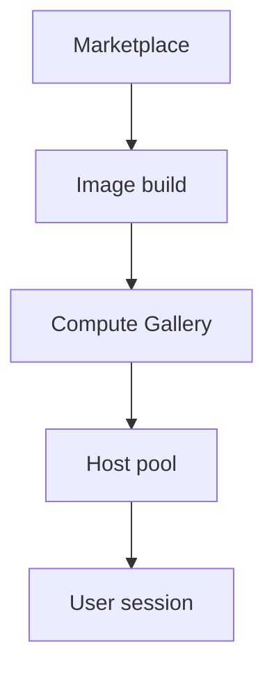
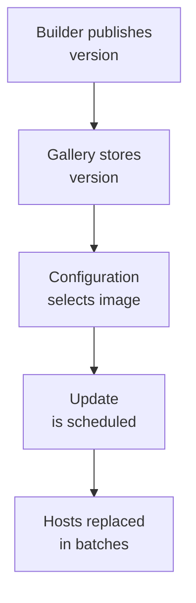

# Images

!!! abstract "At a glance"
    - Start from a supported Azure Marketplace Windows 11 Enterprise multi-session image, not from an existing session host.
    - Keep the base image lean: operating system, updates, platform agents, security tooling, and configuration required before first sign-in.
    - Deliver applications with App Attach where practical, and use Microsoft Intune for policy and management.
    - Build images with Azure Image Builder or Azure Virtual Desktop custom image templates, then publish versioned images to Azure Compute Gallery.
    - Roll image versions through rings with session host update, and use Microsoft's Windows update methodology guidance for what should be image-based versus patched in place.

## In plain terms

Level 100

An image is like the master recipe for every session host. If the recipe is clean and repeatable, every host comes out the same. If the recipe contains old leftovers, every host inherits them.

The North Star keeps the recipe lean. Put the operating system and universal agents in the image. Deliver applications with App Attach where possible and manage settings with Intune.

This diagram shows the image supply chain.

## What it is

Level 200

An image is the source used to create session host virtual machines. In Azure Virtual Desktop, image quality directly affects sign-in time, security posture, application compatibility, supportability, and the success of dynamic scaling. If every host is rebuilt from a known image, the host pool becomes a replaceable compute layer instead of a collection of hand-maintained servers.

The North Star image pipeline is:

1. Start with a supported Azure Marketplace Windows 11 Enterprise multi-session image.
2. Use Azure Image Builder or Azure Virtual Desktop custom image templates to apply controlled customisation.
3. Store the result as a versioned image in Azure Compute Gallery.
4. Point the host pool session host configuration at the image version.
5. Roll it out through session host update.

## How it fits

1. **Start from the Marketplace.** Windows 11 Enterprise multi-session, with or without Microsoft 365 Apps.
2. **Build a lean base image** with Azure VM Image Builder: the operating system, the security agents and what every user needs, and nothing that App Attach or Intune can deliver.
3. **Publish an image version** to Azure Compute Gallery, and replicate it to every region you deploy in.
4. **Reference the version in the session host configuration**, so every new host is built from it.
5. **Roll out in rings** with session host update: a ring 0 host pool first, then ring 1, then the production host pools.

Images provide the operating system and baseline. App Attach provides applications at sign-in. Intune provides policy, certificates, scripts, and device management after enrolment.

## North Star recommendation

Use a lean base image built from a brand-new source. Microsoft recommends not creating a new base VM from an existing custom image in [Create an Azure Virtual Desktop golden image](https://learn.microsoft.com/azure/virtual-desktop/set-up-golden-image#other-recommendations).

**Status: Azure Image Builder is available as a managed service in the regions listed in the Azure VM Image Builder overview. Its DevOps task is preview, and USGov Arizona and USGov Virginia are listed as public preview regions.** See [Azure VM Image Builder overview](https://learn.microsoft.com/azure/virtual-machines/image-builder-overview#regions).

**Status: Azure Virtual Desktop custom image templates are documented as a current feature built on Azure Image Builder.** The feature article does not mark custom image templates as preview, and describes the creation process in [Custom image templates](https://learn.microsoft.com/azure/virtual-desktop/custom-image-templates).

Use Azure Compute Gallery for production image distribution because Microsoft says it provides region replication, versioning, and sharing for custom images in [Custom image templates](https://learn.microsoft.com/azure/virtual-desktop/custom-image-templates#creation-process). The September 2026 What's new page says Windows 11 Enterprise 26H2 and Windows 11 Enterprise + Microsoft Apps 26H2 images are now available in Azure Marketplace in [What's new](https://learn.microsoft.com/azure/virtual-desktop/whats-new#september-2026).

## Design decisions

Level 300

| Decision | North Star choice | Why |
|---|---|---|
| Source image | Azure Marketplace Windows 11 Enterprise multi-session | Marketplace images are a supported source for custom image templates and Azure Image Builder, per [Custom image templates](https://learn.microsoft.com/azure/virtual-desktop/custom-image-templates#creation-process). |
| Microsoft 365 Apps | Use the Microsoft 365 Apps variant where the standard user experience requires it | Microsoft provides Windows client multi-session images for Azure Virtual Desktop and the Windows 11 on Azure article references Windows 11 Enterprise multi-session as an Azure Virtual Desktop image family in [How to deploy Windows 11 on Azure](https://learn.microsoft.com/azure/virtual-machines/windows/windows-desktop-multitenant-hosting-deployment). |
| Image build engine | Azure Image Builder through custom image templates or infrastructure as code | Azure Image Builder lets you start from Marketplace or custom images, add customisations, and distribute to Azure Compute Gallery, managed images, or VHDs, per [Azure VM Image Builder overview](https://learn.microsoft.com/azure/virtual-machines/image-builder-overview). |
| Image content | Lean base image | A small image reduces rebuild time, troubleshooting scope, and session host update risk. Applications that can be attached at sign-in should not be baked into every host. |
| Application delivery | App Attach first | App Attach dynamically attaches applications and avoids installing them locally on images or hosts, per [App Attach overview](https://learn.microsoft.com/azure/virtual-desktop/app-attach-overview). |
| Image store | Azure Compute Gallery | It manages image definitions, versions, replication, and sharing, per [Azure Compute Gallery overview](https://learn.microsoft.com/azure/virtual-machines/azure-compute-gallery). |
| Rollout | Session host update rings | Session host update replaces hosts from the updated session host configuration in batches, per [Session host update](https://learn.microsoft.com/azure/virtual-desktop/session-host-update). |
| Update methodology | Image-based servicing for pooled Windows client multi-session | Microsoft recommends **Session host update** and **Azure Compute Gallery** for Windows client multi-session monthly updates and feature updates in [Windows update management methodologies for session hosts](https://learn.microsoft.com/azure/virtual-desktop/windows-update-management-methodologies-session-hosts). |

## What belongs where

=== "Base image"
    Put only the components that must exist before Intune policy, App Attach, and user sign-in can complete:

    - Windows 11 Enterprise multi-session source image.
    - Current quality updates where they are part of the image build process.
    - Azure Virtual Desktop and platform prerequisites that are part of deployment.
    - Security agents that must run before the first user signs in.
    - Network, monitoring, and endpoint agents that cannot be reliably delivered after enrolment.
    - FSLogix agent if not delivered through Intune or a custom image template script.

=== "App Attach"
    Put suitable applications into App Attach packages. Microsoft says App Attach can use **MSIX**, **MSIX bundle**, **Appx**, **Appx bundle**, and **App-V** package formats, and that applications are not installed locally on session hosts or images in [App Attach overview](https://learn.microsoft.com/azure/virtual-desktop/app-attach-overview).

=== "Intune"
    Put policy, certificates, scripts, security settings, and supported application deployment into Microsoft Intune. Microsoft recommends using Intune to manage Azure Virtual Desktop and states that Intune can manage Microsoft Entra joined and Microsoft Entra hybrid joined session hosts in [Manage the operating system of session hosts](https://learn.microsoft.com/azure/virtual-desktop/management).

## Under the hood

Level 400

Azure Compute Gallery is the distribution system. Microsoft lists limits of **100 galleries**, **1,000 image definitions**, and **10,000 image versions** per subscription per region, plus a maximum **100 replicas per image version** ([Azure Compute Gallery](https://learn.microsoft.com/azure/virtual-machines/azure-compute-gallery#limits)).

Session host update is the rollout system. Microsoft says it first updates one **initial** host, then updates the rest in batches, and that only one update can run or be scheduled in a single host pool at a time ([Session host update](https://learn.microsoft.com/azure/virtual-desktop/session-host-update#update-process)).

## In this section

-   __[Building images](building-images.md)__

    ---

    Source images, Azure Image Builder, custom image templates and Microsoft's golden image guidance.

-   __[Azure Compute Gallery](azure-compute-gallery.md)__

    ---

    Image definitions, versions, replication, storage redundancy and Trusted launch alignment.

-   __[Rollout and cadence](rollout-and-cadence.md)__

    ---

    Rolling images out in rings with session host update, how often to update, and the requirements to plan for.

## Common pitfalls

- Capturing a session host from the pool and using it as the next base image.
- Joining the image VM to the host pool before sysprep.
- Baking every application into the image because it is operationally familiar.
- Treating Intune enrolment state as something that can be safely cloned.
- Creating image definitions that do not align with Trusted launch requirements.
- Replicating images to fewer regions than consuming host pools.
- Running session host update without testing the new image in a representative host pool.
- Forgetting that App Attach and FSLogix have storage and network dependencies, even when the host image is healthy.

## Microsoft Learn

- [Create an Azure Virtual Desktop golden image](https://learn.microsoft.com/azure/virtual-desktop/set-up-golden-image)
- [Prepare and customize a VHD image of Azure Virtual Desktop](https://learn.microsoft.com/azure/virtual-desktop/set-up-customize-master-image)
- [Azure VM Image Builder overview](https://learn.microsoft.com/azure/virtual-machines/image-builder-overview)
- [Create an Azure Virtual Desktop image by using Azure VM Image Builder](https://learn.microsoft.com/azure/virtual-machines/windows/image-builder-virtual-desktop)
- [Custom image templates](https://learn.microsoft.com/azure/virtual-desktop/custom-image-templates)
- [Overview of Azure Compute Gallery](https://learn.microsoft.com/azure/virtual-machines/azure-compute-gallery)
- [Session host update](https://learn.microsoft.com/azure/virtual-desktop/session-host-update)
- [App Attach in Azure Virtual Desktop](https://learn.microsoft.com/azure/virtual-desktop/app-attach-overview)
- [Using Azure Virtual Desktop multi-session with Microsoft Intune](https://learn.microsoft.com/intune/solutions/azure-virtual-desktop-multi-session)
- [Windows update management methodologies for session hosts](https://learn.microsoft.com/azure/virtual-desktop/windows-update-management-methodologies-session-hosts)
