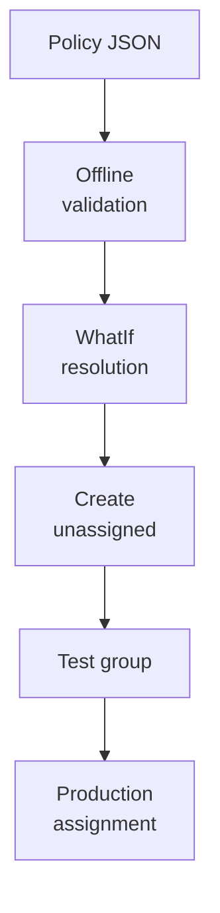

# Policy examples

!!! abstract "At a glance"
    - The repository has four example Intune policies for North Star session hosts: Microsoft Entra Kerberos and FSLogix, Defender exclusions for FSLogix, clipboard transfer direction, and Windows LAPS.
    - Each file is readable JSON that records, for every setting, where to find it in the settings picker, the CSP or registry path, the value, the scope, why it's set and the Microsoft Learn source.
    - [Deploy-IntunePolicy.ps1](https://github.com/marckean/AVD-Reference_Architecture/blob/main/tools/intune/Deploy-IntunePolicy.ps1) resolves every setting against your tenant's settings catalog through Microsoft Graph before it creates anything, and stops with the settings picker path if it can't.
    - Policies are created unassigned. Run offline validation, then `-WhatIf`, then a test device group, then production.

<span class="level l300">Level 300</span>

The examples are not magic templates. They are readable policy definitions that resolve real settings in your tenant before anything is created.

This diagram shows the safe deployment path.



## Why examples help

An organisation that has never configured Intune for multi-session session hosts starts from an empty settings catalog. The [required policies](policies.md) page explains what each host needs and why. These examples turn that list into files you can review with your security and operations teams, adapt, and deploy in minutes rather than days. They live in [tools/intune](https://github.com/marckean/AVD-Reference_Architecture/tree/main/tools/intune) in the repository, outside the website.

Learn says that to configure policies for Windows Enterprise multi-session VMs you use the settings catalog, and that you can use device-based configuration targeted to devices or user-based configuration targeted to users ([Intune and multi-session](https://learn.microsoft.com/intune/solutions/azure-virtual-desktop-multi-session#create-the-configuration-profile)). Every setting in these examples is device-scoped, so they target device groups.

## The examples

| Policy file | Settings | Learn source |
| --- | --- | --- |
| [avd-identity-and-fslogix.json](https://github.com/marckean/AVD-Reference_Architecture/blob/main/tools/intune/policies/avd-identity-and-fslogix.json) | **Kerberos > Cloud Kerberos Ticket Retrieval Enabled** set to **Enabled**, so Microsoft Entra joined hosts can get Kerberos tickets for Azure Files. FSLogix **Enabled** **1**, **VHDLocations**, **ProfileType** **0**, **SizeInMBs** **30000**, **IsDynamic** **1**, **VolumeType** **vhdx**, **FlipFlopProfileDirectoryName** **1**, **DeleteLocalProfileWhenVHDShouldApply** **0** and **RoamIdentity** **0** | [Microsoft Entra Kerberos for Azure Files](https://learn.microsoft.com/azure/storage/files/storage-files-identity-auth-hybrid-identities-enable), [FSLogix configuration settings](https://learn.microsoft.com/fslogix/reference-configuration-settings) |
| [avd-defender-fslogix-exclusions.json](https://github.com/marckean/AVD-Reference_Architecture/blob/main/tools/intune/policies/avd-defender-fslogix-exclusions.json) | Microsoft Defender Antivirus **Excluded Paths**, **Excluded Processes** (**frxsvc.exe**, **frxccds.exe**) and **Excluded Extensions** (**VHD**, **VHDX**) for FSLogix | [FSLogix antivirus exclusions](https://learn.microsoft.com/fslogix/overview-prerequisites#configure-antivirus-file-and-folder-exclusions) |
| [avd-session-redirection.json](https://github.com/marckean/AVD-Reference_Architecture/blob/main/tools/intune/policies/avd-session-redirection.json) | **Restrict clipboard transfer from server to client** and **Restrict clipboard transfer from client to server** set to **Allow plain text**, with **Do not allow Clipboard redirection** left **Disabled** | [Clipboard transfer direction and data types](https://learn.microsoft.com/azure/virtual-desktop/clipboard-transfer-direction-data-types) |
| [avd-windows-laps.json](https://github.com/marckean/AVD-Reference_Architecture/blob/main/tools/intune/policies/avd-windows-laps.json) | **Backup Directory** set to Microsoft Entra ID, **Password Age Days** **30**, **Password Complexity** **4** (Learn: *"Microsoft recommends that this setting always be configured to 4"*), **Password Length** **16**, **Post Authentication Actions** reset the password | [LAPS CSP](https://learn.microsoft.com/windows/client-management/mdm/laps-csp) |

Every value is a starting point. Before you deploy, replace the Contoso share path in **VHDLocations**, review **SizeInMBs** per persona, review the Defender exclusions with your security team, and review clipboard direction with your security and user experience owners. Keep **DeleteLocalProfileWhenVHDShouldApply** at **0** until migration testing is done: Learn warns that it permanently deletes the matching local profile ([FSLogix configuration settings](https://learn.microsoft.com/fslogix/reference-configuration-settings#deletelocalprofilewhenvhdshouldapply)).

## Why settings are resolved at deployment time

Settings catalog policies refer to each setting by a setting definition ID, and to each choice by an option ID. Those IDs shouldn't be copied from another tenant or written from memory. So the files describe each setting the way a person would find it, and the script finds the real definition in your tenant:

1. It reads the policy files and checks them offline.
2. It connects with the Microsoft Graph PowerShell SDK and lists the setting definitions from the settings catalog (the Microsoft Graph beta **deviceManagementConfigurationSettingDefinition** resource).
3. For each setting, it finds exactly one matching definition and, for choice settings, checks the option exists.
4. If anything doesn't resolve, it stops before creating anything and tells you the settings picker path to check.

The settings catalog APIs are in Microsoft Graph beta, which Learn says is subject to change, so always run `-WhatIf` first ([deviceManagementConfigurationPolicy resource type](https://learn.microsoft.com/graph/api/resources/intune-deviceconfigv2-devicemanagementconfigurationpolicy)).

## Deploy them

```powershell
# 1. Check the files without connecting to anything
./tools/intune/Deploy-IntunePolicy.ps1 -OfflineValidationOnly

# 2. Connect, resolve every setting and create nothing
./tools/intune/Deploy-IntunePolicy.ps1 -WhatIf -Verbose

# 3. Create the policies, unassigned, then review them in the Intune admin center
./tools/intune/Deploy-IntunePolicy.ps1 -Verbose

# 4. Assign them to a device group that contains only test session hosts
./tools/intune/Deploy-IntunePolicy.ps1 -AssignToGroupId '<test device group object ID>'
```

The script uses the delegated Microsoft Graph scope **DeviceManagementConfiguration.ReadWrite.All** to create policies ([Connect-MgGraph](https://learn.microsoft.com/powershell/module/microsoft.graph.authentication/connect-mggraph)). Target the policies the way [Enrolment and targeting](targeting.md) describes: device groups for session hosts, and device-scoped settings.

To roll back, unassign the policy or delete it in the Intune admin center. The script doesn't delete anything.

## Use AI to adapt them

The repository's `intune-policy-examples` skill teaches GitHub Copilot the file format and the rule that IDs are never invented, so you can ask it to explain a setting, change a value, or draft a new policy file in the same format. Copilot in Intune can also explain settings while you work in the admin center, if your organisation uses Security Copilot ([Microsoft Copilot in Intune](https://learn.microsoft.com/intune/copilot/)). See [Working with AI](../accelerators/working-with-ai.md).

---

Part of [Intune](index.md).
