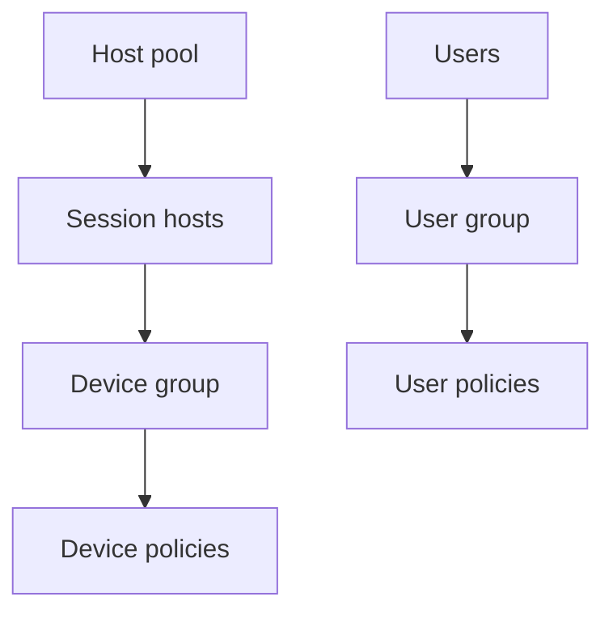

# Enrolment and targeting

<span class="level l300">Level 300</span>

Targeting is how Intune knows which settings go to which session hosts. For multi-session, scope matters: device settings go to devices, and user settings go to users.

This diagram shows the targeting model.



## Targeting session hosts

Use Microsoft Entra device groups for session hosts. When creating a Settings Catalog profile, Learn says to add a settings filter with:

```text
Key: OS edition
Operator: ==
Value: Enterprise multi-session
```

Then select settings from the filtered list [Windows Enterprise multi-session](https://learn.microsoft.com/intune/solutions/azure-virtual-desktop-multi-session#create-the-configuration-profile).

Use device groups for device-scoped settings. Learn says device-based configuration cannot be assigned to users and user-based configuration cannot be assigned to devices. If the scope is wrong, it is reported as **Error** or **Not applicable** [Windows Enterprise multi-session](https://learn.microsoft.com/intune/solutions/azure-virtual-desktop-multi-session#overview).

---

Part of [Intune](index.md).
