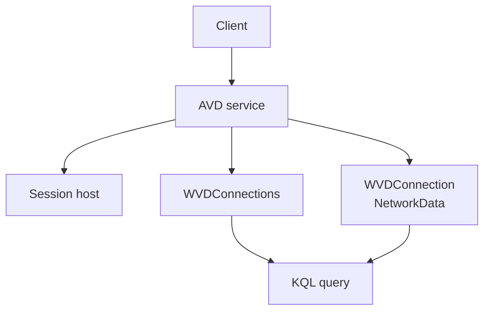

# Connection quality and errors

<span class="level l300">Level 300</span>

Connection quality is the user experience view of the network. It tells you whether the session is delayed, constrained or falling back to a less optimal path.

This diagram shows how connection records and network samples are correlated.



## Connection quality and network data

Azure Virtual Desktop writes connection network data to the `WVDConnectionNetworkData` table. Microsoft documents KQL examples that use `EstRoundTripTimeInMs` for estimated round-trip time and `EstAvailableBandwidthKBps` for estimated available bandwidth [Queries for the WVDConnectionNetworkData table](https://learn.microsoft.com/azure/azure-monitor/reference/queries/wvdconnectionnetworkdata). Use this data to prove whether RDP Shortpath, client location, private endpoints or network routing changes are improving user experience.

```kusto
WVDConnectionNetworkData
| summarize percentiles(EstRoundTripTimeInMs, 90, 50, 10) by bin(TimeGenerated,10m)
| render timechart
```

```kusto
WVDConnectionNetworkData
| summarize percentiles(EstAvailableBandwidthKBps, 90, 50, 10) by bin(TimeGenerated,10m)
| render timechart
```

To find users with poor network experience, use the Learn-documented join between `WVDConnectionNetworkData` and `WVDConnections`:

```kusto
WVDConnectionNetworkData
| join kind=leftouter
(
    WVDConnections
    | where State == "Completed"
    | distinct CorrelationId, UserName
) on CorrelationId
| summarize AvgRTT=round(avg(EstRoundTripTimeInMs)), RTT_P95=percentile(EstRoundTripTimeInMs, 95) by UserName
| top 10 by AvgRTT desc
```

## Failure and error triage

The diagnostics article documents `WVDConnections`, `WVDErrors` and `WVDCheckpoints`. It also states that `WVDErrors` shows management errors, host registration issues and issues while users subscribe to apps or desktops, and that `ServiceError` should be `false` for admin-resolvable issues. If `ServiceError` is `true`, Learn says to escalate to Microsoft and provide the `CorrelationID` [Send diagnostic data to Log Analytics for Azure Virtual Desktop](https://learn.microsoft.com/azure/virtual-desktop/diagnostics-log-analytics).

```kusto
WVDErrors
| where UserName == "userupn"
| take 100
```

```kusto
WVDErrors
| where CodeSymbolic == "ErrorSymbolicCode"
| summarize count(UserName) by CodeSymbolic
```

!!! note

    Learn states that connections that do not reach Azure Virtual Desktop do not show up in diagnostics because the diagnostics role service is part of Azure Virtual Desktop. Pair AVD diagnostics with client, network and Service Health evidence when a user cannot reach the service at all.

## Under the hood

<span class="level l400">Level 400</span>

Microsoft Learn documents `WVDConnectionNetworkData` queries that use `EstRoundTripTimeInMs`, `EstAvailableBandwidthKBps`, `CorrelationId`, `UdpUse`, `ClientOS`, `ClientType`, `ClientVersion`, `ConnectionType`, `ResourceAlias` and `SessionHostSxSStackVersion` [Queries for the WVDConnectionNetworkData table](https://learn.microsoft.com/azure/azure-monitor/reference/queries/wvdconnectionnetworkdata). Use `CorrelationId` to join the network samples to the completed connection record.

```kusto
WVDConnectionNetworkData
| summarize RTTP90=percentile(EstRoundTripTimeInMs,90), BWP90=percentile(EstAvailableBandwidthKBps,90), StartTime=min(TimeGenerated), EndTime=max(TimeGenerated) by CorrelationId
| join kind=inner
(
    WVDConnections
    | where State == "Connected"
    | extend Protocol = iif(UdpUse in ("0", "<>"), "TCP", "UDP")
) on CorrelationId
| project CorrelationId, StartTime, EndTime, UserName, SessionHostName, RTTP90, BWP90, Protocol, ClientOS, ClientType, ClientVersion, ConnectionType, ResourceAlias, SessionHostSxSStackVersion
```

---

Part of [Monitoring](index.md).
