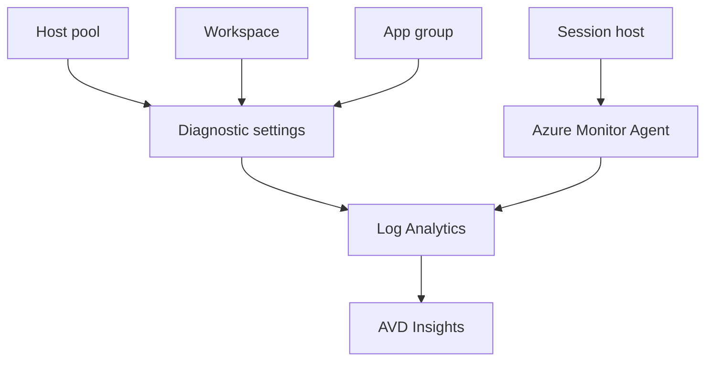

# Diagnostics and AVD Insights

Level 300

Diagnostics are the service-side records. Azure Virtual Desktop Insights is the workbook that helps people read those records without starting from a blank query window.

This diagram shows how diagnostics and host telemetry meet in Log Analytics.

## Diagnostic settings

Use diagnostic settings to send Azure Virtual Desktop logs to Log Analytics. In the portal flow documented by Learn, you go to the Azure Virtual Desktop object, open **Diagnostic settings**, add a setting, choose **Send to Log Analytics**, and select the categories required for the object [Send diagnostic data to Log Analytics for Azure Virtual Desktop](https://learn.microsoft.com/azure/virtual-desktop/diagnostics-log-analytics).

For a North Star deployment, configure diagnostics through infrastructure as code so every new host pool, workspace and application group is attached to the correct Log Analytics workspace on creation. Do not rely on a manual portal step after the environment is live.

## Azure Virtual Desktop Insights

Azure Virtual Desktop Insights checks configuration by resource. Learn documents a **Check Configuration** workbook and messages such as **No existing diagnostic configuration was found for the selected host pool** or workspace when diagnostics are missing [Enable Insights to monitor Azure Virtual Desktop](https://learn.microsoft.com/azure/virtual-desktop/insights). The same article states that to collect session host information you must configure a DCR, associate session hosts with it, install Azure Monitor Agent on all session hosts in the host pool and ensure they send data to a Log Analytics workspace.

For host pools with more than 1,000 session hosts, Learn recommends installing Azure Monitor Agent when you create a session host by using an Azure Resource Manager template [Enable Insights to monitor Azure Virtual Desktop](https://learn.microsoft.com/azure/virtual-desktop/insights). In this architecture, bake the Azure Monitor Agent extension and DCR association into the same automation that creates or refreshes session hosts.

## Under the hood

Level 400

Azure Virtual Desktop Insights needs both AVD diagnostics and host data. Learn states that session host data collection requires a **Data Collection Rule (DCR)**, Azure Monitor Agent on all session hosts in the host pool, and data sent to a Log Analytics workspace [Enable Insights to monitor Azure Virtual Desktop](https://learn.microsoft.com/azure/virtual-desktop/insights). The same page says the configuration workbook checks for missing counters and missing event logs.

For the service side, Learn lists diagnostic categories including **Management Activities**, **Feed**, **Connections**, **Errors**, **Checkpoints** and **Connection Graphics** [Send diagnostic data to Log Analytics for Azure Virtual Desktop](https://learn.microsoft.com/azure/virtual-desktop/diagnostics-log-analytics). Treat these as the minimum data set before tuning ingestion volume.

---

Part of [Monitoring](index.md).
