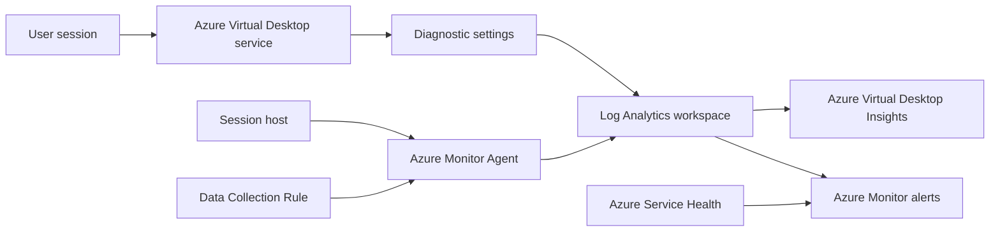

# Monitoring

!!! abstract "At a glance"

    - Send Azure Virtual Desktop diagnostics from host pools, workspaces and application groups to Log Analytics so connection, feed, error, checkpoint, management and graphics data can be queried centrally.
    - Use Azure Virtual Desktop Insights as the operational workbook for capacity, reliability, connection quality and session host health.
    - Install Azure Monitor Agent on session hosts through the image or deployment process, then attach a Data Collection Rule for the recommended performance counters and Windows Event Logs.
    - Alert on user-impacting symptoms first: failed connections, unavailable session hosts, exhausted capacity and Azure service health events.
    - Control cost by collecting only the diagnostic categories, counters and event logs that support an operational decision.

## What it is

Monitoring for the [North Star AVD design](../overview/how-it-fits-together.md) has two layers.

The first layer is **control plane diagnostics**. Azure Virtual Desktop creates activity logs for user and administrative actions and can send those diagnostics to Log Analytics by using diagnostic settings. Microsoft Learn lists these activity log categories: **Management Activities**, **Feed**, **Connections**, **Errors**, **Checkpoints** and **Connection Graphics** in the Azure Virtual Desktop diagnostics article [Send diagnostic data to Log Analytics for Azure Virtual Desktop](https://learn.microsoft.com/azure/virtual-desktop/diagnostics-log-analytics). These records are the source of truth for brokering, user connection flow, resource feed subscription and service-side errors.

The second layer is **session host telemetry**. Session hosts are Windows 11 Enterprise multi-session virtual machines, so you also need guest operating system data such as CPU, memory, disk, event logs and agent health. Azure Virtual Desktop Insights uses Azure Monitor Workbooks and requires Azure Monitor Agent, a Data Collection Rule and a Log Analytics workspace for session host performance counters and Windows Event Logs, as documented in [Enable Insights to monitor Azure Virtual Desktop](https://learn.microsoft.com/azure/virtual-desktop/insights). Azure Monitor Agent is the supported agent for guest operating system data collection in Azure Monitor and uses Data Collection Rules to define what is collected, how it is processed and where it is sent, as described in [Azure Monitor Agent overview](https://learn.microsoft.com/azure/azure-monitor/agents/azure-monitor-agent-overview).

**Status:** Generally available for Azure Monitor Agent. Microsoft Learn states that Azure Monitor Agent is available for general availability features in all global Azure regions, Azure Government and Azure operated by 21Vianet in [Azure Monitor Agent overview](https://learn.microsoft.com/azure/azure-monitor/agents/azure-monitor-agent-overview). Azure Virtual Desktop Insights is generally available, as stated in [What's new in Azure Virtual Desktop?](https://learn.microsoft.com/azure/virtual-desktop/whats-new). Azure Virtual Desktop diagnostic settings are not labelled as preview in their Learn article, but Learn does not provide an explicit GA statement on that page.

## How it fits

In the North Star design, session hosts are disposable because they use [ephemeral OS disks](https://learn.microsoft.com/azure/virtual-machines/ephemeral-os-disks) and are managed through session host configuration and autoscale. Monitoring therefore focuses on the pool, image version, connection path and profile service rather than on repairing an individual host. If a host is unhealthy, drain it, delete it and let the platform recreate capacity.

## North Star recommendation

| Decision | North Star choice | Why |
| --- | --- | --- |
| Log destination | One Log Analytics workspace per environment or landing zone | Azure Virtual Desktop diagnostics and Azure Monitor Agent data need a common query surface for Insights and alerts. |
| Diagnostic scope | Enable diagnostics on each host pool, workspace and application group | Learn describes diagnostics for Azure Virtual Desktop objects, and user connection flow crosses all three resource types. |
| Diagnostic categories | Start with **Management Activities**, **Feed**, **Connections**, **Errors**, **Checkpoints** and **Connection Graphics** | These are the Azure Virtual Desktop activity log categories listed by Learn. |
| Session host collection | Install Azure Monitor Agent from image build or deployment automation and associate a DCR | Insights requires a DCR, Azure Monitor Agent on all monitored hosts and data sent to Log Analytics. |
| Workbook | Use Azure Virtual Desktop Insights for daily operations | Learn describes Insights as an Azure Monitor Workbooks dashboard for understanding Azure Virtual Desktop environments. |
| Alerts | Alert on failed connections, capacity exhaustion, unavailable hosts and Service Health | These alerts map to user impact, not just infrastructure noise. |

## In this section

-   __[Diagnostics and AVD Insights](diagnostics.md)__

    ---

    Diagnostic settings, the Log Analytics workspace and AVD Insights.

-   __[Connection quality and errors](connection-quality.md)__

    ---

    Round-trip time, bandwidth and connection data, and triaging failures and errors.

-   __[Autoscale and alerts](autoscale-and-alerts.md)__

    ---

    Autoscale diagnostics and the alerts worth setting up.

## Common pitfalls

!!! warning "Collecting everything is not an operations strategy"

    Azure Monitor Logs charges are typically driven by ingestion and retention in Log Analytics workspaces. Microsoft Learn states that several Azure Monitor features have no direct cost but add to workspace data [Azure Monitor Logs cost calculations and options](https://learn.microsoft.com/azure/azure-monitor/logs/cost-logs). Start with the AVD categories and counters required by Insights, then add only what an alert, workbook or investigation needs.

!!! warning "Disposable hosts still need identity in monitoring"

    If hosts are deleted and recreated, alerts that key only on a VM name become noisy. Tie operational views to host pool, image version, scaling plan and correlation IDs, then use VM names only for short-lived triage.

!!! tip "Keep the raw correlation ID"

    AVD diagnostics use `CorrelationId` across connection, checkpoint and error records. Keep it in alerts and incident tickets so support can join the sequence later.

## Microsoft Learn

- [Send diagnostic data to Log Analytics for Azure Virtual Desktop](https://learn.microsoft.com/azure/virtual-desktop/diagnostics-log-analytics)
- [Enable Insights to monitor Azure Virtual Desktop](https://learn.microsoft.com/azure/virtual-desktop/insights)
- [Azure Virtual Desktop Insights glossary](https://learn.microsoft.com/azure/virtual-desktop/insights-glossary)
- [Queries for the WVDConnectionNetworkData table](https://learn.microsoft.com/azure/azure-monitor/reference/queries/wvdconnectionnetworkdata)
- [Azure Monitor Agent overview](https://learn.microsoft.com/azure/azure-monitor/agents/azure-monitor-agent-overview)
- [Autoscale scaling plans and example scenarios in Azure Virtual Desktop](https://learn.microsoft.com/azure/virtual-desktop/autoscale-scenarios)
- [Create and assign an autoscale scaling plan for Azure Virtual Desktop](https://learn.microsoft.com/azure/virtual-desktop/autoscale-create-assign-scaling-plan)
- [What is Azure Service Health?](https://learn.microsoft.com/azure/service-health/overview)
- [Azure Monitor Logs cost calculations and options](https://learn.microsoft.com/azure/azure-monitor/logs/cost-logs)
