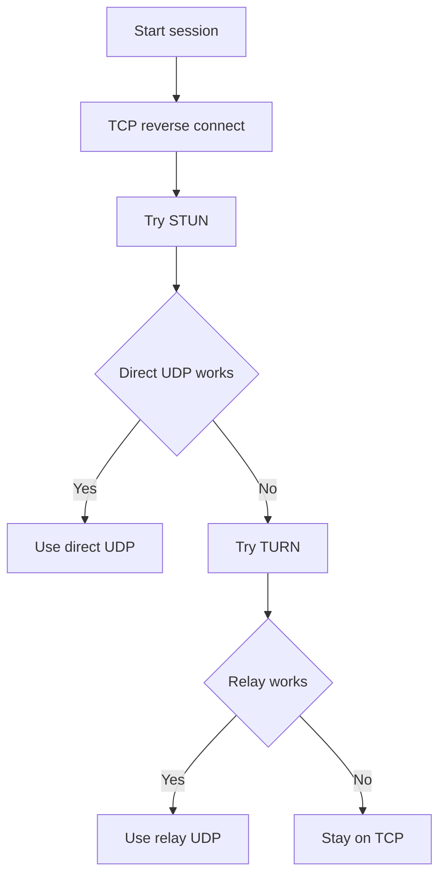

# Connection paths and quality

Level 300

This page explains which path the user's Remote Desktop Protocol traffic takes, and why the same deployment can use different paths depending on the client network.

This diagram shows the fallback order: start compatible, then use User Datagram Protocol when it works.

## Connection paths

RDP Shortpath has two modes. For **managed networks**, Learn describes direct connectivity between client and session host over private connectivity such as ExpressRoute or site-to-site VPN; a UDP listener is enabled on session hosts, with port **3390** by default unless changed ([RDP Shortpath for Azure Virtual Desktop](https://learn.microsoft.com/azure/virtual-desktop/rdp-shortpath)). For **public networks**, Learn describes direct UDP using **STUN** first, then relayed UDP using **TURN** if direct connectivity is not possible, falling back to TCP reverse connect if UDP is blocked ([RDP Shortpath for Azure Virtual Desktop](https://learn.microsoft.com/azure/virtual-desktop/rdp-shortpath)).

For Azure public cloud, Learn lists required RDP transport endpoints for RDP Shortpath and RDP Multipath: TCP-based RDP to `*.wvd.microsoft.com` on TCP 443, TURN to `51.5.0.0/16` on UDP 3478, and STUN to `51.5.0.0/16` on UDP 1024-65535 with default 49152-65535 ([Use RDP Multipath to improve connection reliability to Azure Virtual Desktop](https://learn.microsoft.com/azure/virtual-desktop/rdp-multipath)). The Azure Virtual Desktop What's new page records global expansion of TURN relay in September 2025 ([What's new in Azure Virtual Desktop](https://learn.microsoft.com/azure/virtual-desktop/whats-new)).

**RDP Multipath status:** Generally available in Azure public cloud for multiple UDP transport paths and redundant TCP transport paths. The What's new page says redundant TCP transport paths became generally available in July 2026; in Azure Government, multiple UDP transport paths are generally available and redundant TCP transport paths are in phased rollout according to Learn ([Use RDP Multipath to improve connection reliability to Azure Virtual Desktop](https://learn.microsoft.com/azure/virtual-desktop/rdp-multipath), [What's new in Azure Virtual Desktop](https://learn.microsoft.com/azure/virtual-desktop/whats-new)).

## Latency, bandwidth and media

For interactive desktop use, design for less than 150 ms round-trip time. The Azure Virtual Desktop prerequisites say round-trip time from the client's network to the Azure region that contains the host pools "should be less than 150 ms" ([Prerequisites for Azure Virtual Desktop](https://learn.microsoft.com/azure/virtual-desktop/prerequisites#network)). The connection quality troubleshooting guide adds that latency up to 150 ms shouldn't affect user experience that doesn't involve rendering or video, that latencies between 150 ms and 200 ms "should be fine for text processing", and that "Latency above 200 ms might affect user experience" ([Troubleshoot connection quality in Azure Virtual Desktop](https://learn.microsoft.com/troubleshoot/azure/virtual-desktop/troubleshoot-connection-quality)).

Connection graphics data, which Learn marks as preview, uses a different measure: end-to-end delay per frame. It treats less than 150 ms as good and 150 ms to 300 ms as "Okay" ([Analyze connection quality in Azure Virtual Desktop](https://learn.microsoft.com/azure/virtual-desktop/connection-latency)). Frame delay and round-trip time aren't the same thing, so set targets against round-trip time and use frame delay to diagnose.

For consolidated IOPS, bandwidth, latency, subnet and quota figures, see [Sizing estimates](../overview/sizing-estimates.md).

For Teams, use media optimisation. Learn says Teams on Azure Virtual Desktop supports calling and meeting functionality by redirecting it to the local device when using Windows App or Remote Desktop client on supported platforms ([Use Microsoft Teams on Azure Virtual Desktop](https://learn.microsoft.com/azure/virtual-desktop/teams-on-avd)). For browser video and calls, Multimedia redirection redirects video playback and calls from the remote session to the local device for processing ([Multimedia redirection for video playback and calls in a remote session](https://learn.microsoft.com/azure/virtual-desktop/multimedia-redirection-video-playback-calls)).

**Status:** Multimedia redirection call redirection is generally available according to the Azure Virtual Desktop What's new page for October 2024 ([What's new in Azure Virtual Desktop](https://learn.microsoft.com/azure/virtual-desktop/whats-new)). Connection Graphics Data Logs are preview, as marked by Learn ([Analyze connection quality in Azure Virtual Desktop](https://learn.microsoft.com/azure/virtual-desktop/connection-latency)).

## Under the hood

Level 400

RDP Shortpath uses Interactive Connectivity Establishment concepts. Learn says the client stores STUN-discovered public IP and port information in a candidate table as a **reflexive candidate**. It also says when both managed and public Shortpath are available, Azure Virtual Desktop uses a first-found algorithm and the user uses whichever connection is established first for that session ([RDP Shortpath for Azure Virtual Desktop](https://learn.microsoft.com/azure/virtual-desktop/rdp-shortpath)).

RDP Multipath adds path resilience. Learn says each active user session can establish up to five outbound transport paths: up to three User Datagram Protocol ports for Shortpath and Multipath, and up to two Transmission Control Protocol ports for reverse connect, including redundant TCP transport paths ([Use RDP Multipath to improve connection reliability to Azure Virtual Desktop](https://learn.microsoft.com/azure/virtual-desktop/rdp-multipath)).

---

Part of [Networking](index.md).
