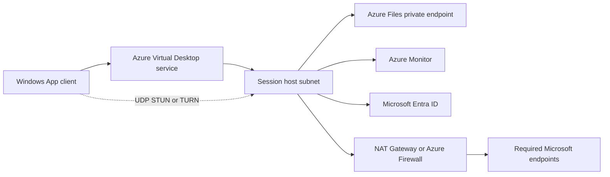

# Networking

!!! abstract "At a glance"
    - Azure Virtual Desktop starts with reverse connect over TCP 443, so session hosts do not need inbound internet ports for brokering.
    - RDP Shortpath adds UDP for better performance, using STUN for direct paths and TURN for relayed paths.
    - Use hub-and-spoke networking, private endpoints for profile and application shares, and explicit outbound connectivity for session hosts.
    - Bypass proxies for Azure Virtual Desktop traffic where policy allows; Microsoft Learn says proxies can affect stability and performance.
    - Keep round-trip latency from the client network to the Azure region under 150 ms where possible.

## What it is

Azure Virtual Desktop networking is the set of paths that lets a client discover a workspace, authenticate, connect to a session host, mount user profiles, attach applications, send telemetry, and reach required Microsoft services. The North Star design is Microsoft Entra joined, Intune managed, and cloud first, but it still depends on deliberate network design.

The connection starts with Azure Virtual Desktop reverse connect. The RDP Shortpath article states that by default RDP begins a TCP-based reverse connect transport, then tries to establish UDP; if UDP succeeds, TCP drops, otherwise TCP remains the fallback ([RDP Shortpath for Azure Virtual Desktop](https://learn.microsoft.com/azure/virtual-desktop/rdp-shortpath)).

**Status:** Reverse connect over TCP 443 is generally available as core Azure Virtual Desktop connectivity. RDP Shortpath for public networks via STUN and TURN is generally available in Azure public cloud, RDP Shortpath using UDP over Azure Private Link is generally available as of February 2026, and centralised RDP Shortpath management through Microsoft Intune or Group Policy is generally available as of January 2026 ([RDP Shortpath for Azure Virtual Desktop](https://learn.microsoft.com/azure/virtual-desktop/rdp-shortpath), [What's new in Azure Virtual Desktop](https://learn.microsoft.com/azure/virtual-desktop/whats-new)).

## How it fits

1. **Private service access.** Clients on managed networks can reach the Azure Virtual Desktop service through Private Link.
2. **Public service path.** Clients on the internet use the service's public endpoints.
3. **Reverse connect.** Session hosts connect outbound to the service, so no inbound ports are opened to them.
4. **RDP Shortpath.** Clients on managed networks can connect to session hosts directly over UDP. Clients on the internet use STUN or TURN.
5. **Storage private endpoint.** Session hosts reach Azure Files through a private endpoint.

From the session host's side, these are the flows it needs:

Use a hub-and-spoke model. Put shared connectivity, DNS forwarding, firewalling and inspection decisions in the hub. Put host pools, private endpoints and workload subnets in spokes. Keep profile storage and App Attach storage close to the session hosts. Use [networking](index.md), [identity](../identity/index.md), [host pools](../host-pools/index.md), [profiles](../profiles/index.md), [app attach](../app-attach/index.md) and [security](../security/index.md) as one design, not separate decisions.

Where available, use regional host pools for new deployments. Regional host pools are generally available as of September 2026 and store host pool metadata in the selected Azure region rather than a geographical database shared across regions ([What's new in Azure Virtual Desktop](https://learn.microsoft.com/azure/virtual-desktop/whats-new)).

## North Star recommendation

Enable RDP Shortpath and design the network so UDP works. Use TURN as the expected path when direct STUN is blocked by NAT or firewall topology. Use RDP Multipath-capable Windows App versions to improve resiliency. Keep Azure Virtual Desktop service traffic and RDP traffic away from proxies where possible.

!!! note "Private Link"
    Azure Virtual Desktop Private Link is supported by Learn as a design option, but it includes specific configuration rules. If you enable UDP over Private Link, Learn says you must opt in on the host pool **Networking** page and disable public RDP Shortpath options for STUN and TURN ([Azure Private Link with Azure Virtual Desktop](https://learn.microsoft.com/azure/virtual-desktop/private-link-overview)).

## Design decisions

| Decision | North Star choice | Why |
| --- | --- | --- |
| RDP transport | Reverse connect plus RDP Shortpath | Reverse connect gives compatibility; UDP Shortpath improves reliability and latency where allowed ([RDP Shortpath](https://learn.microsoft.com/azure/virtual-desktop/rdp-shortpath)). |
| Resiliency | RDP Multipath | Learn says RDP Multipath keeps backup paths on standby and can switch to the next best path ([RDP Multipath](https://learn.microsoft.com/azure/virtual-desktop/rdp-multipath)). |
| Profile and app shares | Private endpoints | Azure Files private endpoints provide private IP access from a virtual network ([Azure Files network endpoints](https://learn.microsoft.com/azure/storage/files/storage-files-networking-endpoints)). |
| Topology | Hub-and-spoke | Centralises DNS, inspection and egress while keeping host pool spokes isolated. |
| Outbound internet | Explicit outbound with NAT Gateway or firewall | Learn says default outbound access gives an implicit outbound public IP and recommends explicit outbound connectivity instead ([Default outbound access in Azure](https://learn.microsoft.com/azure/virtual-network/ip-services/default-outbound-access)). |
| Proxy | Bypass AVD traffic | Learn recommends bypassing proxies for Azure Virtual Desktop traffic ([Proxy server guidelines](https://learn.microsoft.com/azure/virtual-desktop/proxy-server-support)). |

## In this section

-   __[Connection paths and quality](connection-paths.md)__

    ---

    Reverse connect, RDP Shortpath, RDP Multipath, latency, bandwidth and media.

-   __[Required flows and endpoints](required-flows.md)__

    ---

    The network flows, endpoints and service tags Azure Virtual Desktop needs, and how to treat proxies.

-   __[Private and outbound connectivity](private-connectivity.md)__

    ---

    Private endpoints, private DNS, Private Link and explicit outbound connectivity for session hosts.

## Common pitfalls

- Blocking required FQDNs because a firewall rule uses only IP addresses. Learn says Azure Virtual Desktop does not have a list of IP address ranges that can replace FQDNs ([Required FQDNs](https://learn.microsoft.com/azure/virtual-desktop/required-fqdn-endpoint)).
- Sending RDP media through a proxy and expecting Teams media optimisation to work.
- Forgetting NAT scale. RDP Multipath can establish up to five outbound transport paths per active user session, so firewall and NAT capacity must account for concurrent sessions ([RDP Multipath](https://learn.microsoft.com/azure/virtual-desktop/rdp-multipath)).
- Creating private endpoints without DNS integration.
- Allowing default outbound access from session host subnets.
- Treating private endpoints as a replacement for Conditional Access, device compliance or [identity](../identity/index.md). They solve network exposure, not user trust.

## Microsoft Learn

- [RDP Shortpath for Azure Virtual Desktop](https://learn.microsoft.com/azure/virtual-desktop/rdp-shortpath)
- [Use RDP Multipath to improve connection reliability to Azure Virtual Desktop](https://learn.microsoft.com/azure/virtual-desktop/rdp-multipath)
- [Required FQDNs and endpoints for Azure Virtual Desktop](https://learn.microsoft.com/azure/virtual-desktop/required-fqdn-endpoint)
- [Proxy server guidelines for Azure Virtual Desktop](https://learn.microsoft.com/azure/virtual-desktop/proxy-server-support)
- [Azure Private Link with Azure Virtual Desktop](https://learn.microsoft.com/azure/virtual-desktop/private-link-overview)
- [Configure network endpoints for accessing Azure file shares](https://learn.microsoft.com/azure/storage/files/storage-files-networking-endpoints)
- [Default outbound access in Azure](https://learn.microsoft.com/azure/virtual-network/ip-services/default-outbound-access)
- [What is Azure NAT Gateway?](https://learn.microsoft.com/azure/nat-gateway/nat-overview)
- [Use Microsoft Teams on Azure Virtual Desktop](https://learn.microsoft.com/azure/virtual-desktop/teams-on-avd)
- [Multimedia redirection for video playback and calls in a remote session](https://learn.microsoft.com/azure/virtual-desktop/multimedia-redirection-video-playback-calls)
- [Analyze connection quality in Azure Virtual Desktop](https://learn.microsoft.com/azure/virtual-desktop/connection-latency)
