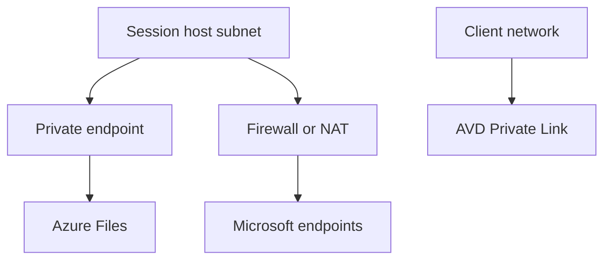

# Private and outbound connectivity

Level 300

This page explains how to keep storage and optional Azure Virtual Desktop service paths private, while still giving session hosts reliable outbound access to Microsoft services.

This diagram shows the private and outbound split.

## Private endpoints and DNS

Use private endpoints for Azure Files shares that host FSLogix profiles and App Attach packages. Azure Files supports public endpoints and private endpoints; private endpoints exist within a virtual network and have a private IP address from that virtual network ([Configure network endpoints for accessing Azure file shares](https://learn.microsoft.com/azure/storage/files/storage-files-networking-endpoints)).

For Azure Virtual Desktop Private Link, Learn documents three workflows and sub-resources: **global** on `Microsoft.DesktopVirtualization/workspaces` for initial feed discovery, **feed** on `Microsoft.DesktopVirtualization/workspaces` for feed download, and **connection** on `Microsoft.DesktopVirtualization/hostpools` for host pool connections ([Azure Private Link with Azure Virtual Desktop](https://learn.microsoft.com/azure/virtual-desktop/private-link-overview)).

Private endpoint DNS is not optional. For Azure Virtual Desktop Private Link, Learn states that the private DNS zone for **privatelink.wvd.microsoft.com** returns the private IP address for workspace feed download ([Azure Private Link with Azure Virtual Desktop](https://learn.microsoft.com/azure/virtual-desktop/private-link-overview)). For Azure Files, link the private DNS zone for the file endpoint to the host pool virtual network, or ensure custom DNS resolves the storage account file endpoint to the private endpoint IP.

## Outbound connectivity

Do not rely on default outbound access. Learn says Azure automatically assigns an outbound public IP address when a VM has no explicitly defined outbound method, and that this is default outbound access ([Default outbound access in Azure](https://learn.microsoft.com/azure/virtual-network/ip-services/default-outbound-access)). Use explicit egress such as Azure NAT Gateway or Azure Firewall instead.

**Status:** Azure NAT Gateway is generally available as an Azure networking service. Learn describes it as a fully managed and highly resilient NAT service that lets all instances in a subnet connect outbound to the internet while remaining fully private, and says it does not permit unsolicited inbound connections from the internet ([What is Azure NAT Gateway?](https://learn.microsoft.com/azure/nat-gateway/nat-overview)).

## Under the hood

Level 400

Azure Virtual Desktop Private Link has three sub-resources with different scope. Learn lists **global** for initial feed discovery, **feed** for workspace feed download, and **connection** for host pool connections. It also says only one **global** private endpoint can exist for the entire Azure Virtual Desktop deployment ([Azure Private Link with Azure Virtual Desktop](https://learn.microsoft.com/azure/virtual-desktop/private-link-overview)).

Private Link does not automatically mean User Datagram Protocol works. Learn says Azure Virtual Desktop supports UDP traffic with Private Link only when you opt in from the host pool **Networking** page, and if you enable the UDP opt-in checkbox you must disable public RDP Shortpath options for STUN and TURN ([Azure Private Link with Azure Virtual Desktop](https://learn.microsoft.com/azure/virtual-desktop/private-link-overview)).

For outbound internet, Learn defines default outbound access as Azure automatically assigning an outbound public IP address when a virtual machine has no explicitly defined outbound connectivity method. Avoid that implicit path by using an explicit firewall or NAT design ([Default outbound access in Azure](https://learn.microsoft.com/azure/virtual-network/ip-services/default-outbound-access)).

---

Part of [Networking](index.md).
