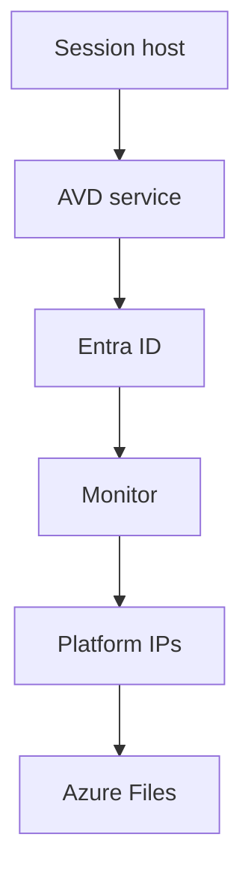

# Required flows and endpoints

Level 300

This page is the firewall checklist. Azure Virtual Desktop will not work reliably if the service, agent, authentication, monitoring or transport endpoints are blocked.

This diagram groups the outbound paths a session host needs.

## Required flows

| Source | Destination | Port or protocol | Purpose |
| --- | --- | --- | --- |
| Session host | `*.wvd.microsoft.com` | TCP 443 | Azure Virtual Desktop service traffic and TCP based RDP connectivity ([Required FQDNs](https://learn.microsoft.com/azure/virtual-desktop/required-fqdn-endpoint)). |
| Session host | `*.service.windows.cloud.microsoft` | TCP 443 | Azure Virtual Desktop service traffic ([Required FQDNs](https://learn.microsoft.com/azure/virtual-desktop/required-fqdn-endpoint)). |
| Session host | `login.microsoftonline.com` | TCP 443 | Authentication to Microsoft Online Services ([Required FQDNs](https://learn.microsoft.com/azure/virtual-desktop/required-fqdn-endpoint)). |
| Client and session host | `51.5.0.0/16` | UDP 3478 | TURN relayed UDP-based RDP ([RDP Multipath](https://learn.microsoft.com/azure/virtual-desktop/rdp-multipath)). |
| Client and session host | `51.5.0.0/16` | UDP 1024-65535, default 49152-65535 | STUN direct UDP-based RDP ([RDP Multipath](https://learn.microsoft.com/azure/virtual-desktop/rdp-multipath)). |
| Session host | `168.63.129.16` | TCP and UDP 80, TCP 32526, TCP and UDP 53 when using Azure DNS | Azure platform service connectivity ([Required FQDNs](https://learn.microsoft.com/azure/virtual-desktop/required-fqdn-endpoint)). |
| Session host | `169.254.169.254` | TCP 80 | Azure Instance Metadata Service ([Required FQDNs](https://learn.microsoft.com/azure/virtual-desktop/required-fqdn-endpoint)). |
| Session host | Azure Files private endpoint | TCP 445 | FSLogix profile containers and App Attach SMB access ([Azure Files network endpoints](https://learn.microsoft.com/azure/storage/files/storage-files-networking-endpoints)). |
| Session host | `*.prod.warm.ingest.monitor.core.windows.net` and `gcs.prod.monitoring.core.windows.net` | TCP 443 | Azure Monitor agent traffic ([Required FQDNs](https://learn.microsoft.com/azure/virtual-desktop/required-fqdn-endpoint)). |
| Session host | `azkms.core.windows.net` | TCP 1688 | Windows activation ([Required FQDNs](https://learn.microsoft.com/azure/virtual-desktop/required-fqdn-endpoint)). |

## Required endpoints and service tags

Microsoft Learn states that Azure Virtual Desktop deployments are not supported when the required FQDNs and endpoints are blocked ([Required FQDNs and endpoints for Azure Virtual Desktop](https://learn.microsoft.com/azure/virtual-desktop/required-fqdn-endpoint)). Use the **WindowsVirtualDesktop** service tag and Azure Firewall FQDN tags where they fit. Learn says Azure Virtual Desktop has both a service tag and FQDN tag and recommends using service tags and FQDN tags to simplify network configuration ([Required FQDNs and endpoints for Azure Virtual Desktop](https://learn.microsoft.com/azure/virtual-desktop/required-fqdn-endpoint)).

The same article warns that `169.254.169.254` and `168.63.129.16` must not be intercepted, proxied or redirected, because blocking or redirecting them can cause provisioning failures, health monitoring issues and connection problems ([Required FQDNs and endpoints for Azure Virtual Desktop](https://learn.microsoft.com/azure/virtual-desktop/required-fqdn-endpoint)).

## Proxy guidance

Microsoft Learn is direct: "We recommend bypassing proxies for Azure Virtual Desktop traffic" because proxies do not make Azure Virtual Desktop more secure, most are not designed for long-running WebSocket connections, and proxy geography can add latency ([Proxy server guidelines for Azure Virtual Desktop](https://learn.microsoft.com/azure/virtual-desktop/proxy-server-support)).

Learn also states that Azure Virtual Desktop does not support proxy servers with media optimisation for Microsoft Teams ([Proxy server guidelines for Azure Virtual Desktop](https://learn.microsoft.com/azure/virtual-desktop/proxy-server-support)). If a proxy is mandatory, keep it in the same Azure geography as the Azure Virtual Desktop cluster and use RDP Shortpath for managed networks so RDP data can bypass the proxy where possible ([Proxy server guidelines for Azure Virtual Desktop](https://learn.microsoft.com/azure/virtual-desktop/proxy-server-support)).

## Under the hood

Level 400

The required endpoint page separates session host endpoints, Azure fabric communication IPs, optional endpoints, client endpoints and certificate checks. It also says all session host entries are outbound and that you do not need to open inbound ports for Azure Virtual Desktop ([Required FQDNs and endpoints for Azure Virtual Desktop](https://learn.microsoft.com/azure/virtual-desktop/required-fqdn-endpoint)).

Two Azure platform addresses are special. Learn says `169.254.169.254` is the Azure Instance Metadata Service endpoint, and `168.63.129.16` is used for Azure platform service connectivity. Traffic to these addresses **must not be intercepted, proxied, or redirected** ([Required FQDNs and endpoints for Azure Virtual Desktop](https://learn.microsoft.com/azure/virtual-desktop/required-fqdn-endpoint)).

For restricted egress environments, Learn says the Azure Virtual Desktop Agent URL Tool validates required FQDNs and endpoints. It also says that if you prefer not to use a wildcard for agent traffic, you can find specific FQDNs by looking under **event ID 3701**, and those FQDNs are region-specific ([Required FQDNs and endpoints for Azure Virtual Desktop](https://learn.microsoft.com/azure/virtual-desktop/required-fqdn-endpoint)).

---

Part of [Networking](index.md).
