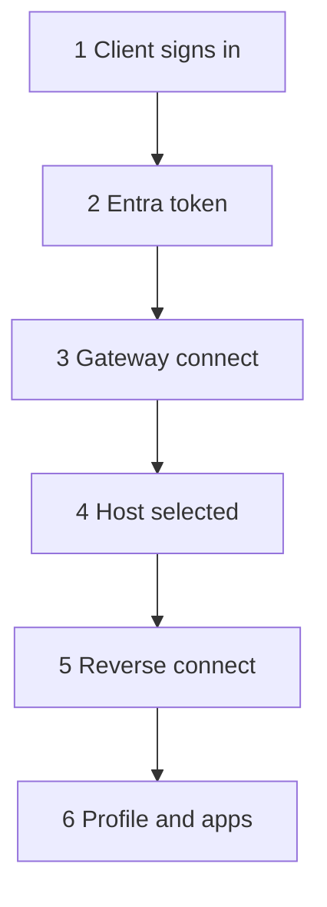
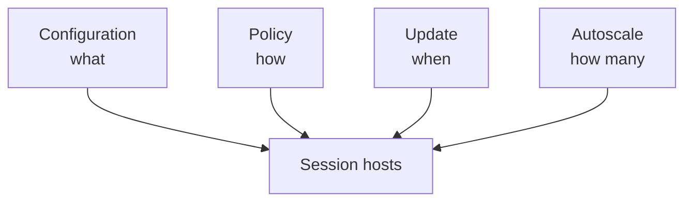
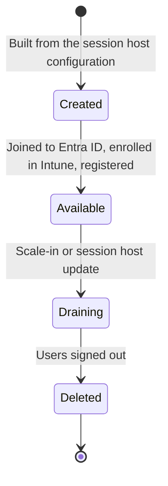
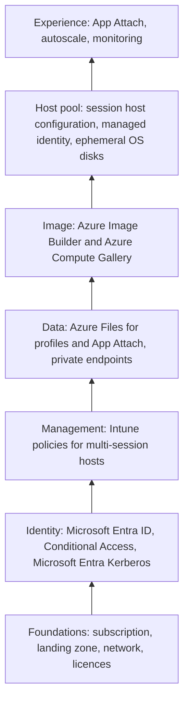

# How it fits together

!!! abstract "At a glance"
    - Users connect through the Azure Virtual Desktop service. Session hosts never accept inbound connections, because they reverse connect to the service over TCP 443.
    - Microsoft Entra ID signs users in, applies Conditional Access, provides single sign-on to the session host and issues the Kerberos tickets that give access to profile storage on Azure Files.
    - The pooled host pool is driven by four native features: the session host configuration, the session host management policy, session host update and autoscale.
    - Profiles and applications live on Azure Files, reached over private endpoints. The image comes from Azure Compute Gallery.
    - Everything reports to Azure Monitor, so you can see both the user experience and the platform.

Level 200

This page is the wiring diagram for the North Star. It shows how sign-in, connection brokering, profiles, applications, images, policy and monitoring work together.

## The big picture

1. **Sign in.** Users sign in with Microsoft Entra ID, which applies Conditional Access and provides single sign-on to the session host ([Configure single sign-on](https://learn.microsoft.com/azure/virtual-desktop/configure-single-sign-on)).
2. **Connect.** Windows App or the web client gets the user's feed and connects through the Azure Virtual Desktop gateway. RDP Shortpath then tries to move the session to UDP, with TCP as the fallback ([RDP Shortpath](https://learn.microsoft.com/azure/virtual-desktop/rdp-shortpath)).
3. **Reverse connect.** Session hosts connect out to the service over TCP 443, so "no inbound network ports are required to be open" ([Security recommendations](https://learn.microsoft.com/azure/virtual-desktop/security-recommendations)).
4. **Profiles and applications.** At sign-in, FSLogix attaches the user's profile container, using Microsoft Entra Kerberos for access, and App Attach mounts the applications assigned to them. Both come from Azure Files over a private endpoint ([FSLogix with Microsoft Entra ID](https://learn.microsoft.com/fslogix/how-to-configure-profile-container-entra-id-hybrid), [App Attach](https://learn.microsoft.com/azure/virtual-desktop/app-attach-overview)).
5. **Session host lifecycle.** The session host configuration defines every host. Session host update and autoscale create, update and delete hosts to match the configuration and demand ([Host pool management approaches](https://learn.microsoft.com/azure/virtual-desktop/host-pool-management-approaches)).
6. **Image.** New hosts use an image version from Azure Compute Gallery, built by Azure Image Builder ([Azure Image Builder](https://learn.microsoft.com/azure/virtual-machines/image-builder-overview)).
7. **Policy.** Intune configures every host with settings catalog policies ([Intune and multi-session](https://learn.microsoft.com/intune/solutions/azure-virtual-desktop-multi-session)).
8. **Observe.** Diagnostics and performance data go to Azure Monitor and Log Analytics, where AVD Insights presents them ([AVD Insights](https://learn.microsoft.com/azure/virtual-desktop/insights)).

The numbers on the diagram match the steps above. The rest of this page takes each part in turn. For identity background, see [Device join models](../demystified/device-join-models.md), [Application authentication](../demystified/application-authentication.md) and [Kerberos and NTLM](../demystified/kerberos-and-ntlm.md).

## The components and what they do

| Component | What it does | Where you configure it | Deep dive |
| --- | --- | --- | --- |
| Workspace, application groups and host pool | The workspace publishes application groups to users. Application groups expose a desktop or RemoteApp applications from a host pool ([AVD terminology](https://learn.microsoft.com/azure/virtual-desktop/terminology)) | Azure | [Host pools](../host-pools/index.md) |
| Session host configuration | Defines what every session host looks like: image, VM size, OS disk, join type, network, security type and more ([Host pool management approaches](https://learn.microsoft.com/azure/virtual-desktop/host-pool-management-approaches#session-host-configuration)) | Azure, on the host pool | [Host pools](../host-pools/index.md) |
| Session host management policy | Defines how hosts are created and updated: time zone, batch size, logoff delay and message, and what happens to hosts that fail to create ([Host pool management approaches](https://learn.microsoft.com/azure/virtual-desktop/host-pool-management-approaches#session-host-management-policy)) | Azure, on the host pool | [Host pools](../host-pools/index.md) |
| Session host update | Applies a changed configuration to existing hosts in batches ([Session host update](https://learn.microsoft.com/azure/virtual-desktop/session-host-update)) | Azure, scheduled per update | [Images](../images/index.md) |
| Dynamic autoscaling | Creates, deletes, starts and stops session hosts to match usage and schedules ([Autoscale scenarios](https://learn.microsoft.com/azure/virtual-desktop/autoscale-scenarios)) | Azure, as a scaling plan | [Scaling](../scaling/index.md) |
| Microsoft Entra ID | Signs users in, applies Conditional Access and provides single sign-on to session hosts ([Configure single sign-on](https://learn.microsoft.com/azure/virtual-desktop/configure-single-sign-on)) | Microsoft Entra admin center | [Identity and access](../identity/index.md) |
| Intune | Configures session hosts and user sessions through settings catalog policies ([Intune and multi-session](https://learn.microsoft.com/intune/solutions/azure-virtual-desktop-multi-session)) | Intune admin center | [Intune policies](../intune/index.md) |
| Azure Files | Stores FSLogix profile containers, with identity-based SMB access through Microsoft Entra Kerberos, and App Attach packages ([Enable Microsoft Entra Kerberos for Azure Files](https://learn.microsoft.com/azure/storage/files/storage-files-identity-auth-hybrid-identities-enable), [App Attach](https://learn.microsoft.com/azure/virtual-desktop/app-attach-overview)) | Azure | [User profiles](../profiles/index.md) and [App Attach](../app-attach/index.md) |
| Azure Image Builder and Azure Compute Gallery | Build, version and replicate the base image ([Azure Image Builder](https://learn.microsoft.com/azure/virtual-machines/image-builder-overview)) | Azure | [Images](../images/index.md) |
| Azure Monitor and AVD Insights | Collect diagnostics, performance data and connection quality ([AVD Insights](https://learn.microsoft.com/azure/virtual-desktop/insights)) | Azure | [Monitoring](../monitoring/index.md) |

## How a user connects

Azure Virtual Desktop uses reverse connect. The session host never listens for incoming RDP connections. It keeps an outbound, TLS-protected channel open to the service, and both the client and the session host connect out to the same gateway, which relays traffic between them ([Understanding AVD network connectivity](https://learn.microsoft.com/azure/virtual-desktop/network-connectivity)).

| Step | What happens |
| --- | --- |
| 1 | Windows App signs the user in to Microsoft Entra ID, and Conditional Access applies |
| 2 | Microsoft Entra ID returns a token |
| 3 | The client connects to the Azure Virtual Desktop gateway |
| 4 | The service brokers the request to the selected session host |
| 5 | The session host reverse connects to the gateway, and the gateway relays RDP |
| 6 | FSLogix attaches the profile, and App Attach registers the assigned applications |

Steps 1 to 5 summarise the [client connection sequence on Microsoft Learn](https://learn.microsoft.com/azure/virtual-desktop/network-connectivity#client-connection-sequence). Step 6 uses [single sign-on with Microsoft Entra authentication](https://learn.microsoft.com/azure/virtual-desktop/configure-single-sign-on), [FSLogix profile containers with Microsoft Entra ID](https://learn.microsoft.com/fslogix/how-to-configure-profile-container-entra-id-hybrid) and App Attach. For Entra joined hosts, App Attach access is granted to the Azure Virtual Desktop service principals rather than to each user ([Add and manage App Attach applications](https://learn.microsoft.com/azure/virtual-desktop/app-attach-setup)). Once the session is up, RDP Shortpath can move the transport to UDP for lower latency ([RDP Shortpath](https://learn.microsoft.com/azure/virtual-desktop/rdp-shortpath)).

## Four features that run the host pool

A host pool with a session host configuration is run by four native features working together. Learn describes them as what, how, when and how many ([Host pool management approaches](https://learn.microsoft.com/azure/virtual-desktop/host-pool-management-approaches#session-host-configuration-management-approach)).

!!! warning "Choose the management approach before you create the host pool"
    The management approach is set when the host pool is created and can't be changed later. A host pool created without a session host configuration can't have one added afterwards ([Host pool management approaches](https://learn.microsoft.com/azure/virtual-desktop/host-pool-management-approaches)). Tooling built for standard management doesn't work with a session host configuration, so plan the move to the North Star as a new host pool, not an upgrade.

## The life of a session host

A session host in the North Star is short-lived. It's created from the current configuration, takes sessions while demand needs it, and is deleted when autoscale scales in or session host update replaces it. Because the OS disk is ephemeral, there's no stopped state to return to: hosts with ephemeral OS disks don't support start and deallocate, which is why Learn recommends dynamic autoscaling with **Minimum percentage of active hosts (%)** set to 100% in every phase ([Ephemeral OS disks on AVD](https://learn.microsoft.com/azure/virtual-desktop/deploy/session-hosts/ephemeral-os-disks)). That way autoscale only creates and deletes hosts.

This has three consequences you design for:

1. **Nothing on the host matters.** Profiles live in FSLogix containers on Azure Files, applications in App Attach packages, and configuration in the session host configuration and Intune.
2. **Fixes go into the configuration, not the host.** A broken host gets deleted. A broken configuration gets fixed and rolled out with session host update.
3. **Capacity planning moves to quota and image replication.** Scale-out now means creating virtual machines, so quota in the region and image versions replicated to the region matter more than they did with power management ([Scaling](../scaling/index.md)).

## How the layers depend on each other

The North Star is a stack. Each layer depends on the ones beneath it, which is why the [dependency checklist](../getting-there/dependencies.md) runs from the bottom up.

## Under the hood

Level 400

For identity internals, see [Device join models](../demystified/device-join-models.md), [Application authentication](../demystified/application-authentication.md) and [Kerberos and NTLM](../demystified/kerberos-and-ntlm.md). Those pages explain why the North Star uses Microsoft Entra join by default and why a separate hybrid-joined pool remains useful for some applications.

## Next

- Go deep on a layer in [Architecture](../index.md).
- See what has to be in place first in the [dependency checklist](../getting-there/dependencies.md).
